# Configuration and Data Deployment in Pipelines (Preview)

> [!NOTE] ALM Accelerator for Advanced Makers is currently in public preview. Please see Issues currently tagged as [vnext](https://github.com/microsoft/coe-starter-kit/issues?q=is%3Aopen+is%3Aissue+label%3Aalm-accelerator+label%3Avnext) for the Roadmap to be completed prior to general availability. While in Public Preview it can be expected that there will be breaking changes and frequent updates to address feedback from preview members. Additionally, the Public Preview is reliant on the experimental [Power Apps Source File Pack and Unpack Utility](https://github.com/microsoft/PowerApps-Language-Tooling) that is being developed separately from AA4AM.

The ALM Accelerator uses json formatted files for updating **connection references, environment variables, setting permissions for AAD Groups and Dataverse teams** as well as **sharing Canvas Apps and updating ownership of solution components** such as Power Automate flows. The instructions below are **optional** and depend on what type of components your solution pipelines deploy. For instance, if your solutions only contain Dataverse Tables, Columns and Model Driven Apps with no per environment configuration or data needed then **some of these steps may not be necessary** and can be skipped. The following configuration file allow you to fully automate the deployment of your solutions and specify how to configure items that are specific to the environment to which the solution is being deployed.

> [!NOTE] For an example of configuration and data deployment configuration see the ALMAcceleratorSampleSolution here  https://github.com/microsoft/coe-starter-kit/blob/ALMAcceleratorSampleSolution/ALMAcceleratorSampleSolution/config/deploymentSettings.json and https://github.com/microsoft/coe-starter-kit/blob/ALMAcceleratorSampleSolution/ALMAcceleratorSampleSolution/config/customDeploymentSettings.json

## Before you start...

The following documentation is intended to be a step-by-step process for setting up deployment configuration files manually. However, it is recommended that you use the in app feature to generate this information on export of your solution. This document will provide details and context for the actions that are performed by the AA4AM app and pipelines and act as a reference for those who want to know the specifics of each step in the process.

### Table of Contents
- [Configuration and Data Deployment in Pipelines (Preview)](#configuration-and-data-deployment-in-pipelines--preview-)
  * [Before you start...](#before-you-start)
    + [Table of Contents](#table-of-contents)
    + [Creating a Deployment Settings Json File](#creating-a-deployment-settings-json-file)
      - [Create Connection Reference Json](#create-connection-reference-json)
      - [Create Environment Variable Json](#create-environment-variable-json)
    + [Creating a Custom Deployment Settings Json File](#creating-a-custom-deployment-settings-json-file)
      - [Create Default Environment Variable Json](#create-default-environment-variable-json)
      - [Create AAD Group Canvas Configuration Json](#create-aad-group-canvas-configuration-json)
      - [Create AAD Group / Team Configuration Json](#create-aad-group---team-configuration-json)
      - [Create Solution Component Ownership Json](#create-solution-component-ownership-json)
    + [Importing Data from your Pipeline](#importing-data-from-your-pipeline)


### Creating a Deployment Settings Json File

When storing the customDeploymentSettings.json in the root of the config directory the same configuration will apply to all envionments. Assuming that you are using File Transformation or Token Replacement to store all of the environment specific information, you can specify the environment specific values in your Pipeline Variables. However, **you can also create environment specific customDeploymentSettings.json files** by creating sub-directories in the config directory with the name of the Environment to allow for more flexibility. The directory name in this case **must match the EnvironmentName pipeline variable** you created when setting up your pipeline (e.g. Validate, Test, Production). If no environment specific deployment settings json / directory is found the pipelines will revert to the configuration in the root of the config directory.

Additionally, you can **create user specific configuration files** (e.g. the JohannaDev directory pictured above) for individual developers to use when importing unmanaged solutions from source control. When the user imports an unmanaged solution from source control they will be presented with the option to choose a specific configuration.

>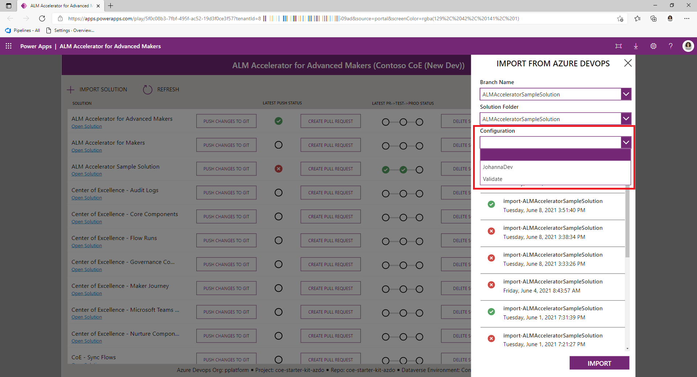

The deployment settings json file is used to configure connection references and environment variables 

```
{
    "EnvironmentVariables": [
        {
            "SchemaName": "cat_shared_sharepointonline_97456712308a4e65aae18bafcd84c81f",
            "Value": "#{environmentvariable.cat_shared_sharepointonline_97456712308a4e65aae18bafcd84c81f}#"
        },
        {
            "SchemaName": "cat_shared_sharepointonline_21f63b2d26f043fb85a5c32fc0c65924",
            "Value": "#{environmentvariable.cat_shared_sharepointonline_21f63b2d26f043fb85a5c32fc0c65924}#"
        },
        {
            "SchemaName": "cat_TextEnvironmentVariable",
            "Value": "#{environmentvariable.cat_TextEnvironmentVariable}#"
        },
        {
            "SchemaName": "cat_ConnectorBaseUrl",
            "Value": "#{environmentvariable.cat_ConnectorBaseUrl}#"
        },
        {
            "SchemaName": "cat_DecimalEnvironmentVariable",
            "Value": "#{environmentvariable.cat_DecimalEnvironmentVariable}#"
        },
        {
            "SchemaName": "cat_JsonEnvironmentVariable",
            "Value": "#{environmentvariable.cat_JsonEnvironmentVariable}#"
        },
        {
            "SchemaName": "cat_ConnectorHostUrl",
            "Value": "#{environmentvariable.cat_ConnectorHostUrl}#"
        }
    ],
    "ConnectionReferences": [
        {
            "LogicalName": "new_sharedsharepointonline_b49bb",
            "ConnectionId": "#{connectionreference.new_sharedsharepointonline_b49bb}#",
            "ConnectorId": "/providers/Microsoft.PowerApps/apis/shared_sharepointonline"
        },
        {
            "LogicalName": "cat_CDS_Current",
            "ConnectionId": "#{connectionreference.cat_CDS_Current}#",
            "ConnectorId": "/providers/Microsoft.PowerApps/apis/shared_commondataserviceforapps"
        }
    ]
}
```

To create the deployment settings json file follow the steps below

1. Copy the above json to a new file called **deploymentSettings.json**

1. Create a **new Directory called config** and save the new file **under the config folder** in git.

   

#### Create Connection Reference Json

The connection reference property in the customDeploymentConfiguration.json is **ConnectionReferences**. This is used for setting connection references in your solution to specific connections configured in a target environment after the solution is imported into an environment. Additionally, the **ConnectionReferences** are used to **enable flows after the solution is imported based on owner of the connection** specified in the variable.

1. **You will need to create the connections manually in your target environments and copy the IDs** for the connection to use in the json value below

1. The format of the json for these variables take the form of an array of name/value pairs.

   ```json
   "ConnectionReferences": 
   [
           {
               "LogicalName": "connection reference1 schema name",
               "ConnectionId": "my environment connection ID1",
               "ConnectorId": "/providers/Microsoft.PowerApps/apis/connectorid1"
           },
           {
               "LogicalName": "connection reference2 schema name",
               "ConnectionId": "my environment connection ID2",
               "ConnectorId": "/providers/Microsoft.PowerApps/apis/connectorid2"
           }
   ]
   ```

   - The **logical name** for the connection reference can be obtained from the **connection reference component** in your solution.
     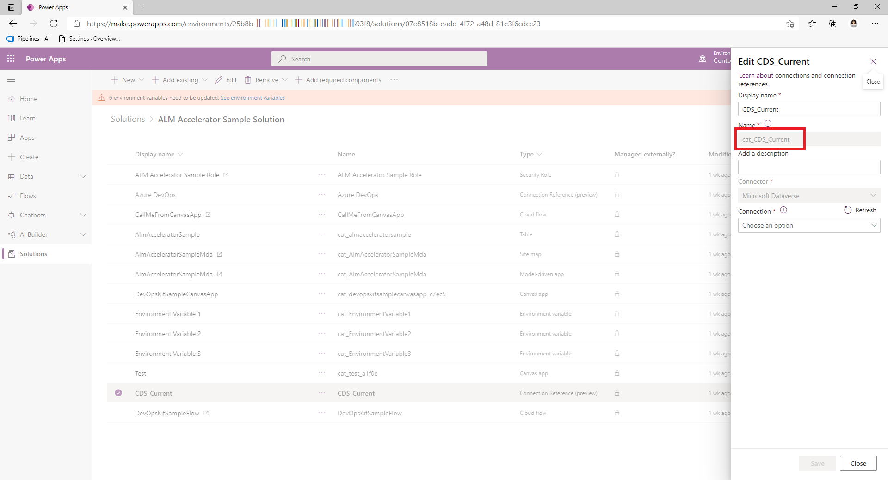

   - The **connection id** can be obtained via the URL of the connection after you create it. For example the id of the connection below is **9f66d1d455f3474ebf24e4fa2c04cea2** where the URL is https://.../connections/shared_commondataservice/9f66d1d455f3474ebf24e4fa2c04cea2/details#
     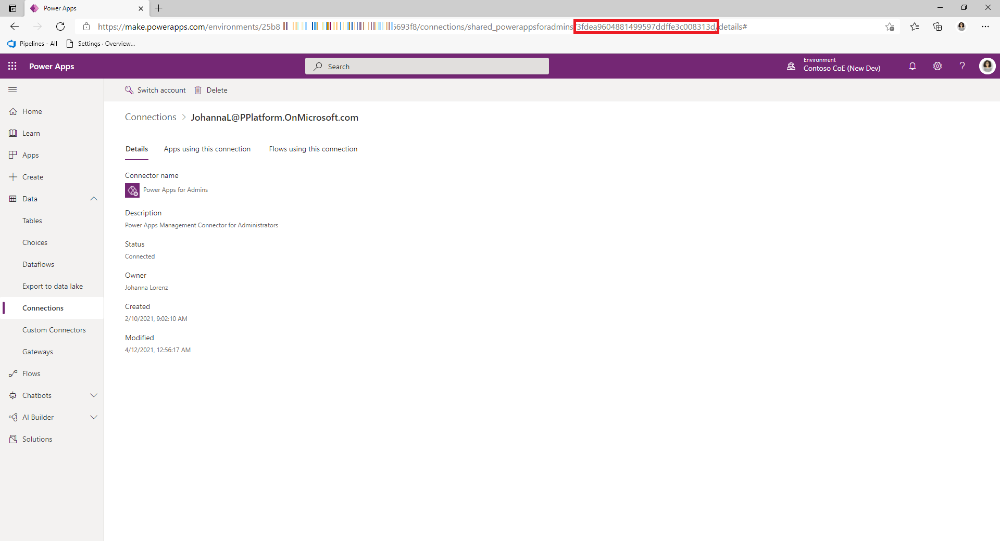

1. Once you've gathered the connection reference schema names and connection ids go to the **customDeploymentSettings.json** and paste the json in  the **ConnectionReferences property**.

   ```json
   "ConnectionReferences": 
   [
           {
               "LogicalName": "new_sharedsharepointonline_b49bb",
               "ConnectionId": "#{connectionreference.new_sharedsharepointonline_b49bb}#",
               "ConnectorId": "/providers/Microsoft.PowerApps/apis/shared_sharepointonline"
           },
           {
               "LogicalName": "cat_CDS_Current",
               "ConnectionId": "#{connectionreference.cat_CDS_Current}#",
               "ConnectorId": "/providers/Microsoft.PowerApps/apis/shared_commondataserviceforapps"
           }
   ]
   ```

1. Using **'Replace Tokens' extension** and adding tokens in your configuration like in the above example navigate to the pipeline for your solution **Select Edit -> Variables**

1. On the Pipeline Variables screen create the **connection.cat_CDS_Current pipeline variable**.

1. Set the value to the **connection id** you gathered above and **Select Keep this value secret** if you want to ensure the value is not saved as plain text.

   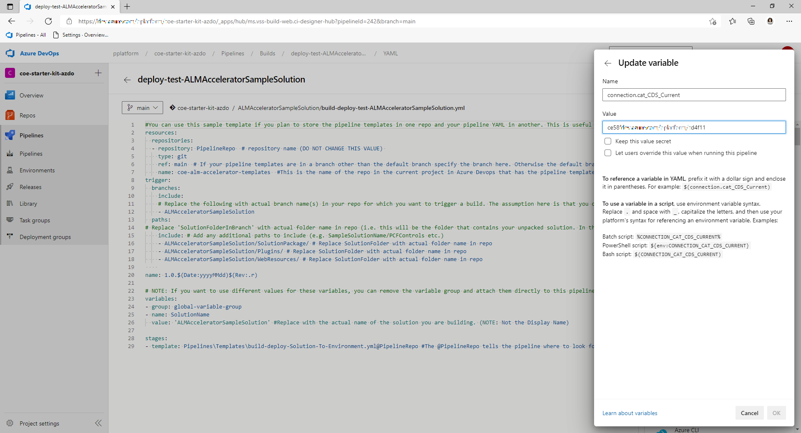

1. Where applicable repeat the steps above for each solution / pipeline you create.

#### Create Environment Variable Json

The environment variable property in the customDeploymentConfiguration.json is **EnvironmentVariables**. This is used for setting Dataverse **Environment variables** in your solution after the solution is imported into an environment.

> [!NOTE] When exporting and source controlling solutions. Environment variable values are exported with the solution. In some cases this could be a security risk if the environment variables contain sensitive information although it's recommended that you not store sensitive information in environment variables. One way to ensure that your environment variable values are not source controlled is to create a solution specifically for environment variable values in your development environment(s) and set the current value of the environment variables in that solution. This will prevent the current values from being exported during the solution export and being stored in source control.

1. The format of the json for these variables take the form of an array of name/value pairs.

   ```json
       "EnvironmentVariables": [
           {
               "SchemaName": "environment variable1 schema name",
               "Value": "environment variable1 value"
           },
           {
               "SchemaName": "environment variable2 schema name",
               "Value": "environment variable2 value"
           }
       ]
   ```

   - The **schema name** for the environment variable can be obtained from the **environment variable component** in your solution.
     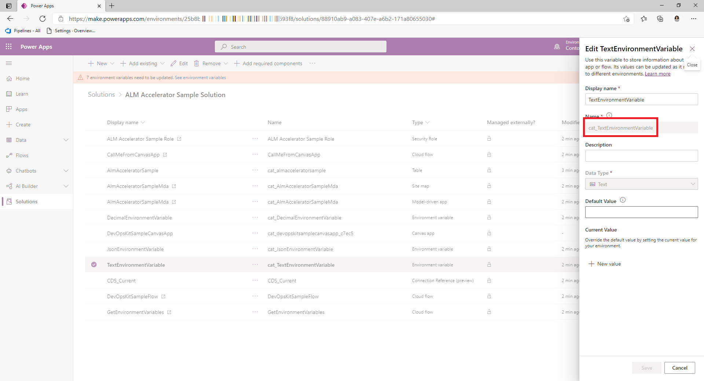

1. Once you've gathered the environment variable schema names and values go to the **customDeploymentSettings.json** and paste the json in the **EnvironmentVariables property**.

   ```json
   {
       "EnvironmentVariables": [
           {
               "SchemaName": "cat_TextEnvironmentVariable",
               "Value": "#{variable.cat_TextEnvironmentVariable}#"
           },
           {
               "SchemaName": "cat_DecimalEnvironmentVariable",
               "Value": "#{variable.cat_DecimalEnvironmentVariable}#"
           },
           {
               "SchemaName": "cat_JsonEnvironmentVariable",
               "Value": "{\"name\":\"#{variable.cat_JsonEnvironmentVariable.name}#\"}"
           }
       ]    
   }
   ```

1. If you are using **'Replace Tokens' extension** and adding tokens in your configuration like in the above example navigate to the pipeline for your solution **Select Edit -> Variables**

1. On the Pipeline Variables screen create a **pipeline variable** for each of the tokens in your configuration (e.g. variable.cat_TextEnvironmentVariable).

1. Set the value to the **environment variable value** for that specific environment and **Select Keep this value secret** if you want to ensure the value is not saved as plain text.

   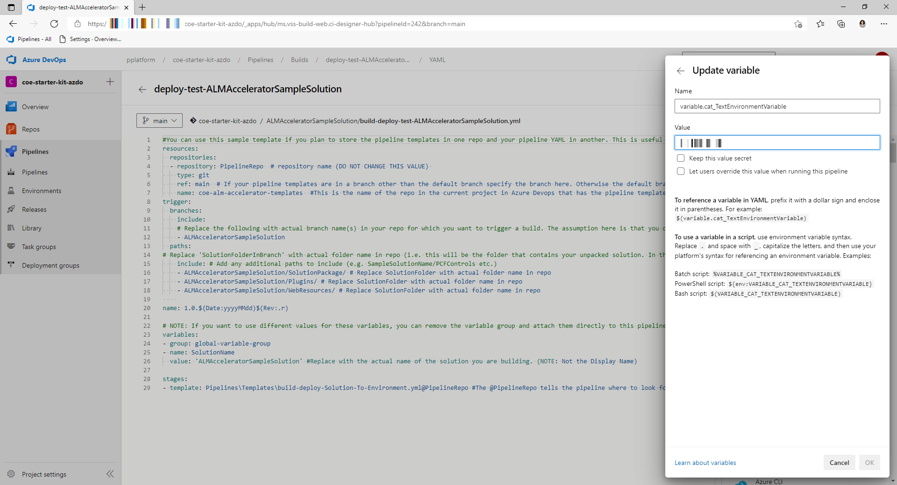

1. Where applicable repeat the steps above for each solution / pipeline you create.

### Creating a Custom Deployment Settings Json File

The custom deployment settings json file contains the configuration settings required to automate the deployment of your solution. This file contains the configuration for Activating Flows on behalf of a user, specify ownership of Flows, Sharing Canvas Apps with AAD Groups and Creating Dataverse Group Teams after deployment. The following is a sample of a custom deployment settings json file which will provide your pipelines with the necessary information required to configure a solution after it's been deployed to an environment.

```json
{
  "ActivateFlowConfiguration": [
    {
      "solutionComponentName": "DevOpsKitSampleFlow",
      "solutionComponentUniqueName": "0a43b549-50ed-ea11-a815-000d3af3a7c4",
      "activateAsUser": "#{activateflow.activateas.DevOpsKitSampleFlow}#"
    },
    {
      "solutionComponentName": "CallMeFromCanvasApp",
      "solutionComponentUniqueName": "71cc728c-2487-eb11-a812-000d3a8fe6a3",
      "activateAsUser": "#{activateflow.activateas.CallMeFromCanvasApp}#"
    },
    {
      "solutionComponentName": "GetEnvironmentVariables",
      "solutionComponentUniqueName": "d2f7f0e2-a1a9-eb11-b1ac-000d3a53c3c2",
      "activateAsUser": "#{activateflow.activateas.GetEnvironmentVariables}#"
    }
  ],
  "SolutionComponentOwnershipConfiguration": [
    {
      "solutionComponentType": 29,
      "solutionComponentName": "DevOpsKitSampleFlow",
      "solutionComponentUniqueName": "0a43b549-50ed-ea11-a815-000d3af3a7c4",
      "ownerEmail": "#{owner.ownerEmail.DevOpsKitSampleFlow}#"
    },
    {
      "solutionComponentType": 29,
      "solutionComponentName": "CallMeFromCanvasApp",
      "solutionComponentUniqueName": "71cc728c-2487-eb11-a812-000d3a8fe6a3",
      "ownerEmail": "#{owner.ownerEmail.CallMeFromCanvasApp}#"
    },
    {
      "solutionComponentType": 29,
      "solutionComponentName": "GetEnvironmentVariables",
      "solutionComponentUniqueName": "d2f7f0e2-a1a9-eb11-b1ac-000d3a53c3c2",
      "ownerEmail": "#{owner.ownerEmail.GetEnvironmentVariables}#"
    }
  ],
  "AadGroupCanvasConfiguration": [
    {
      "aadGroupId": "#{canvasshare.aadGroupId.DevOpsKitSampleCanvasApp}#",
      "canvasNameInSolution": "cat_devopskitsamplecanvasapp_c7ec5",
      "canvasDisplayName": "DevOpsKitSampleCanvasApp",
      "roleName": "#{canvasshare.roleName.DevOpsKitSampleCanvasApp}#"
    }
  ],
  "AadGroupTeamConfiguration": [
    {
      "aadGroupTeamName": "Sample Group Team Name",
      "aadSecurityGroupId": "#{team.samplegroupteamname.aadSecurityGroupId}#",
      "dataverseSecurityRoleNames": [
        "#{team.samplegroupteamname.role}#"
      ]
    }
  ]
}
```

To create the custom deployment settings json file follow the steps below

1. Copy the above json to a new file called **customDeploymentSettings.json**

2. Create a **new Directory called config** and save the new file **under the config folder** in git.

   

#### Create Default Environment Variable Json

The environment variable property in the customDeploymentConfiguration.json is **DefaultEnvironmentVariables**. This is used in the export pipeline for setting Dataverse **Default Environment variables** in your solution when the solution is exported and stored in source control.

> [!NOTE] The Default Environment variables settings only applies if the export pipeline is configured with the pipeline variable **VerifyDefaultEnvironmentVariableValues = true**. See the 

1. The format of the json for these variables take the form of an array of name/value pairs.

   ```json
   [
      [
         "environment variable1 schema name",
         "default environment variable1 value"
      ],
      [
         "environment variable2 schema name",
         "default environment variable2 value"
      ]
   ]
   ```

   - The **schema name** for the environment variable can be obtained from the **environment variable component** in your solution.
     

1. Once you've gathered the environment variable schema names and values go to the **customDeploymentSettings.json** and paste the json in the **DefaultEnvironmentVariables property**.

   ```json
   {
     "DefaultEnvironmentVariables": [
       [ "cat_TextEnvironmentVariable", "#{defaultvariable.cat_TextEnvironmentVariable}#" ],
       [ "cat_DecimalEnvironmentVariable", "#{defaultvariable.cat_DecimalEnvironmentVariable}#" ],
       [ "cat_jsonEnvironmentVariable", "{\"name\":\"#{defaultvariable.cat_jsonEnvironmentVariable.name}#\"}" ]
     ]
   }
   ```
   
1. If you are using **'Replace Tokens' extension** and adding tokens in your configuration like in the above example navigate to the pipeline for your solution **Select Edit -> Variables**

1. On the Pipeline Variables screen create a **pipeline variable** for each of the tokens in your configuration (e.g. **defaultvariable.cat_TextEnvironmentVariable**).

   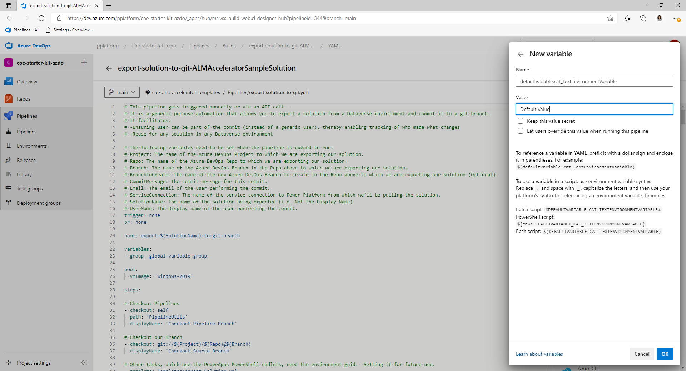

1. Where applicable repeat the steps above for each solution / pipeline you create.

#### Create AAD Group Canvas Configuration Json

The AAD group canvas configuration property in the customDeploymentConfiguration.json is **AadGroupCanvasConfiguration**. This is used for **sharing canvas apps** in your solution with specific **Azure Active Directory Groups** after the solution is imported into an environment.

1. The format of the json for these variables take the form of an array of objects. The **roleName** can be one of **CanView**, **CanViewWithShare** and **CanEdit**

   ```json
   [
    {
        "aadGroupId": "azure active directory group id",
        "canvasNameInSolution": "canvas app schema name1",
        "roleName": "CanView"
    },
    {
        "aadGroupId": "azure active directory group id",
        "canvasNameInSolution": "canvas app schema name2",
        "roleName": "CanViewWithShare"
    },
    {
        "aadGroupId": "azure active directory group id",
        "canvasNameInSolution": "canvas app schema name1",
        "roleName": "CanEdit"
    }
   ]
   ```

   - The **schema name** for the Canvas App can be obtained from the **Canvas App component** in your solution.
     

   - The **azure active directory group id** can be obtained from the **Group blade in Azure Active Directory** from the Azure Portal.
     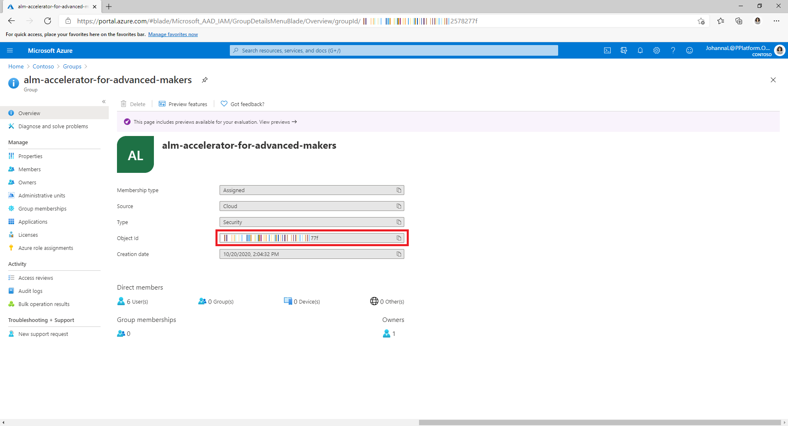

1. Once you've gathered the environment variable schema names and values go to the **customDeploymentSettings.json** and paste the json in the **AadGroupCanvasConfiguration property**.

   ```json
   {
     "AadGroupCanvasConfiguration": [
       {
         "aadGroupId": "#{canvasshare.aadGroupId}#",
         "canvasNameInSolution": "cat_devopskitsamplecanvasapp_c7ec5",
         "roleName": "#{canvasshare.roleName}#"
       }
     ]
   }
   ```
   
1. If you are using **'Replace Tokens' extension** and adding tokens in your configuration like in the above example navigate to the pipeline for your solution **Select Edit -> Variables**

1. On the Pipeline Variables screen create a **pipeline variable** for each of the tokens in your configuration (e.g. canvasshare.aadGroupId).

1. Set the value to the **azure active directory group id** to which the app should be shared for that specific environment and **Select Keep this value secret** if you want to ensure the value is not saved as plain text.

1. Where applicable repeat the steps above for each solution / pipeline you create.


#### Create AAD Group / Team Configuration Json

The AAD group canvas configuration property in the customDeploymentConfiguration.json is **AadGroupTeamConfiguration**. This is used for **mapping Dataverse Teams and Roles** to specific **Azure Active Directory Groups** in your solution with specific **Azure Active Directory Groups** after the solution is imported into an environment.

> [!NOTE] The security roles will need to added to your solution if they are not manually created in the target environment.

1. The format of the json for these variables take the form of an array of objects. One or many roles can be applied to any given team and these roles provide permissions to solution components required by the users in the group.
    ```json
    [
     {
         "aadGroupTeamName": "dataverse team1 name to map",
         "aadSecurityGroupId": "azure active directory group id1",
         "dataverseSecurityRoleNames": [
             "dataverse role1 to apply to the team"
         ]
     },
     {
         "aadGroupTeamName": "dataverse team2 name to map",
         "aadSecurityGroupId": "azure active directory group id2",
         "dataverseSecurityRoleNames": [
             "dataverse role2 to apply to the team"
         ]
     }
    ]
    ```

   - The **Dataverse team name** can be any **existing team or a new team** to be created in Dataverse and mapped to an AAD Group after the solution is imported via the pipeline.

   - The **azure active directory group id** can be obtained from the **Group blade in Azure Active Directory** from the Azure Portal.

   

   - The **Dataverse roles** can be any **Security Role in Dataverse** that would be applied to the **existing or newly created Team** after the solution is imported via the pipeline. The role should have permissions to the resources required by the solution (e.g. Tables and Processes)

1. Once you've gathered the team names, aad group ids and roles go to the **customDeploymentSettings.json** and paste the json in the **AadGroupTeamConfiguration property**.

    ```json
    {
      "AadGroupTeamConfiguration": [
        {
          "aadGroupTeamName": "alm-accelerator-sample-solution",
          "aadSecurityGroupId": "#{team.aadSecurityGroupId}#",
          "dataverseSecurityRoleNames": [
            "ALM Accelerator Sample Role"
          ]
        }
      ]
    }
    ```
    
1. If you are using **'Replace Tokens' extension** and adding tokens in your configuration like in the above example navigate to the pipeline for your solution **Select Edit -> Variables**

1. On the Pipeline Variables screen create a **pipeline variable** for each of the tokens in your configuration (e.g. team.aadSecurityGroupId).

1. Set the value to the **azure active directory group id** to associate with the team in Dataverse and **Select Keep this value secret** if you want to ensure the value is not saved as plain text.

1. Where applicable repeat the steps above for each solution / pipeline you create.

#### Create Solution Component Ownership Json

The solution component ownership property in the customDeploymentConfiguration.json is **SolutionComponentOwnershipConfiguration**. This is used for assigning ownership of solution components to Dataverse Users after the solution is imported into an environment. This is particularly useful for components such as Flows that will be owned by default by the Service Principal user when the solution is imported by the pipeline and organizations want to reassign them after import. Additionally, the  **SolutionComponentOwnershipConfiguration** will be used to enable flows that don't have any connection references. The flow will be enabled by the user specified when no connection references are found to use to enable the flow.

>[!NOTE] The current pipeline only implements the ability to set ownership of Flows. The ability to assign other components to users could be added in the future.

1. The format of the json for these variables take the form of an array of objects.

   ```json
   [
    {
        "solutionComponentType": solution component1 type code,
        "solutionComponentUniqueName": "unique id of the solution component1",
        "ownerEmail": "new owner1 email address"
    },
    {
        "solutionComponentType": solution component2 type code,
        "solutionComponentUniqueName": "unique id of the solution component2",
        "ownerEmail": "new owner2 email address"
    }
   ]
   ```

   - The **solution component type code** is based on the component types specified in the following doc https://docs.microsoft.com/en-us/dynamics365/customer-engagement/web-api/solutioncomponent?view=dynamics-ce-odata-9 (e.g. a Power Automate Flow is component type 29). The component type should be specified as an integer value (i.e. with no quotes)
   - The **unique name of the solution component**, in the case of a Power Automate Flow, has to be taken from the unpacked solution. This is a limitation of flows currently not requiring unique names when they are created. As such the only true unique identifier for a Flow is the internal ID the system uses to identify it in a solution.
     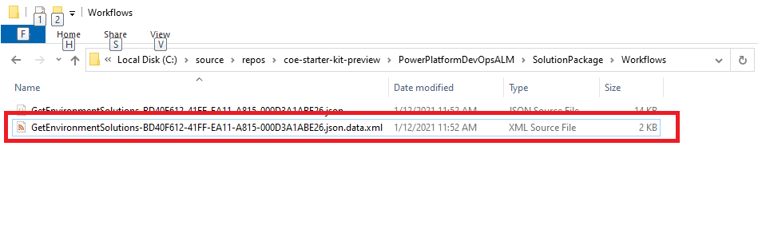
      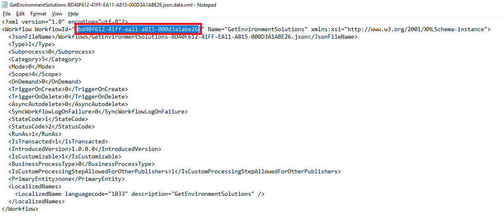
   - The **owner email** can be gathered from the user's record in Dataverse or Office 365.

1. Once you've gathered the component type codes, unique name of the components and owner emails go to the **customDeploymentSettings.json** and paste the json in the **AadGroupTeamConfiguration property**.

   ```json
   {
     "SolutionComponentOwnershipConfiguration": [
       {
         "solutionComponentType": 29,
         "solutionComponentUniqueName": "00000000-0000-0000-0000-00000000000",
         "ownerEmail": "#{owner.ownerEmail}#"
       },
       {
         "solutionComponentType": 29,
         "solutionComponentUniqueName": "00000000-0000-0000-0000-00000000000",
         "ownerEmail": "#{owner.ownerEmail}#"
       }
     ]
   }
   ```
   
1. If you are using **'Replace Tokens' extension** and adding tokens in your configuration like in the above example navigate to the pipeline for your solution **Select Edit -> Variables**

1. On the Pipeline Variables screen create a **pipeline variable** for each of the tokens in your configuration (e.g. owner.ownerEmail).

1. Set the value to the **email address** of the owner of the component and **Select Keep this value secret** if you want to ensure the value is not saved as plain text.

1. Where applicable repeat the steps above for each solution / pipeline you create.

### Importing Data from your Pipeline

In many cases there will be configuration or seed data that you will want to import into your Dataverse environment initially after deploying your solution to the target environment. The pipelines are configured to import data using the **Configuration Migration tool** available via nuget https://www.nuget.org/packages/Microsoft.CrmSdk.XrmTooling.ConfigurationMigration.Wpf. To add configuration data for your pipeline use the following steps. For more information on the **Configuration Migration tool** see here https://docs.microsoft.com/en-us/power-platform/admin/manage-configuration-data

1. Clone the AzDO Repo where your solution is to be source controlled and where you created your solution pipeline YAML to your local machine.

1. If you haven't already create a config directory under your Solution folder above, create a **new Directory called config under the config folder**.

   

1. Install the **Configuration Migration tool** per the instructions here https://docs.microsoft.com/en-us/dynamics365/customerengagement/on-premises/developer/download-tools-nuget

1. Open the **Configuration Migration tool** select **Create schema** and select **Continue**

   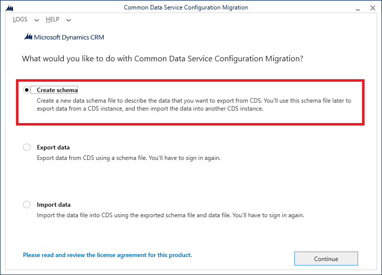

1. **Login to the tenant** from which you want to **export your configuration data**

   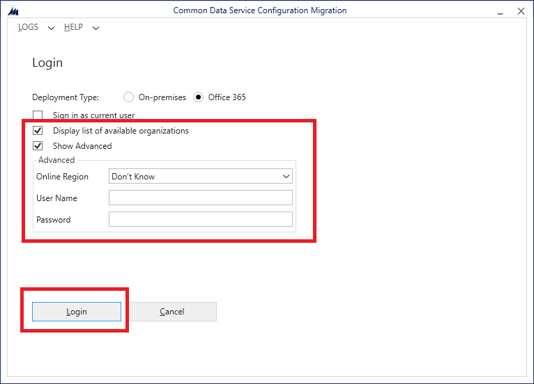

1. Select your **environment**

   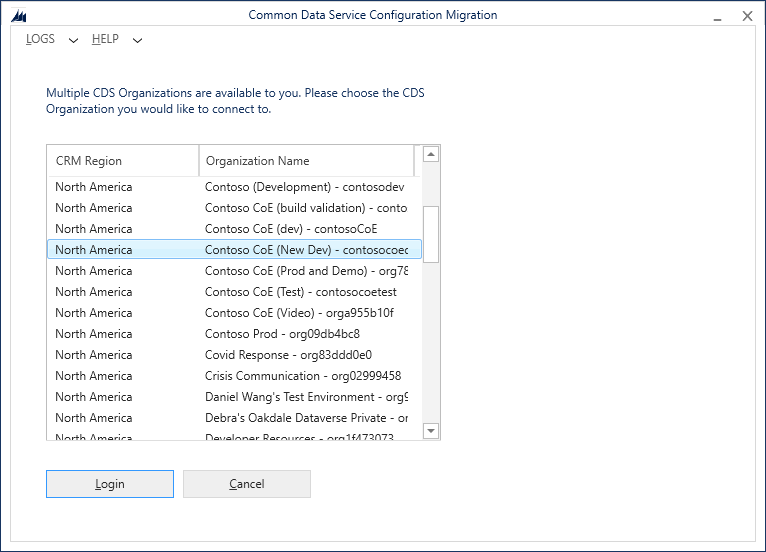

1. Select the specific **Tables and Columns** you want to export for your configuration data.

   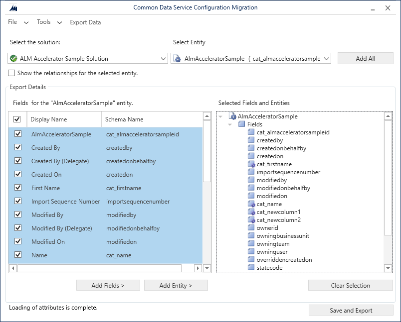

1. Select **Save and Export** and save the data to the directory path **config\ConfigurationMigrationData** in your **local Azure DevOps repo** under the **solution folder** for which this configuration data is to be imported.

   > [!NOTE] The pipeline will look for this specific folder to run the import after your solution is imported. Ensure that the name of the folder and the location are the same as the screenshot below.

   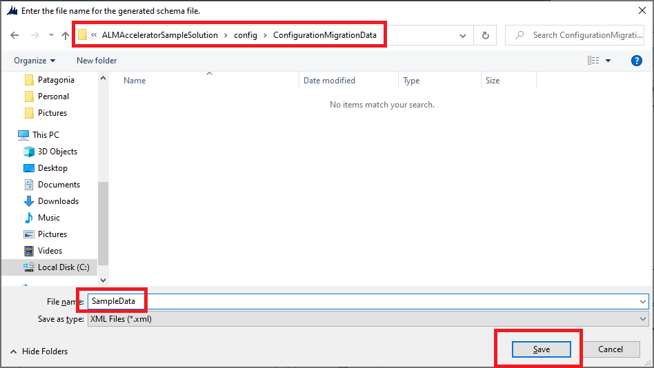

      - Similar to the note regarding specific configuration files per environment the steps above create configuration data that will be deployed to all environments. However, if you have specific configuration data per environment you can **create sub-directories in the config directory** with the name of the Environment to allow for more flexibility. The directory name in this case **must match the EnvironmentName pipeline variable** you created when setting up your pipeline (e.g. Validate, Test, Production). If no environment specific configuration data / directory is found the pipelines will revert to the configuration data in the root of the config directory.
            
   
1. When prompted to **export the data** select **Yes**

   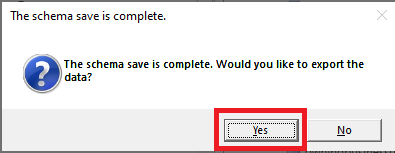

1. Choose the **same location** for your exported data and **select Save** then **Export Data**.

   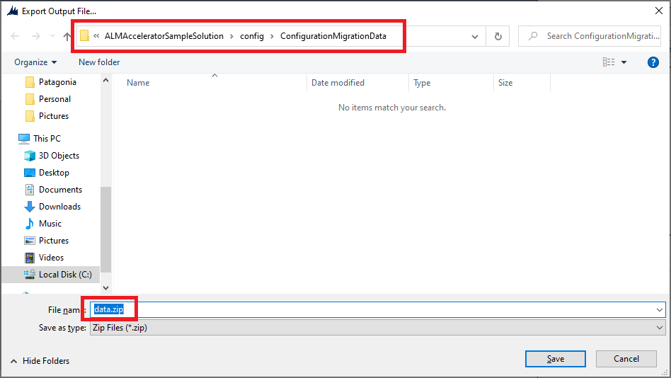

   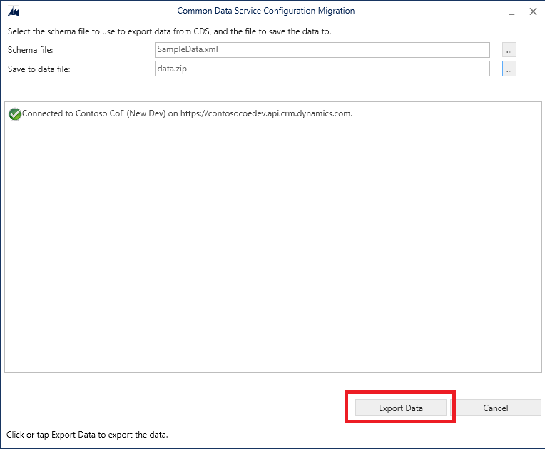

1. When the export is complete **unzip the files from the data.zip** file to the ConfigurationMigrationData directory and **delete the data.zip and SampleData.xml** file.

   

1. Finally, **Commit the changes** with your data to Azure DevOps.