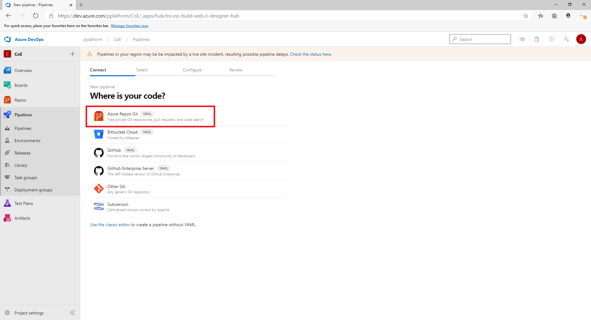
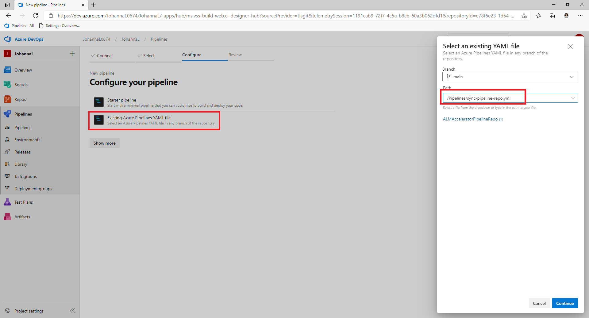
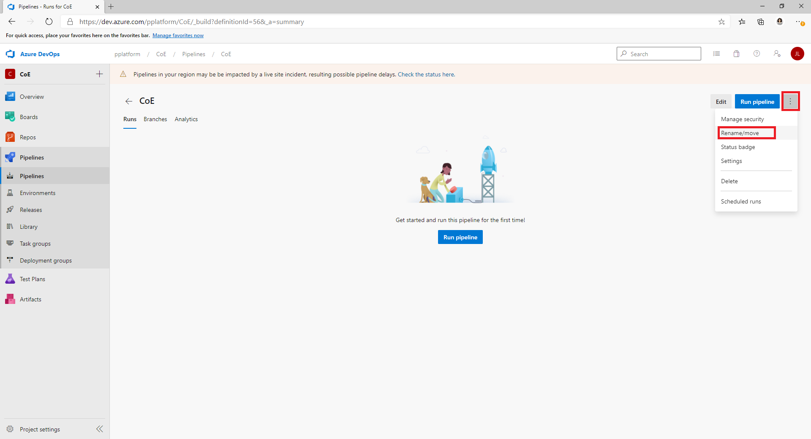
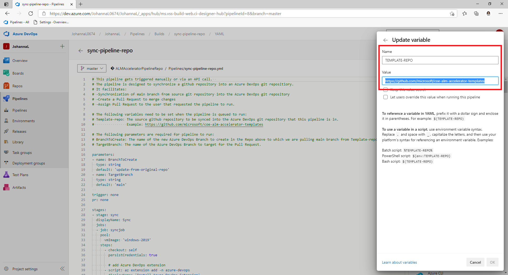
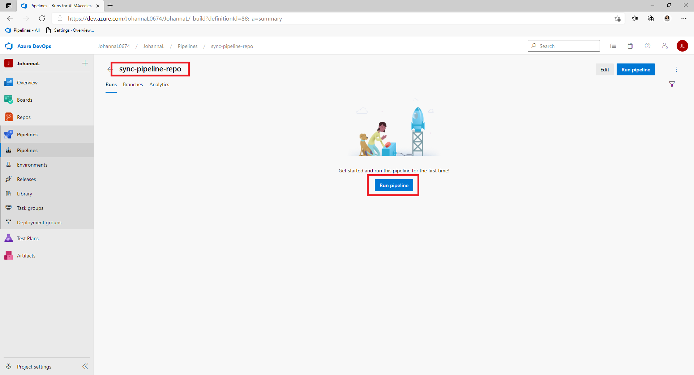
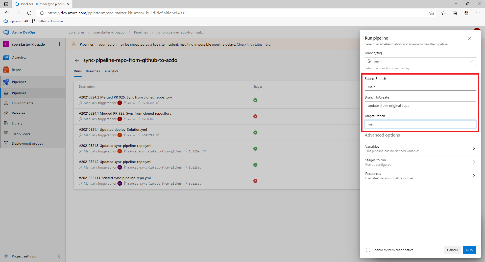
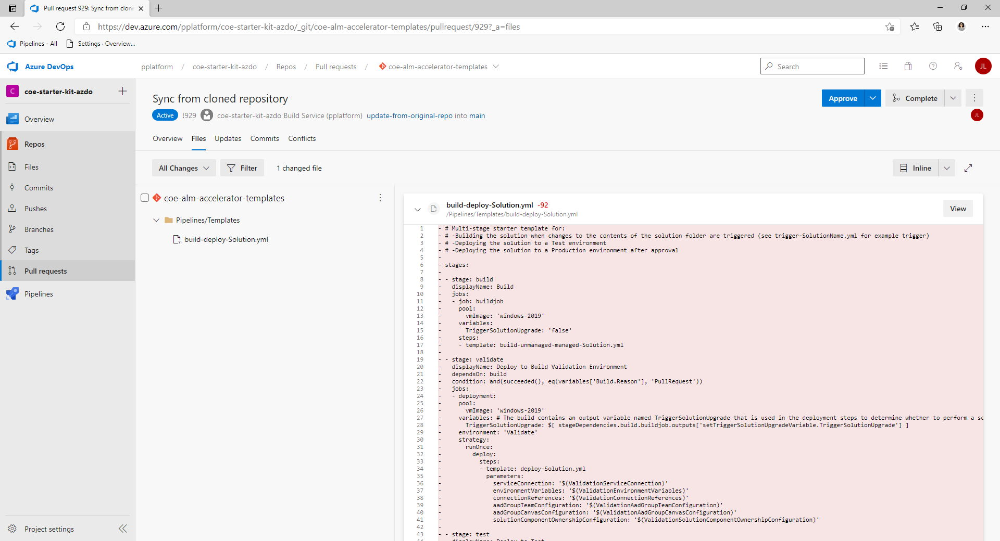

# ALM Accelerator for Advanced Makers Pipeline Sync (Preview)

>  [!NOTE] ALM Accelerator for Advanced Makers is currently in public preview. Please see Issues currently tagged as [vnext](https://github.com/microsoft/coe-starter-kit/issues?q=is%3Aopen+is%3Aissue+label%3Aalm-accelerator+label%3Avnext) for the Roadmap to be completed prior to general availability. While in Public Preview it can be expected that there will be breaking changes and frequent updates to address feedback from preview members. Additionally, the Public Preview is reliant on the experimental [Power Apps Source File Pack and Unpack Utility](https://github.com/microsoft/PowerApps-Language-Tooling) that is being developed separately from AA4AM.

## Pipeline Sync Setup

The Pipeline Sync script was created to make synchronizing the ALM Accelerator for Advanced Makers' (AA4AM) pipeline templates simpler. As the pipeline templates grow and change users are required to update the pipelines with each release of AA4AM. To simplify this process we created another pipeline template that will automatically sync your Azure DevOps repo with the pipeline template repo in GitHub. Follow the steps below to get started using the Pipeline Sync pipeline.

1. Initially, you will need to manually copy the pipeline templates from https://github.com/microsoft/coe-alm-accelerator-templates/blob/main/Pipelines/. Follow the steps in the [SETUPGUIDE.md](SETUPGUIDE.md#copy-the-YAML-pipelines-from-github-to-your-azure-devops-instance) to clone the pipeline template repo to your Azure DevOps repo.

1. In Azure DevOps go to **Pipelines** and **Create a New Pipeline**

1. Select **Azure Repos Git** for your code Repository and point to Azure DevOps repo you created and seeded with the pipeline templates in step 1.
   

1. On the **Configure your pipeline** page select **Existing Azure Pipelines YAML file** and point to **/Pipelines/sync-pipeline-repo.yml** and Select **Continue**.
   

1. On the next screen Select **Save** and then Select the **3 dots next to Run Pipeline** and Select **Rename/Move**.
   

1. Update the pipeline name to **sync-pipeline-repo** and select **Save**.

1. Set the **TEMPLATE-REPO pipeline variable** to https://github.com/microsoft/coe-alm-accelerator-templates

   > [!NOTE] The Sync Pipeline can be used to sync any GitHub repo to Azure DevOps. Setting the TEMPLATE-REPO to the source GitHub repo allows you to specify the source of the sync.

   

1. Run the new Pipeline

   

8. Enter the name of the **SourceBranch**, **BranchToCreate** in Azure DevOps and the **TargetBranch** (e.g. main) and **Select Run**

   

9. After the Pipeline runs a Pull Request will be created for the **BranchToCreate** into the **TargetBranch**. To commit the changes **Approve and Complete the Pull Request**.

   