# ALM Accelerator Sample Solution Setup (Preview)

>  [!NOTE] ALM Accelerator for Advanced Makers is currently in public preview. Please see Issues currently tagged as [vnext](https://github.com/microsoft/coe-starter-kit/issues?q=is%3Aopen+is%3Aissue+label%3Aalm-accelerator+label%3Avnext) for the Roadmap to be completed prior to general availability. While in Public Preview it can be expected that there will be breaking changes and frequent updates to address feedback from preview members. Additionally, the Public Preview is reliant on the experimental [Power Apps Source File Pack and Unpack Utility](https://github.com/microsoft/PowerApps-Language-Tooling) that is being developed separately from AA4AM.

When you create a solution in Dataverse you'll need to create pipelines specifically for that solution. Follow these steps for creating pipelines for the ALM Accelerator Sample Solution in Azure DevOps. There are sample pipelines included in the Pipeline directory in the CoE ALM Templates repo.

- https://github.com/microsoft/coe-alm-accelerator-templates/blob/main/Pipelines/build-deploy-validation-SampleSolution.yml
- https://github.com/microsoft/coe-alm-accelerator-templates/blob/main/Pipelines/build-deploy-test-SampleSolution.yml
- https://github.com/microsoft/coe-alm-accelerator-templates/blob/main/Pipelines/deploy-prod-pipelineartifact-SampleSolution.yml 

### Table of Contents
- [ALM Accelerator Sample Solution Setup](#alm-accelerator-sample-solution-setup)
  * [Table of Contents](#table-of-contents)
  * [Create the Solution Build and Deployment Pipeline(s)](#create-the-solution-build-and-deployment-pipelines)
    + [Create the Validation and Test Pipelines](#create-the-validation-and-test-pipelines)
    + [Create the Production Solution Deployment Pipeline](#create-the-production-solution-deployment-pipeline)
  * [Setting Branch Policies for Pull Request Validation](#setting-branch-policies-for-pull-request-validation)
  * [Setting Deployment Pipeline Variables](#setting-deployment-pipeline-variables)
    + [Create Environment and Service Connection](#create-environment-and-service-connection)
    + [Create Deployment Configuration](#create-deployment-configuration)
- [Importing the Solution and Configuring the ALM Accelerator App](#importing-the-solution-and-configuring-the-alm-accelerator-app)
- [Test the ALM Accelerator App](#test-the-alm-accelerator-app)

### Create the Solution Build and Deployment Pipeline(s)

Solution Pipelines are used to build and deploy your source controlled solutions to environments in your tenant. The sample pipelines provided assume 3 environments (Validation, Test and Production). Repeat the steps in the next section for the Validation and Test environments and then move to the following section to configure the Production pipeline.

#### Create the Validation and Test Pipelines

In this step you'll be creating the Validation and Test Pipelines for reference your pipelines will follow this configuration

| Pipeline YAML File Name                    | Pipeline Name                    | Branch Policy Enabled |
| ------------------------------------------ | -------------------------------- | --------------------- |
| build-deploy-validation-SampleSolution.yml | deploy-validation-SampleSolution | Yes                   |
| build-deploy-test-SampleSolution.yml       | deploy-test-SampleSolution       | No                    |

1. In Azure DevOps go to the **Repo** that contains the [Pipelines folder you committed](SETUPGUIDE.md#copy-the-YAML-pipelines-from-github-to-your-azure-devops-instance) and select the Pipelines folder

1. Open the sample deployment pipeline (i.e. **build-deploy-validation-SampleSolution.yml or build-deploy-test-SampleSolution.yml**) and copy the YAML to use in your new Pipeline. **Note the name of this repo** for use in your pipeline.

   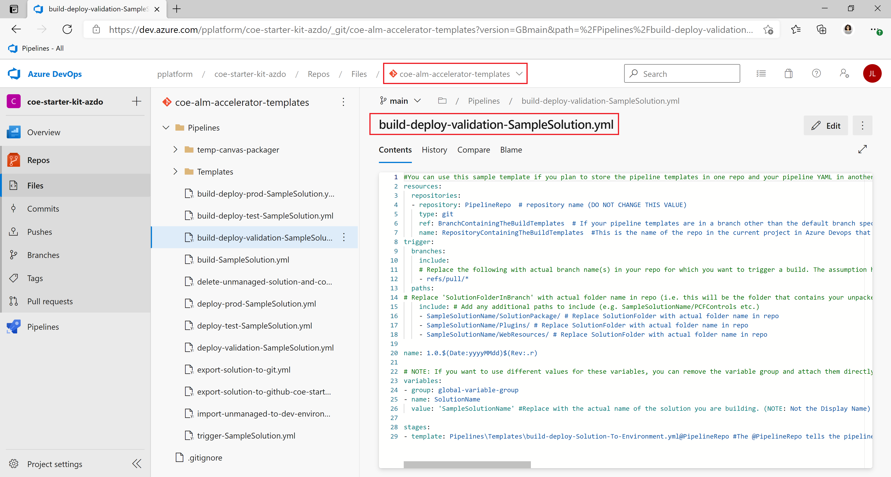

1. Navigate to the **Repo where you want to source control the ALM Accelerator Sample Solution**.
   
1. Create a new Branch based on **your default branch** in the Repo called **ALMAcceleratorSampleSolution**
   
   >  [!NOTE] This branch will be your v-next branch in the repo. All development work should be branched from this branch to a developers personal working branch and then merged into the v-next branch in order to push to Validation and Testing. Later when a release is ready the v-next branch can be merged into the main or default branch.
   
   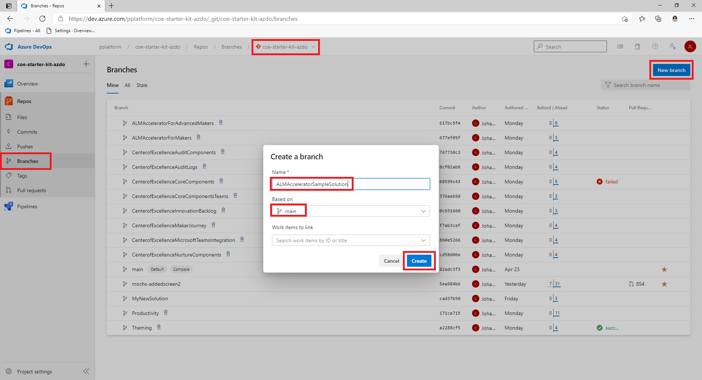
   
1. Select **New** from the top menu and then **Folder**
   
   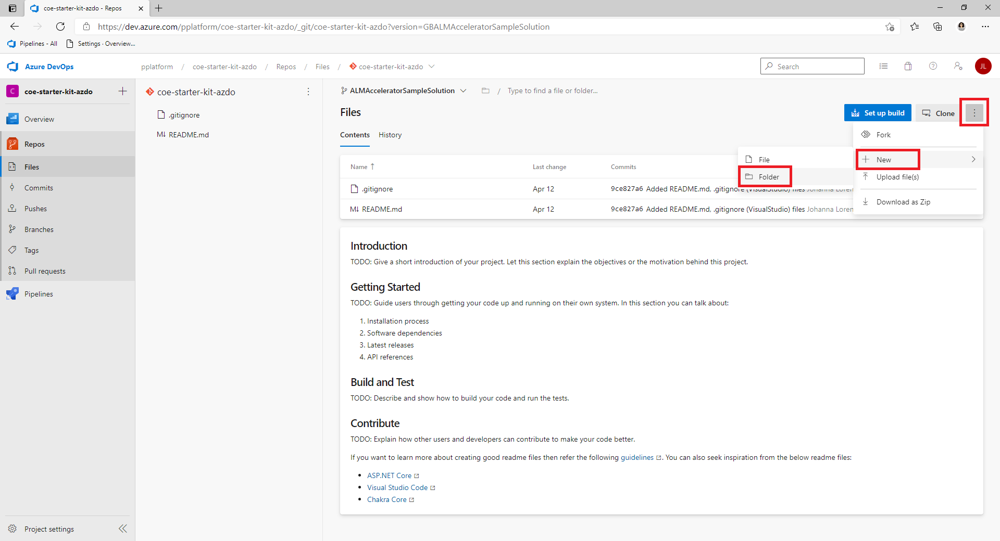
   
1. Give the new Folder the name **ALMAcceleratorSampleSolution** and the new Pipeline YAML file a name (e.g. **build-deploy-validation-ALMAcceleratorSampleSolution.yml** or **build-deploy-test-ALMAcceleratorSampleSolution.yml**). Select **Create**.

   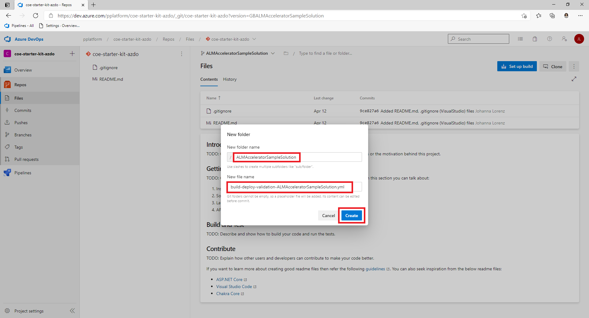

1. Paste the YAML from **build-deploy-validation-SampleSolution.yml** or **build-deploy-test-SampleSolution.yml** into your new Pipeline YAML file.

   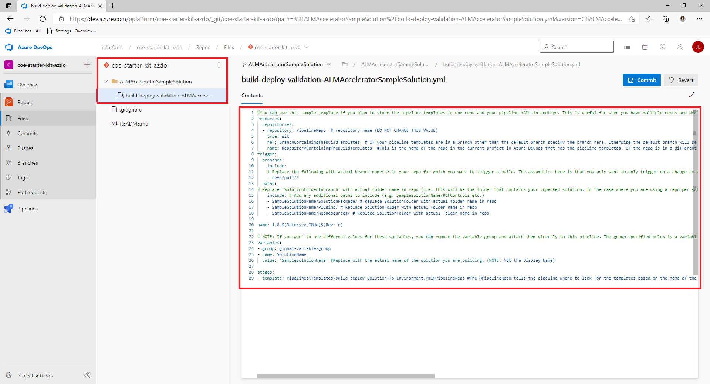

1. Update the following values in your new Pipeline YAML.

   - Change the **resources -> repositories -> name**  to the repo name that contains your pipeline templates. If your template repository is in another AzDO project you can use the format **projectname/reponame** here. In this case the repo is called **coe-alm-accelerator-templates** (remember we told you to remember the pipeline repo name?) and it exists in the same project as our **ALMAcceleratorSampleSolution repo**. Additionally, you can specify a branch for where your templates live using the **ref** parameter if required.

      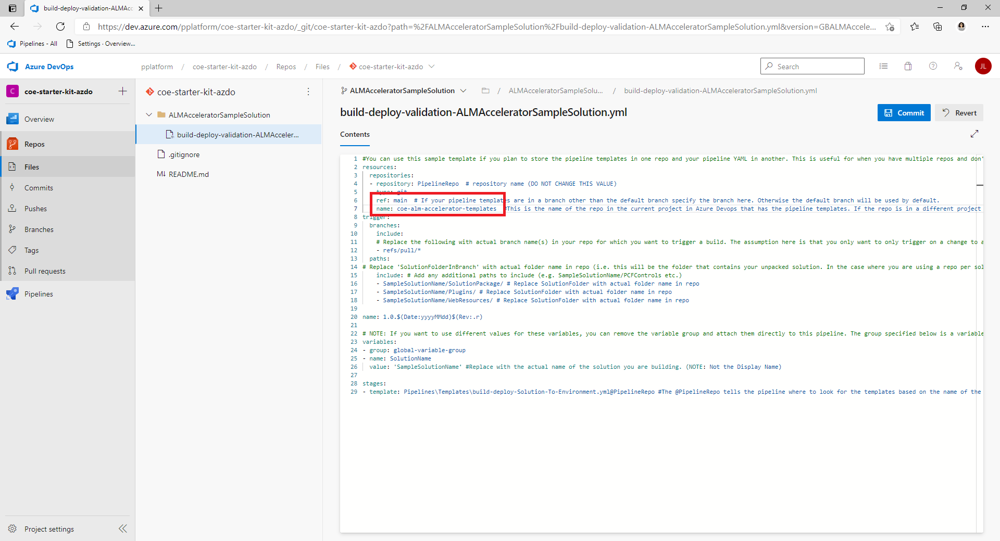

    - Change any value that references **SampleSolutionName** to the unique name of the ALM Accelerator Sample Solution (i.e. **ALMAcceleratorSampleSolution**).

      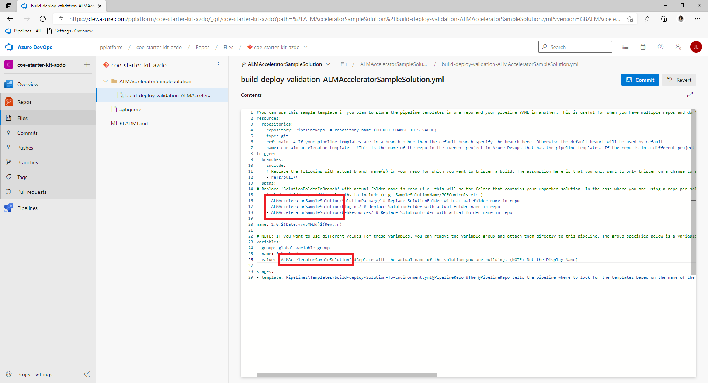

    - Select **Commit** to save your changes.

1. In Azure DevOps go to **Pipelines** and **Create a New Pipeline**

1. Select **Azure Repos Git** for your code Repository.
   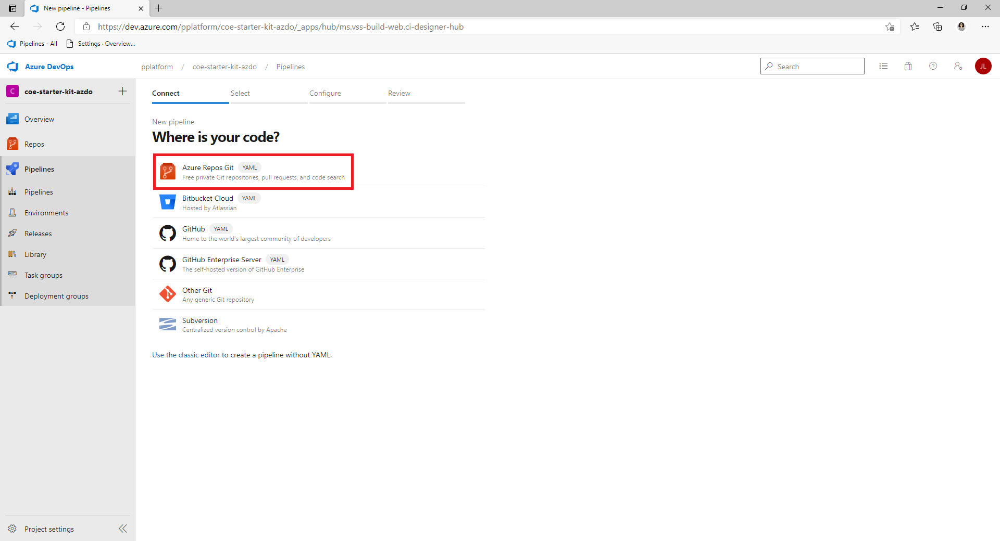

1. Select the **Azure DevOps repo** which contains the deployment **Pipeline YAML created above**.

    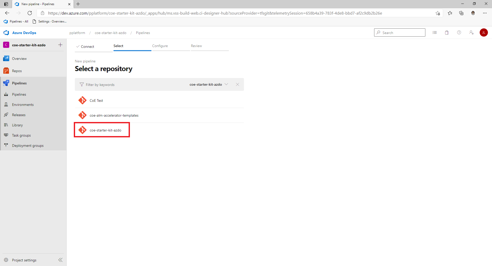

1. On the **Configure your pipeline** page select **Existing Azure Pipelines YAML file**, point to the **YAML File in your repo that you created in step 5** and Select **Continue**.
   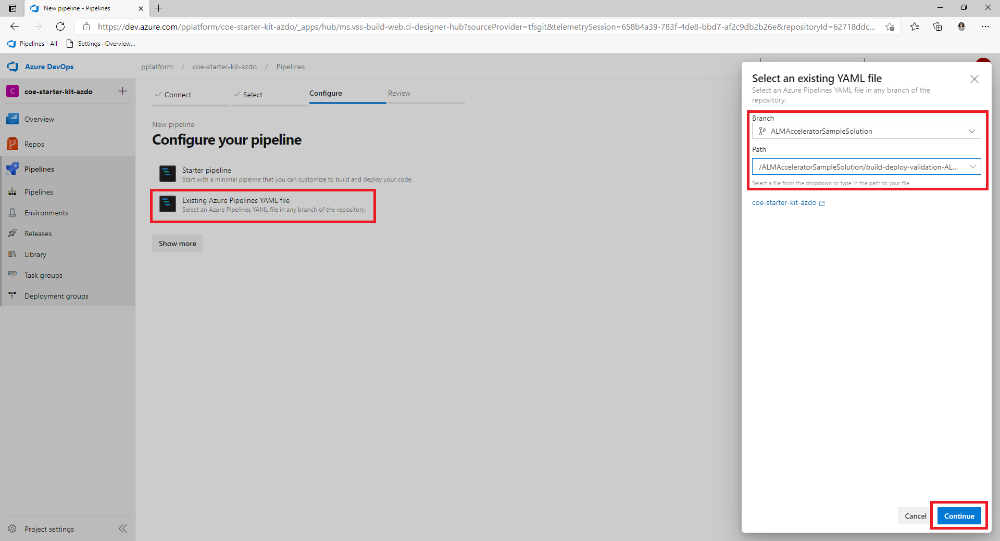

1. On the next screen Select **Save** and then Select the 3 dots next to Run Pipeline and Select **Rename/Move**.
   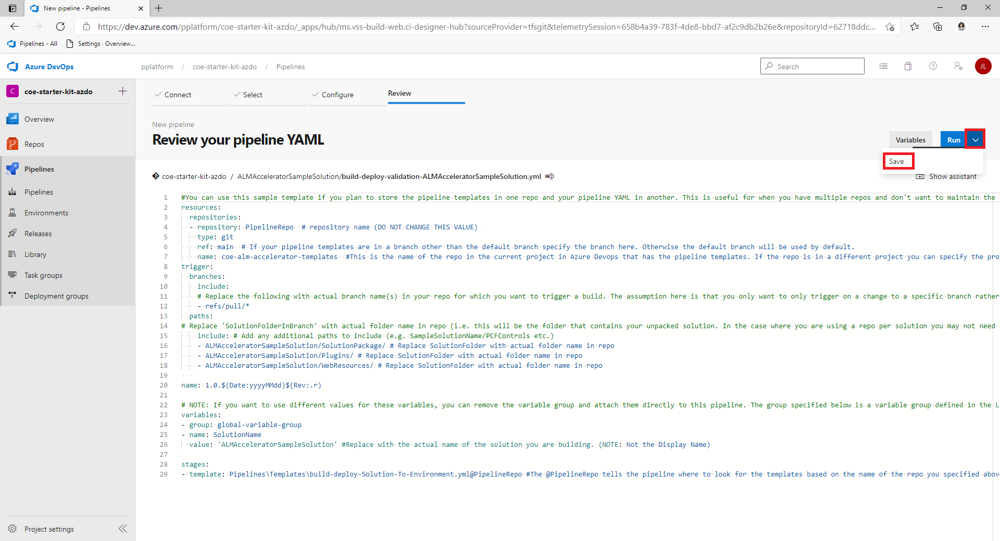

   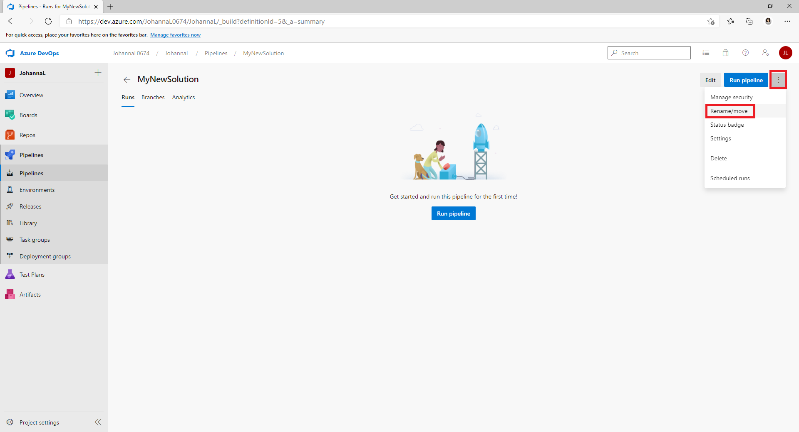
   
1. Update the pipeline name to **deploy-validation-ALMAcceleratorSampleSolution** or **deploy-test-ALMAcceleratorSampleSolution** (where 'ALMAcceleratorSampleSolution' is the name of the ALM Accelerator Sample Solution) and select **Save**.

    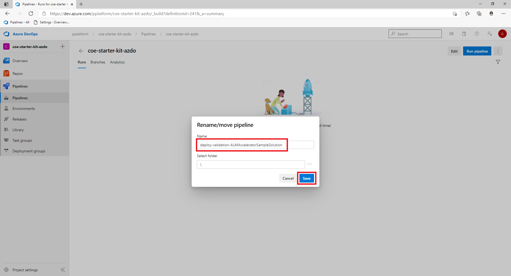

1. Update the **Default branch for manual and scheduled builds**

   - Select Edit on your new Pipeline

   - **Select the 3 dots** on the top right and **Select Triggers**

   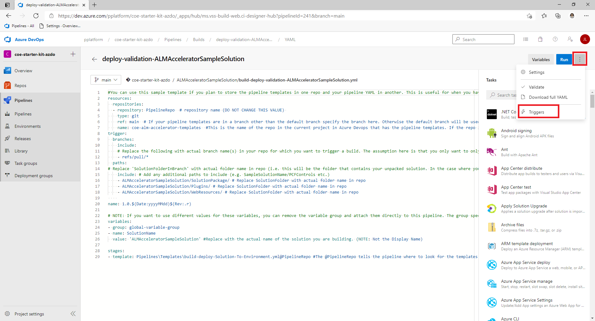

   - **Select the YAML tab** and **Select Get Sources**. 

   - Update the **Default branch for manual and scheduled builds** to point to your **Solution branch**

   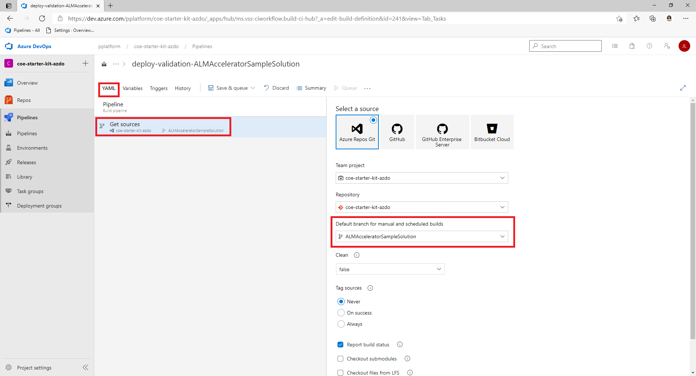

   - **Drop-down and Select Save** (not Save & queue) to save the pipeline

1. Repeat the steps above to create a deployment pipeline for each of your environments referencing the sample deployment pipeline YAML from the **coe-alm-accelerator-templates repo** (i.e. deploy-test-SampleSolution.yml).

#### Create the Production Solution Deployment Pipeline

As mentioned in the note above, the previous section allows you to create pipelines that build and deploy for each environment (Validation, Test and Production). However, if you want to only build and deploy for Validation and Test and then deploy the artifacts from the Test build to Production you can follow these instructions to create your production deployment pipeline after you've created your build and deploy pipeline for Validation and Test above. For reference your pipeline will be configured as follows.

| Pipeline YAML File Name                      | Pipeline Name                            | Branch Policy Enabled |
| -------------------------------------------- | ---------------------------------------- | --------------------- |
| deploy-prod-ALMAcceleratorSampleSolution.yml | deploy-prod-ALMAcceleratorSampleSolution | No                    |

1. In Azure DevOps go to the **Repo** that contains the [Pipelines folder you committed](#copy-the-YAML-pipelines-from-github-to-your-azure-devops-instance) and select the Pipelines folder

1. Open the sample deployment pipeline (i.e. **deploy-prod-pipelineartifact-SampleSolution.yml**) and copy the YAML to use in your new Pipeline. **Note the name of this repo** for use in your pipeline.

   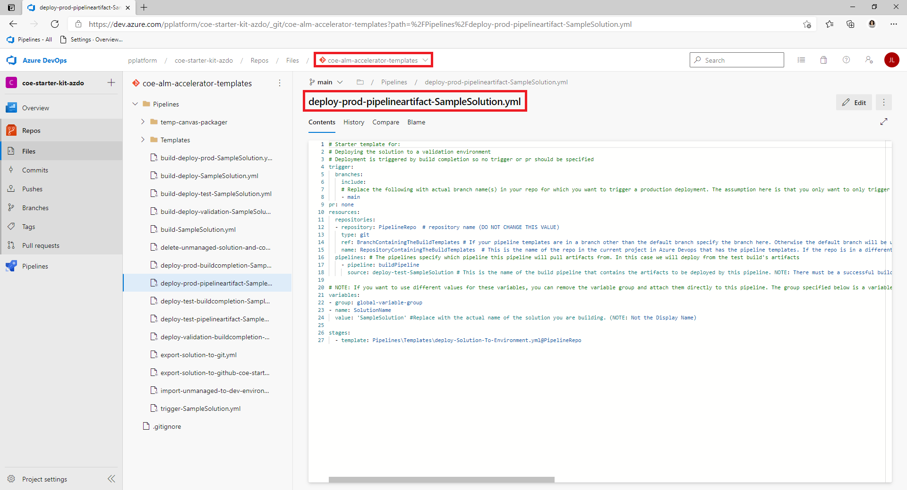

1. Navigate to the **Repo where you want to source control the ALM Accelerator Sample Solution**.

1. Navigate to the [SolutionName] subfolder and then Select **New** from the top menu and then **File**

   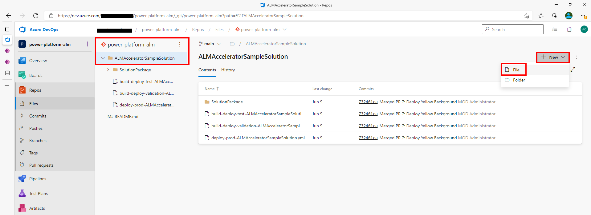

5. Give the new Pipeline YAML file a name (e.g. **deploy-prod-ALMAcceleratorSampleSolution.yml**). Select **Create**

   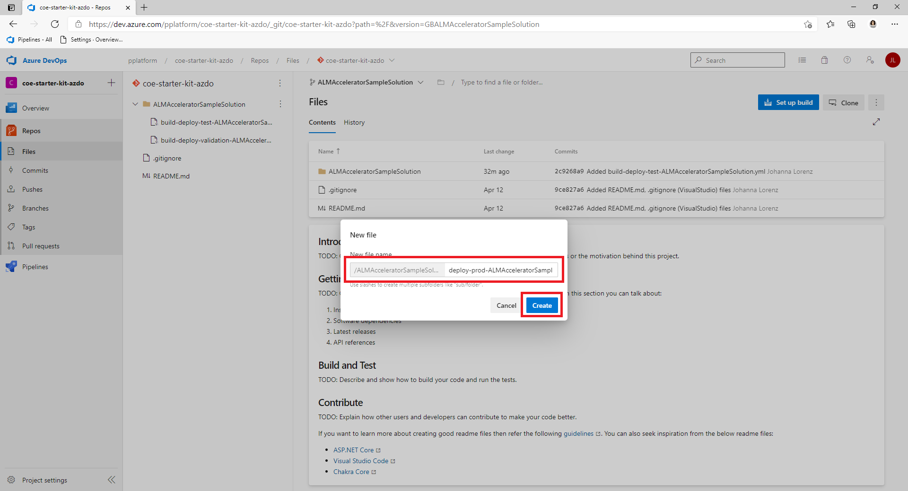

6. Paste the YAML from **deploy-prod-pipelineartifact-SampleSolution.yml** into your new Pipeline YAML file.

   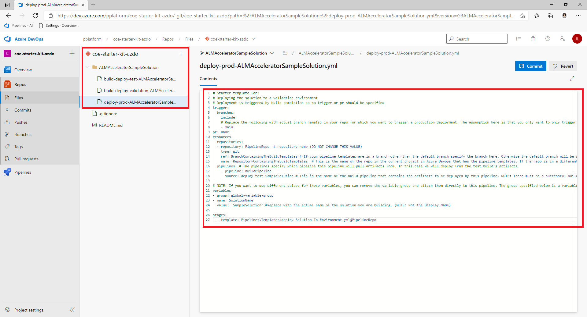

7. Update the following values in your new Pipeline YAML.

   - Update the **trigger -> branches -> include** to the branch(es) for which changes would trigger a deployment to production. 

   - Change the **resources -> repositories -> name** to the repo name that contains your pipeline templates. If your template repository is in another AzDO project you can use the format **projectname/reponame** here. In this case the repo is called **coe-alm-accelerator-templates** and it exists in the same project as our ALMAcceleratorSampleSolution repo. Additionally, you can specify a branch for where your templates live using the **ref** parameter if required.

     

   - Update **resources -> pipelines -> source** to specify **the build pipeline that contains the artifacts to be deployed** by this pipeline. In this case we are going to deploy the artifacts from our Test pipeline, created above, that built and deployed our ALMAcceleratorSampleSolution to the Test environment.

     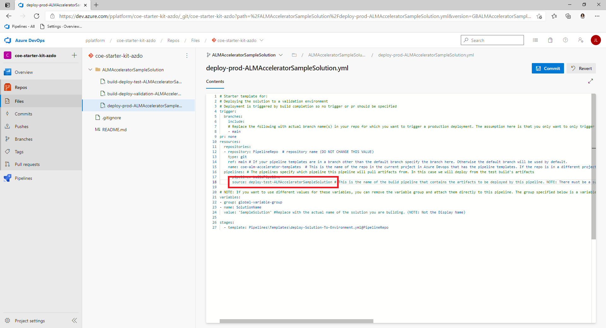

   - Change any value that references **SampleSolutionName** to the unique name of the ALM Accelerator Sample Solution (i.e. **ALMAcceleratorSampleSolution**).

     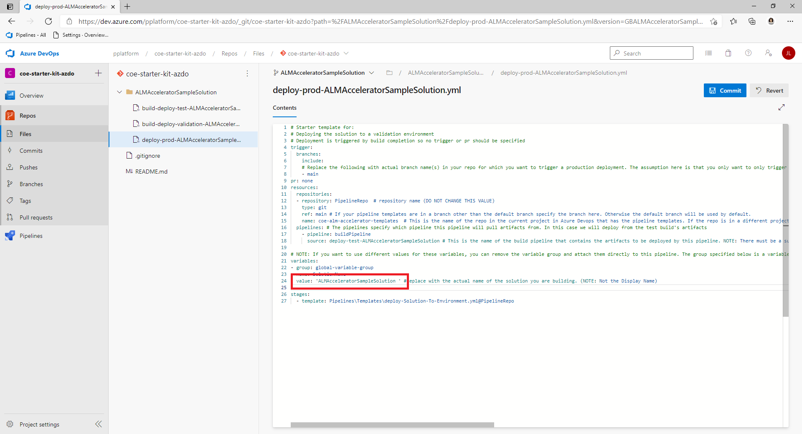

   - Click **Commit** to save the changes to your repository.

8. Repeat the same steps 9-15, performed above, for **deploy-validation-ALMAcceleratorSampleSolution** and **deploy-test-ALMAcceleratorSampleSolution** to create a pipeline from the new production pipeline YAML called **deploy-prod-ALMAcceleratorSampleSolution**.

### Setting Branch Policies for Pull Request Validation

In order to leverage executing the build pipeline for the ALM Accelerator Sample Solution when a **Pull Request is created** you'll need to create a **Branch Policy** to execute the **Validation Pipeline** you created in the previous step. Use the following steps to set your Branch Policy. For more information on Branch Policies see here https://docs.microsoft.com/en-us/azure/devops/repos/git/branch-policies?view=azure-devops

1. In Azure DevOps go to **Repos** and select the **Branches** folder

1. Locate the **target branch** on which you want to run the **Pull Request policy** and select the ellipsis to the right of the target branch and Select **Branch Policies**.

   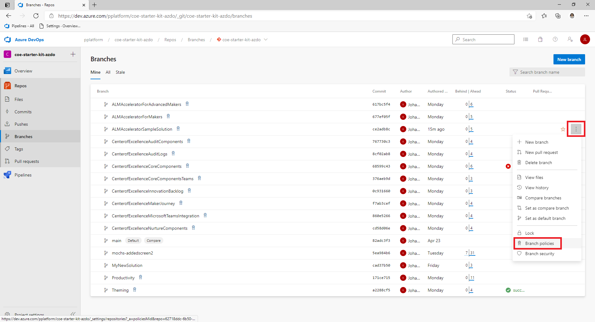

1. On the **Branch Policies** screen go to **Build Validation**

1. Click the **+ Button** to add a **new Branch Policy**

   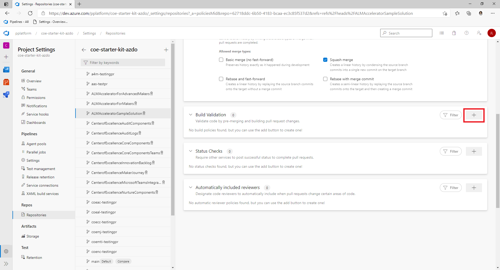

1. Select the Pipeline you just created from the **Build pipeline** dropdown

1. Specify a **Path filter** (if applicable). The path filter will ensure that only changes to the path specified will trigger the pipeline for your Pull Request.

1. Set the **Trigger** to **Automatic**

1. Set the **Policy requirement** to **Required**

1. Set the **Build expiration** to **Immediately**

1. Set a **Display name** for your Branch Policy (e.g. PR Build Validation)

1. Click **Save**

   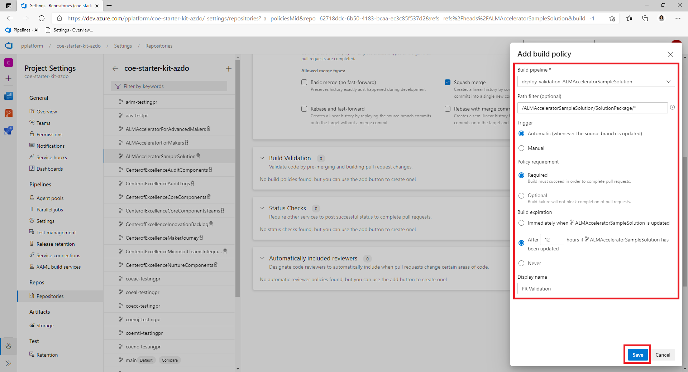

### Setting Deployment Pipeline Variables

The ALM Accelerator uses json formatted Pipeline variables for updating **connection references, environment variables, setting permissions for AAD Groups and Dataverse teams** as well as **sharing Canvas Apps and updating ownership of solution components** such as Power Automate flows. **EnvironmentName** and **ServiceConnection** variables are **required** for each pipeline. All other pipeline variables are **optional** and depend on what type of components the ALM Accelerator Sample Solution pipelines deploy. For instance, if the ALM Accelerator Sample Solutions only contain Dataverse Tables, Columns and Model Driven Apps **some of these steps may not be necessary** and can be skipped. The following variables allow you to fully automate the deployment of the ALM Accelerator Sample Solutions and specify how to configure items that are specific to the environment to which the solution is being deployed.

> [!IMPORTANT] These pipeline variables will be set for each **deployment pipeline** you've configured above based on the environment to which your pipeline deploys.

#### Create Environment and Service Connection

These variables are required by every deployment pipeline. The Environment variable is **EnvironmentName** and the Service Connection variable is **ServiceConnection**.

The **EnvironmentName** variable is used to specify the Azure DevOps environment being deployed to in order to enable tracking deployment history and set permissions and approvals for deployment to specific environments. Depending on the environment to which you're deploying set this value to **Validate, Test or Production** For more information on Environments in AzureDevOps see https://docs.microsoft.com/en-us/azure/devops/pipelines/process/environments.

1. Open the pipeline you created previously (**deploy-validation-ALMAcceleratorSampleSolution**, **deploy-test-ALMAcceleratorSampleSolution** or **deploy-production-ALMAcceleratorSampleSolution**) and **Select Edit**

   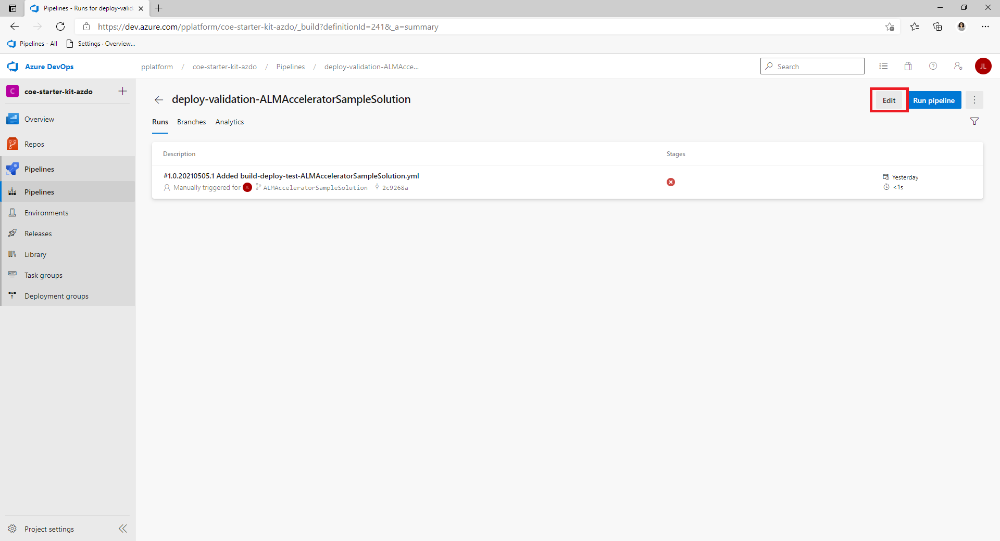

2. **Select Variables**

   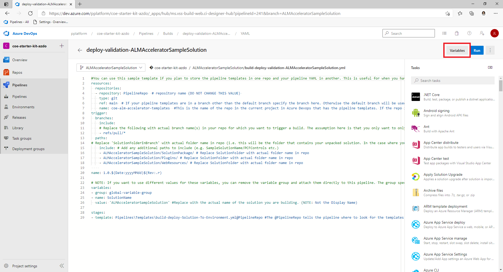

3. Select New Variable

   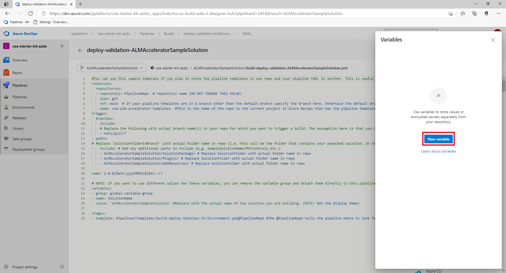

4. In the New Variable Screen Enter "**EnvironmentName**" for the Name and either (**Validate, Test or Production**) for the Value depending on which pipeline you are editing and **Select OK**

   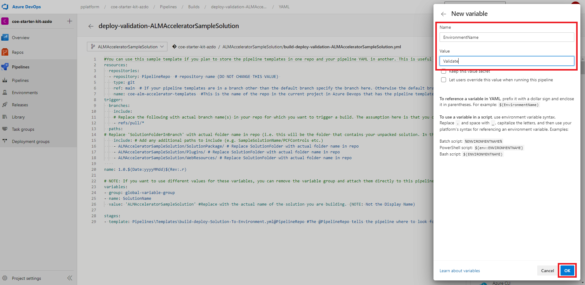

5. Repeat the steps above to create the **ServiceConnection** variable. This is used to specify how the deployment pipeline connects to the Power Platform. The values used for the Service Connection variable are the names of the Service Connections created during setup [Create a Service Connection for DevOps to access Power Platform](SETUPGUIDE.md#create-service-connections-for-devops-to-access-power-platform)

   > [!NOTE] The Value for the ServiceConnection variable must be identical to the Name of the Service Connection. Including any trailing slashes.

   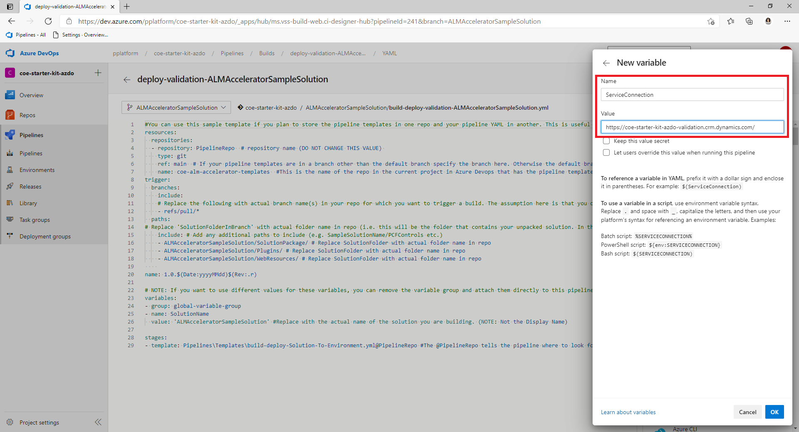

6. Repeat adding the **EnvironmentName** and **ServiceConnection** for each of the pipelines created above (i.e. **deploy-test-ALMAcceleratorSampleSolution** and **deploy-production-ALMAcceleratorSampleSolution**)

#### Create Deployment Configuration

To configure your pipelines to update **connection references, environment variables, set permissions for AAD Groups and Dataverse teams** as well as **sharing Canvas Apps and updating ownership of solution components** such as Power Automate flows follow the instructions in the [DEPLOYMENTCONFIGGUIDE](DEPLOYMENTCONFIGGUIDE.md).

## Importing the Solution and Configuring the ALM Accelerator App

To get started using the ALM Accelerator For Advanced Makers App follow the instructions in the [SETUPGUIDE](SETUPGUIDE.md#importing-the-solution-and-configuring-the-app).

## Test the ALM Accelerator App

1. Download the **latest unmanaged solution** of the **ALM Accelerator Sample Solution** from the latest release of the ALM Accelerator For Advanced Makers on GitHub (https://github.com/microsoft/coe-starter-kit/releases).

    > [!NOTE] The screenshot below is for reference as to where the unmanaged solution exists under a release. The actual version should be the most recent release.
    
    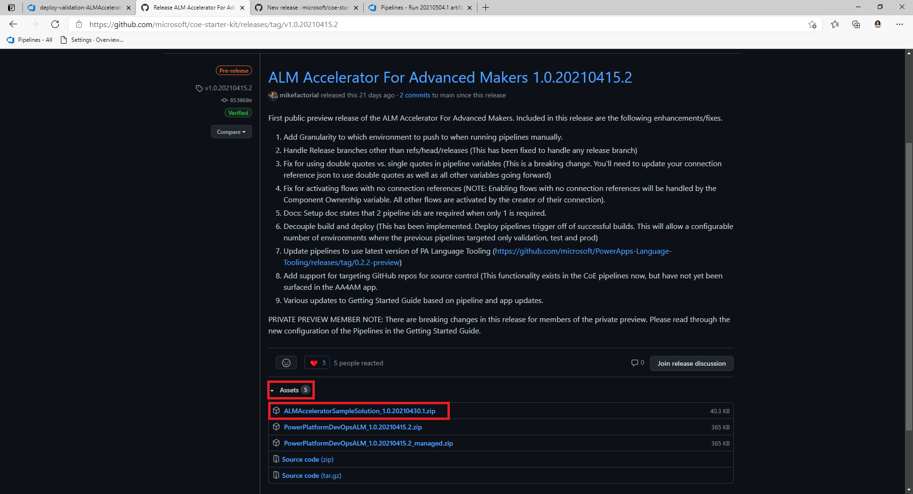

1. Import the solution into a developer environment

1. Once the solution is installed run the ALM Accelerator For Advanced Makers App.

    > [!NOTE] When you first launch the app you may need to consent to the app using your connections.
    
1. Select the **Cog** in the top right to select your **Azure DevOps Environment**, **Project** and **Repo** to which you'll push your changes and submit your pull requests and select **Save**
   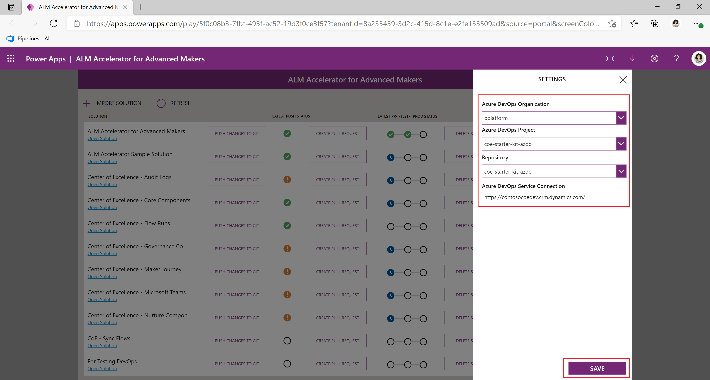

   > [!NOTE] If you don't see your DevOps Organization / Project in the dropdown double check that the Custom connector is working correctly after updating it's Security settings.
   
1. From the Environment Drop Down **Select the Dataverse Environment** in which you will be doing your development work.
   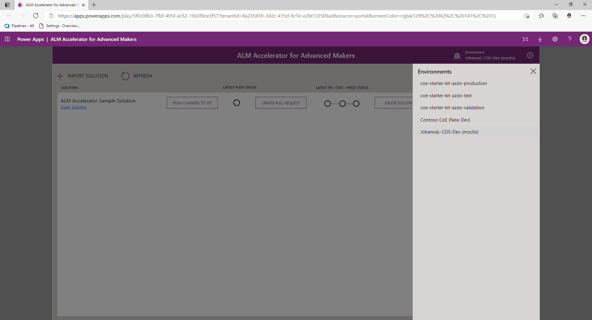

   > [!NOTE] In order for your Environment to show up in this drop down a service connection in the Azure DevOps project you just selected is required (see [Create a Service Connection for DevOps to access Power Platform](SETUPGUIDE.md#create-service-connections-for-devops-to-access-power-platform). Additionally, verify that you've followed the steps to reconnect the flow above if you do not see any environments in the list.
   
1. By default the **unmanaged solutions**, including the **ALM Accelerator Sample Solution**, in your Environment should be displayed in the main window with buttons to **Push Changes** and **Create Pull Requests**.

1. Now that the ALM Accelerator Sample Solution is imported into Dataverse you can push your changes to Git using the **Push Changes to Git** button for the ALM Accelerator Sample Solution.
   
   - Select an **existing branch** or **create a new branch** based on an existing branch and enter a **comment**. Use the hashtag notation e.g. `#123` to link the changes to a specific work item in Azure DevOps and Select **Commit**.
   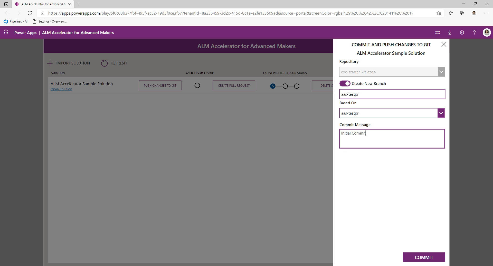
   >[!NOTE]: There is an option to specify if the latest changes contain Delete Components. This allows the user to specify whether to perform an **update** or an **upgrade** of the solution when it is deployed. The former will increase the performance of the pipelines and reduce the overall time to deploy.
   - When the push begins a waiting indicator will appear. If the push is successful a checkbox will appear otherwise a red x will appear. In order to see the progress of your push select the progress indicator which will take you to the running pipeline in Azure DevOps.
   - Note that the first time you run the pipeline, you may need to give it permission to run in the Azure DevOps interface (see the [Troubleshooting](./SETUPGUIDE.md#Troubleshooting) section of the Setup Guide for more information)
   
1. Once the initial push completes successfully you validate that the changes were exported to your branch.
   
   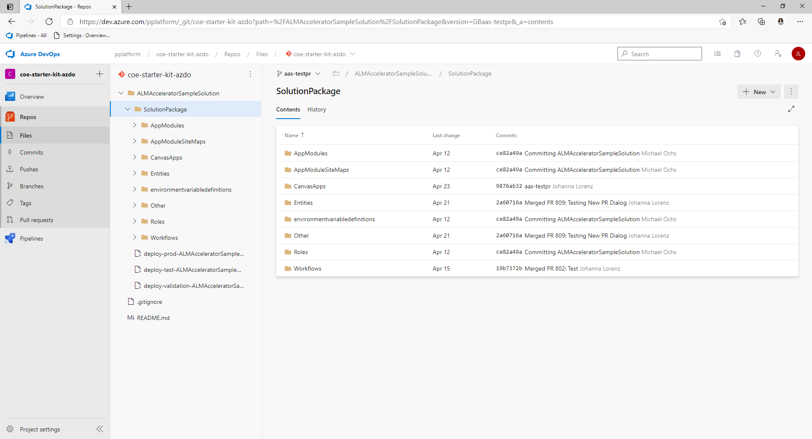
   
1. Next make a small change to the Solution by selecting Open Solution from the ALM Accelerator App.
   
   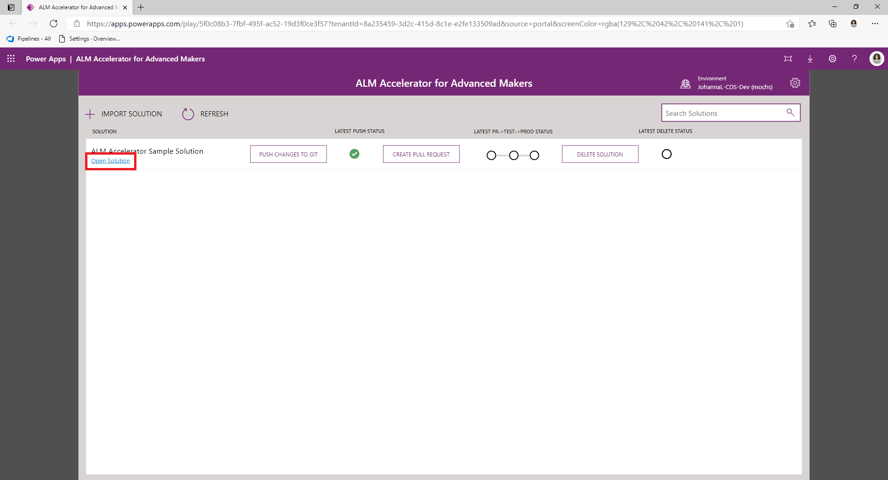
   
1. Find the **DevOpsKitSampleCanvasApp** and **Select the Ellipses** then **Select Edit**
   
   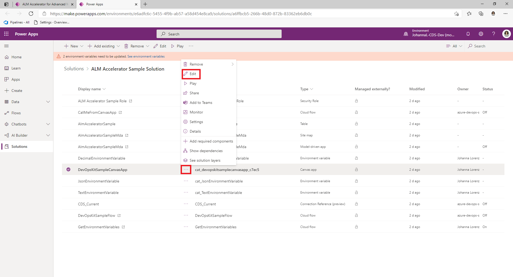
   
1. In the Canvas Editor Menu **Select Insert then Label**.
   
1. Position the new label on the App and **set the Text value**
   
   
   
1. Select **File** from the Canvas Editor Menu and **Select Save** then **Publish**
   
   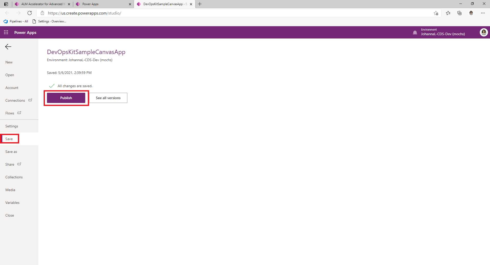
   
1. Return to the ALM Accelerator App and **Select the Configure Deployment Settings link** under the name of the Solution.
   
   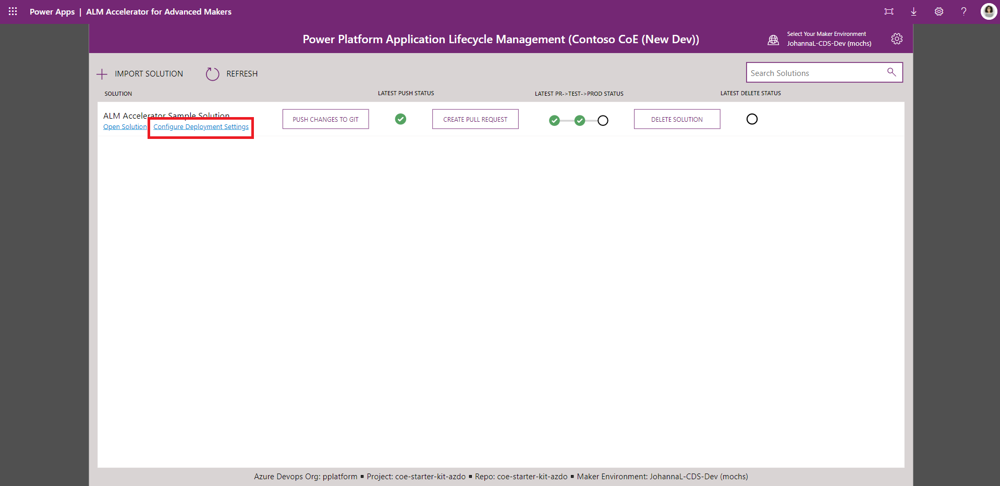On the configuration deployment page you will see the following items
   
   - Deployment Environments
   
     
   
     - The environments listed here are based on the pipeline(s) configured for the solution in Azure DevOps. In the example above we have 3 pipelines configured in Azure DevOps for this solution deploy-validation-ALMAcceleratorSampleSolution, deploy-test-ALMAcceleratorSampleSolution and deploy-prod-ALMAcceleratorSampleSolution. **The app will look for pipelines named deploy-*-UniqueSolutionName to populate this list. If you have named your pipelines different than the pattern above you won't be able to use the deployment configuration functionality.**
   
   - Connection References
   
     
   
     - This screen lists all of the connection references in your solution and allows users to create connections in their downstream environments to hook up the connection references in the target environment.
     - To create a new connection **select the + button**.
     - After creating a new connection **select the refresh button** in the top right to get the latest list of connections.
     - To select an existing connection in the target environment **select a connection from the dropdown list**.
     - To Navigate to the connection in the target environment **select the name or the status of the connection**.
   
   - Environment Variables
   
     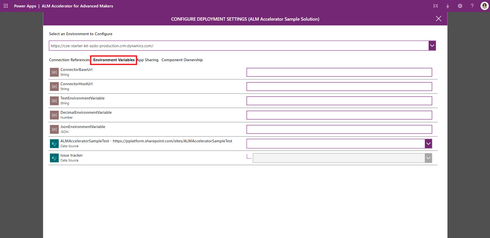
   
     - This screen lists all of the environment variables in your solution and allows users to set the value of the environment variables in the downstream environment.
     - For standard environment variables (e.g. String, Number, JSON) **enter the value in the text box** to the right of the environment variable name
     - For data source environment variables **use the dropdowns to select the appropriate data source** to use in the downstream environment.
   
   - App Sharing
   
     
   
     - This screen lists all of the apps in your solution and allows users to share the apps in the downstream environment with an Azure AAD Group.
     - Use  the dropdown to **select the Azure AAD group** with which you'd like to share the app. 
     - To view the Group details **select the details icon**. This will launch a new browser window with a link to the AAD Group in the Azure Portal.
     - To set the permissions **select the permissions dropdown** and set the permissions to either Can View, Can Edit or Can View and Share.
   
   - Component Ownership
   
     
   
     - This screen lists all of the Flows in your solution and allows users to update the owner of the Flow in the downstream environment by selecting a Dataverse user.
     - Use  the **dropdown to select a Dataverse user** to own the Flow in the downstream environment.
     - To view the Flow **select the name of the Flow** to open a new window with the Flow Definition.
   
1. After configuring your deployment configuration settings, return to the ALM Accelerator App and **Select Push Changes to Git** again and repeat the steps above except this time commit to the branch you already created.
   
   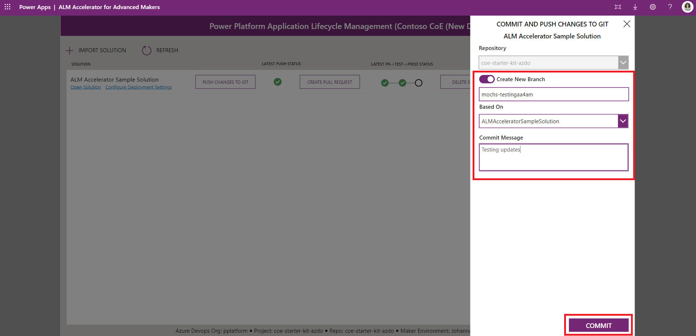
   
   >[!NOTE]: Be sure to publish your changes before initiating the push.
   14. Once the **latest changes are Committed** create a new Pull Request by **Selecting Create Pull Request**
   
   - Specify the **Source and Target branch** and enter a **Title and Comment** for your Pull Request and **Select Create**.
   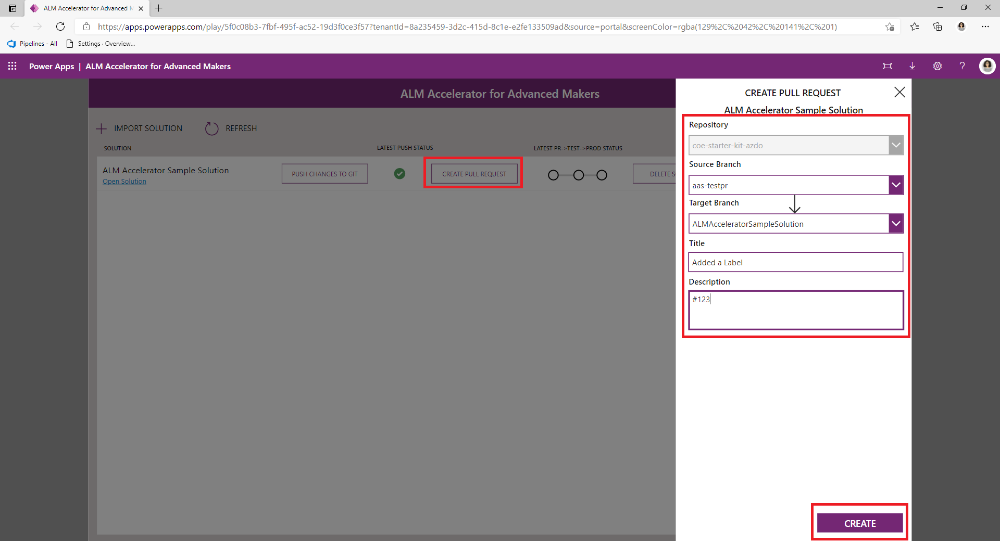
   
1. Once a Pull Request is created for your changes the remaining steps to Merge and Release to Test occur in Azure DevOps. 

1. Select the Icon under the **Latest PR** Column to Launch Azure DevOps and **View the Pull Request**

    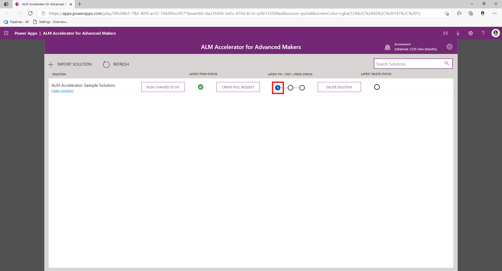

1. Verify that your **Validation Build Branch Policy** was created successfully in the Pull Request by confirming that the Validation Build is running.

     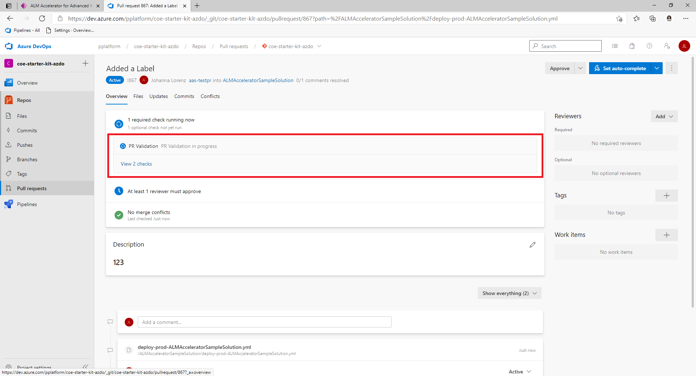

1. Very that your changes are reflected in the PR by Selecting Files and Finding your Canvas App MainScreen.fx.yaml.

     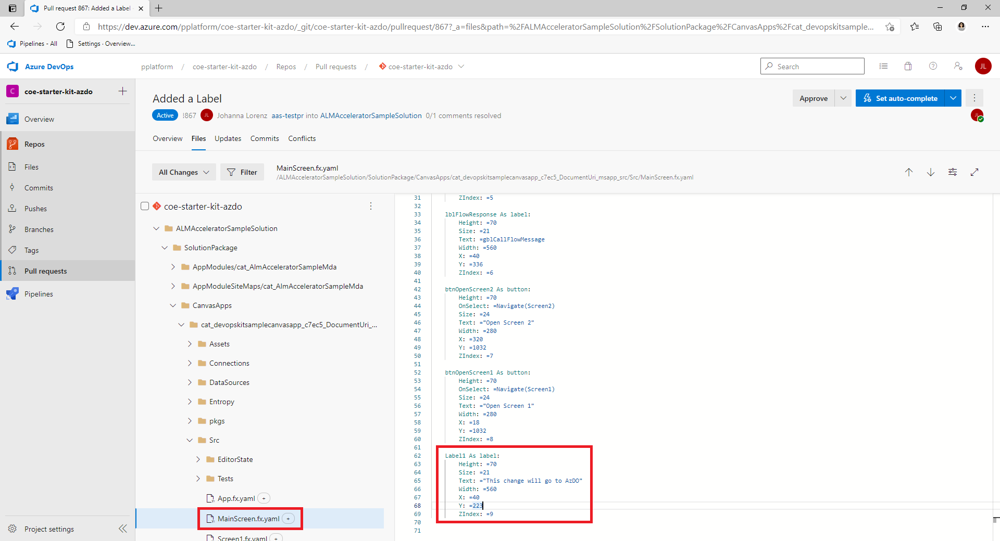

1. Once the **PR Validation Build** completes **Select Approve** then **Select Complete** and **Select Complete merge**.

     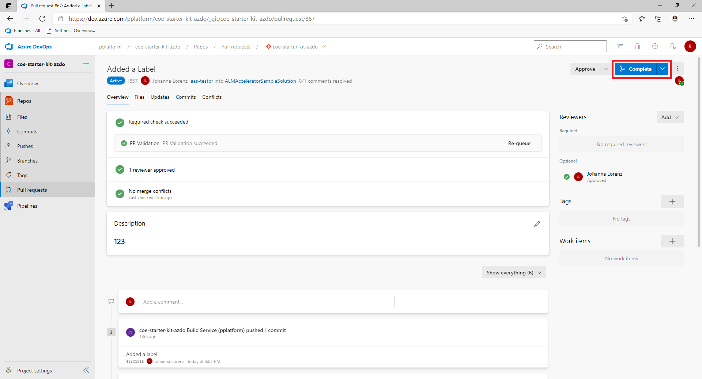

1. After the Merge completes navigate back to the **ALM Accelerator App** and verify that the **Test Deployment** is in Progress.

     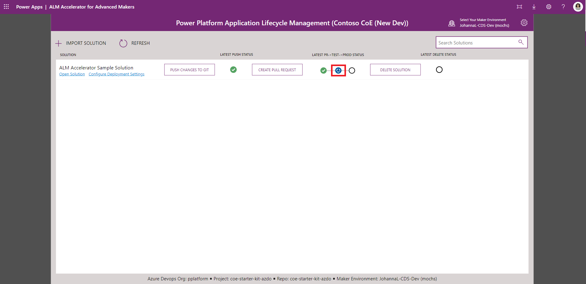

1. After the ALM Accelerator Sample Solution has been deployed to Validation and Test you can validate that the changes appear in both environments and that your environment variables, connection references and sharing has been successfully configured in each of the environments.

     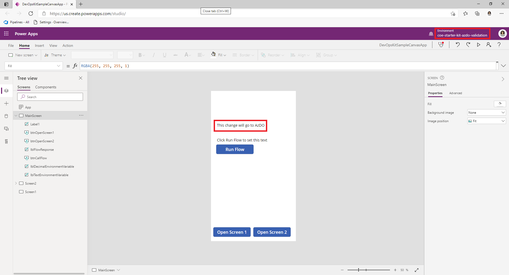

1. The final step is to deploy your Solution to the **production environment**.

     - Create a new Pull Request in Azure DevOps that will pull the changes in ALMAcceleratorSampleSolution branch into the main branch and enter any required information.

       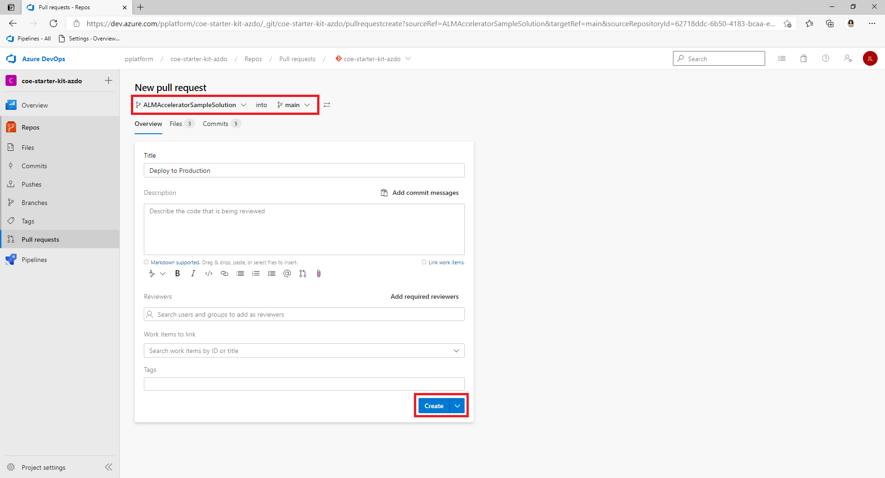

     - This time you will notice that there is **no Build Validation Policy enforcement** since we are only running the build validation for the ALMAcceleratorSampleSolution branch and **not the main branch**.

       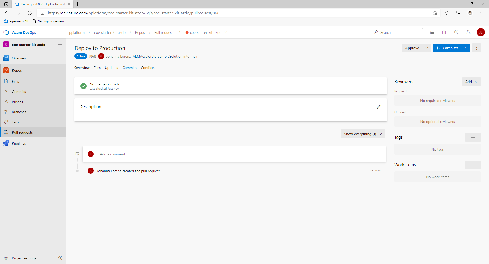

     - **Approve and Complete** the Pull Request as before and verify that the **deploy-prod-ALMAcceleratorSampleSolution** pipeline runs to push your changes to Production.

       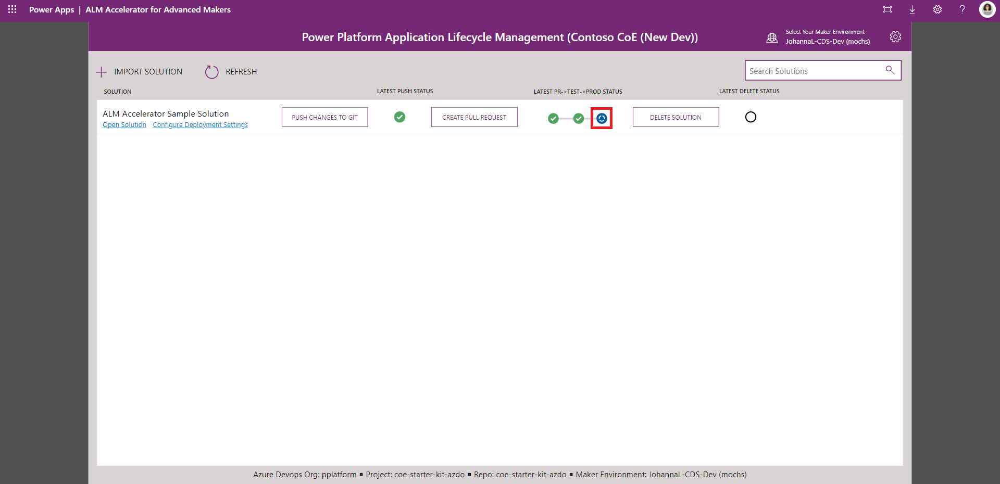

     - Once the pipeline for deploying to Production is finished you will see the status of the deployment in the App similar to the other stages.

       

     