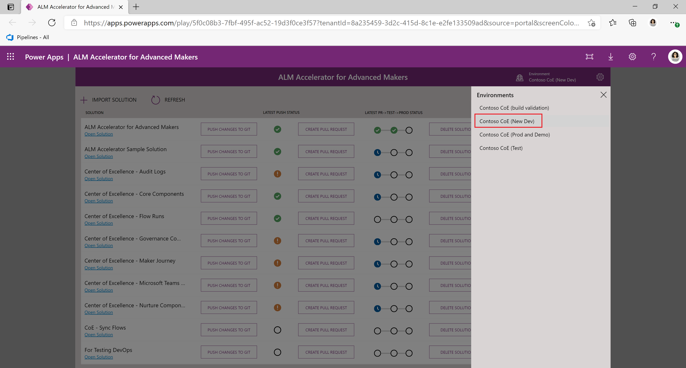
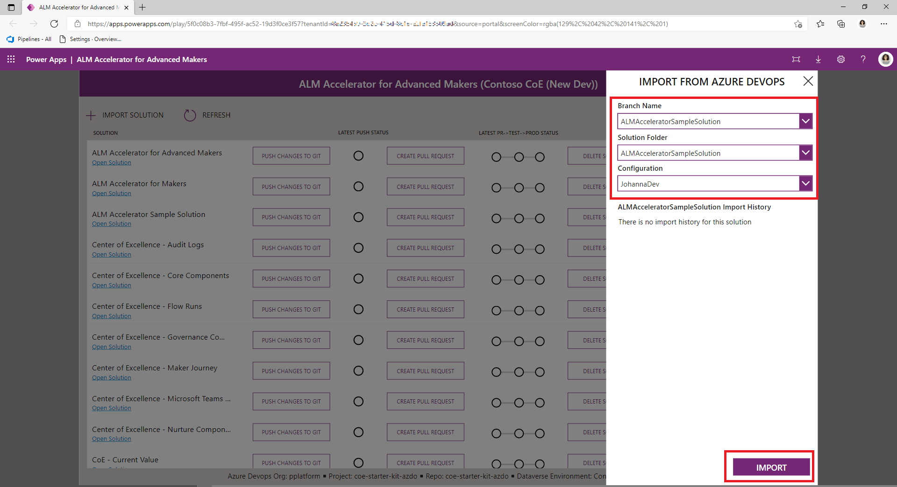
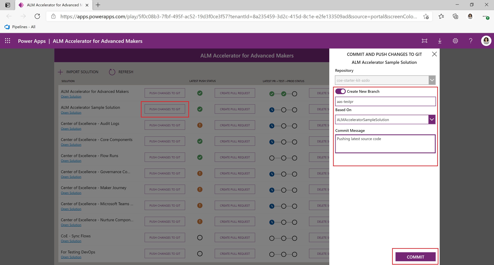
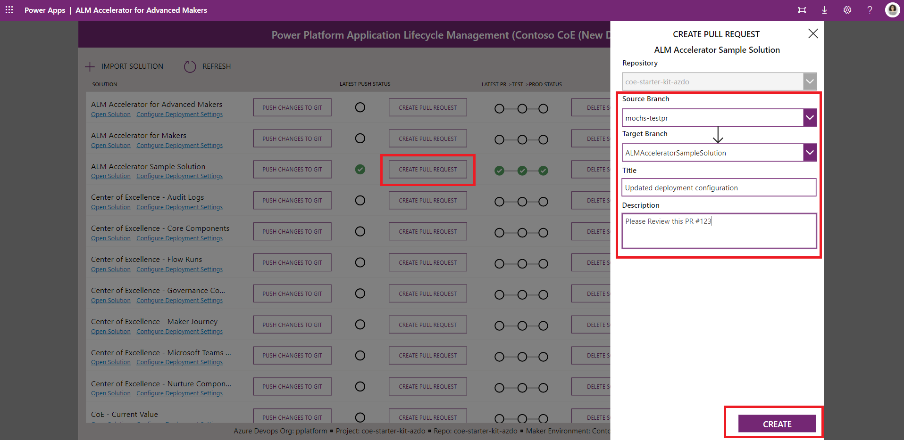
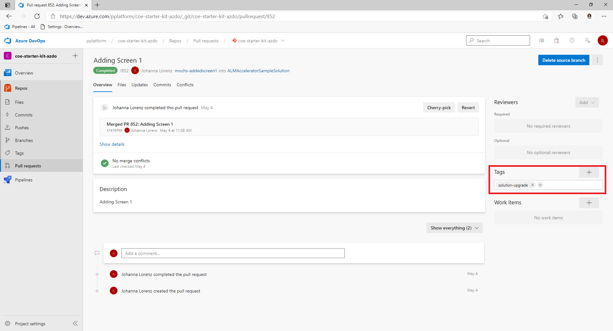
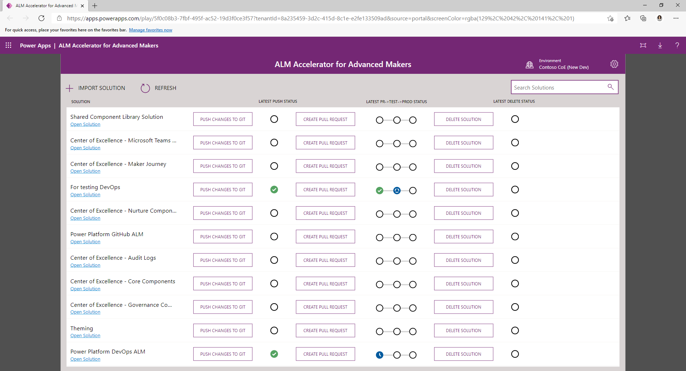

# Use the ALM Accelerator for Advanced Maker App

1. Once the app is installed and configured launch it from your Environment under Apps.

   > [!NOTE] When you first launch the app you may need to consent to the app using your connections.

1. Select the **Cog** in the top right to select your **Azure DevOps Environment**, **Project** and **Repo** to which you'll push your changes and submit your pull requests and select **Save**
   

   > [!NOTE] If you don't see your DevOps Organization / Project in the dropdown double check that the Custom connector is working correctly after updating it's Security settings.

1. From the Environment Drop Down **Select the Dataverse Environment** in which you will be doing your development work.
   

   > [!NOTE] In order for your Environment to show up in this drop down a service connection in the Azure DevOps project you just selected is required (see [Create a Service Connection for DevOps to access Power Platform](#create-service-connections-for-devops-to-access-power-platform). Additionally, verify that you've followed the steps to reconnect the flow above if you do not see any environments in the list.

1. By default the **unmanaged solutions** in your Environment should be displayed in the main window with buttons to **Push Changes** and **Create Pull Requests**.

1. To import an unmanaged solution from an existing Azure DevOps project to begin making changes select the **+ Import Solutions** button and select a solution and version.

   > [!NOTE] the solutions available are based on previous builds of your pipelines. The idea is that others have previously built the solutions and you are pulling the latest copy of the solution into your new development environment. If the solution has never been built previously you would begin with the next step.

   

1. Once your solution is imported into Dataverse, or you've created a new unmanaged solution and made your customizations, you can push your changes to Git using the **Push Changes to Git** button for your solution.

   >[!NOTE]: Be sure to publish your changes before initiating the push. If a newly created solution doesn't show in your list immediately. Click the Refresh button to reload all solutions.

   - Select an **existing branch** or **create a new branch** based on an existing branch and enter a **comment**. Use the hashtag notation e.g. `#123` to link the changes to a specific work item in Azure DevOps and Select **Commit**.
     

   >[!NOTE]: There is an option to specify if the latest changes contain Delete Components. This allows the user to specify whether to perform an **update** or an **upgrade** of the solution when it is deployed. The former will increase the performance of the pipelines and reduce the overall time to deploy.

   - When the push begins a waiting indicator will appear. If the push is successful a checkbox will appear otherwise a red x will appear. In order to see the progress of your push select the progress indicator which will take you to the running pipeline in Azure DevOps.
   - Repeat the pushes as you iterate on your solution.

1. When you are ready to create a pull request for the changes to your branch select the Create Pull Request button.

   >[!NOTE]: Be sure to publish your changes before initiating the push.

   - Specify the Source and Target branch and enter a Title and Comment for your Pull Request and Select Create.**
     

1. Once a Pull Request is created for your changes the remaining steps to Merge and Release to Test occur in Azure DevOps. Depending on the Branch Policies and Triggers configured for your Target Branch, an Azure DevOps user can approve or reject your Pull Request based on their findings in the submitted changes and that status will appear in the App. 

1. In order to initiate a **solution upgrade** in the target environment you can tag a Pull Request with the **solution-upgrade** tag. 

   

1. Approving the PR will initiate the deployment of your solution to the Test environment. If the Pull Request is approved you will see the progress move to Test and a status based on the pipeline's success or failure in that stage.

   

1. For Production a Pull Request will need to be created in Azure DevOps that merges the changes into your Production release branch. The same approval process will be required depending on your branch policies and once the PR is completed your solution will be pushed to Production. Once the pipeline for deploying to Production is finished you will see the status of the deployment in the App.