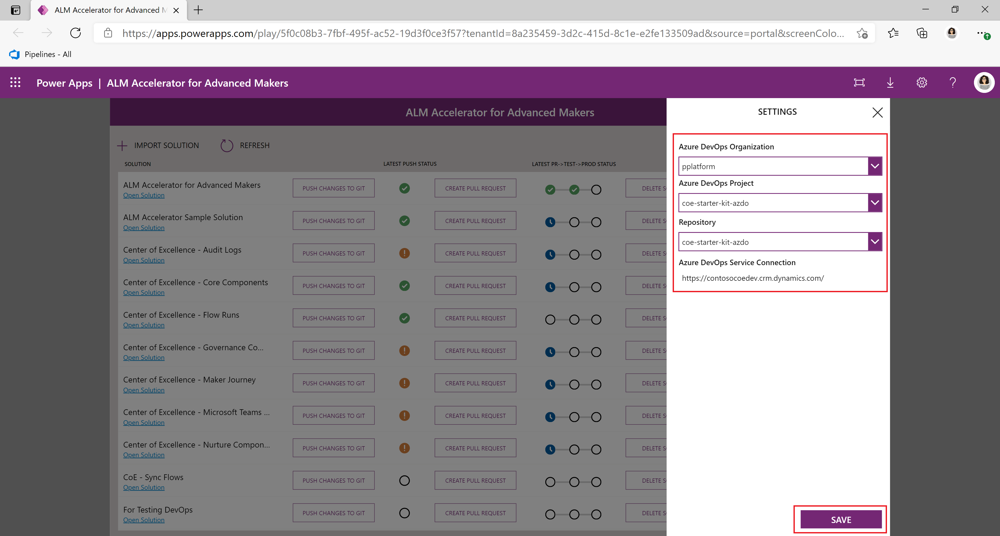
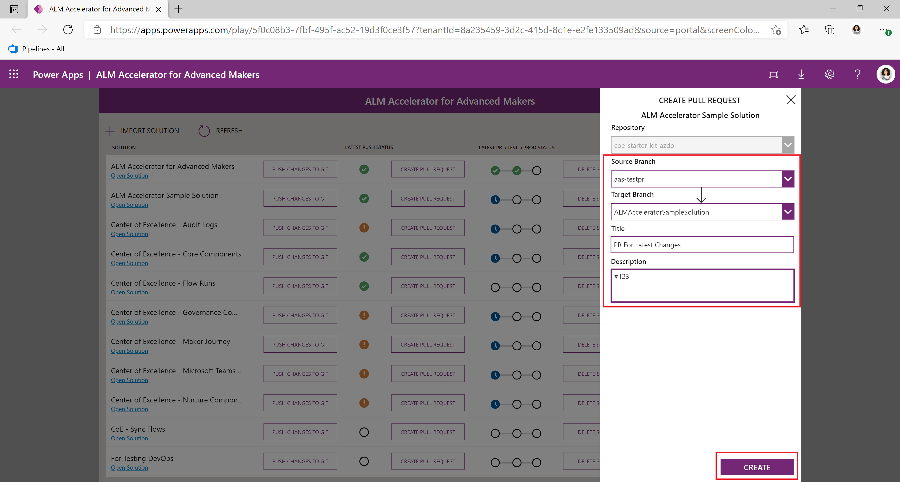

# Use the ALM Accelerator for Advanced Maker App (Preview)

>  [!NOTE] ALM Accelerator for Advanced Makers is currently in public preview. Please see Issues currently tagged as [vnext](https://github.com/microsoft/coe-starter-kit/issues?q=is%3Aopen+is%3Aissue+label%3Aalm-accelerator+label%3Avnext) for the Roadmap to be completed prior to general availability. While in Public Preview it can be expected that there will be breaking changes and frequent updates to address feedback from preview members. Additionally, the Public Preview is reliant on the experimental [Power Apps Source File Pack and Unpack Utility](https://github.com/microsoft/PowerApps-Language-Tooling) that is being developed separately from AA4AM.

1. Once the app is installed and configured launch it from your Environment under Apps.

   > [!NOTE] When you first launch the app you may need to consent to the app using your connections.

1. Select the **Cog** in the top right to select your **Azure DevOps Environment**, **Project** and **Repo** to which you'll push your changes and submit your pull requests and select **Save**
   

   > [!NOTE] If you don't see your DevOps Organization / Project in the dropdown double check that the Custom connector is working correctly after updating it's Security settings.

1. From the Environment Drop Down **Select the Dataverse Environment** in which you will be doing your development work.
   

   > [!NOTE] In order for your Environment to show up in this drop down a service connection in the Azure DevOps project you just selected is required (see [Create a Service Connection for DevOps to access Power Platform](SETUPGUIDE.md#create-service-connections-for-devops-to-access-power-platform). Additionally, verify that you've followed the steps to reconnect the flow above if you do not see any environments in the list.

1. By default the **unmanaged solutions** in your Environment should be displayed in the main window with buttons to **Push Changes** and **Create Pull Requests**.

1. To import an unmanaged solution from an existing Azure DevOps project to begin making changes select the **+ Import Solutions** button and select a **Branch Name, Solution Folder and Configuration (Optional)**.

   - **Branch Name** is based on the branches in Azure DevOps for the Project you selected in the configuration. 

   - **Solution Folder** is a list of folders in the selected branch that contain a **SolutionPackage folder** from a previous export.

   - **Configuration** is a directory under the config directory in the Solution Folder that contains deployment settings and configuration data. For more information on this see the [DEPLOYMENTCONFIGGUIDE](DEPLOYMENTCONFIGGUIDE.md)

   > [!NOTE] The idea here is that you are either pulling the latest from the Solution branch or possibly want to pull another makers branch into your own environment. The configuration allows you to ensure that all of the necessary post solution import configuration and data exists in your environment.

   

1. Once your solution is imported into Dataverse, or you've created a new unmanaged solution and made your customizations, you can begin configuring your solution for deployment.

1. **Select the Configure Deployment Settings link** under the name of the Solution. On the configuration deployment page you will see the following items

   - Deployment Environments

     

     - The environments listed here are based on the pipeline(s) configured for the solution in Azure DevOps. In the example above we have 3 pipelines configured in Azure DevOps for this solution deploy-validation-ALMAcceleratorSampleSolution, deploy-test-ALMAcceleratorSampleSolution and deploy-prod-ALMAcceleratorSampleSolution. **The app will look for pipelines named deploy-*-UniqueSolutionName to populate this list. If you have named your pipelines different than the pattern above you won't be able to use the deployment configuration functionality.**

   - Connection References

      
      
      - This screen lists all of the connection references in your solution and allows users to create connections in their downstream environments to hook up the connection references in the target environment.
      - To create a new connection **select the + button**.
      - After creating a new connection **select the refresh button** in the top right to get the latest list of connections.
      - To select an existing connection in the target environment **select a connection from the dropdown list**.
      - To Navigate to the connection in the target environment **select the name or the status of the connection**.
      
   - Environment Variables

      

      - This screen lists all of the environment variables in your solution and allows users to set the value of the environment variables in the downstream environment.
      - For standard environment variables (e.g. String, Number, JSON) **enter the value in the text box** to the right of the environment variable name
      - For data source environment variables **use the dropdowns to select the appropriate data source** to use in the downstream environment.

   - App Sharing

      

      - This screen lists all of the apps in your solution and allows users to share the apps in the downstream environment with an Azure AAD Group.
      - Use  the dropdown to **select the Azure AAD group** with which you'd like to share the app. 
      - To view the Group details **select the details icon**. This will launch a new browser window with a link to the AAD Group in the Azure Portal.
      - To set the permissions **select the permissions dropdown** and set the permissions to either Can View, Can Edit or Can View and Share.

   - Component Ownership

      
      
      - This screen lists all of the Flows in your solution and allows users to update the owner of the Flow in the downstream environment by selecting a Dataverse user.
      - Use  the **dropdown to select a Dataverse user** to own the Flow in the downstream environment.
      - To view the Flow **select the name of the Flow** to open a new window with the Flow Definition.

1. Once you've configured your solution, you can push your changes to Git using the **Push Changes to Git** button for your solution.

   >[!NOTE]: Be sure to publish your changes before initiating the push. If a newly created solution doesn't show in your list immediately. Click the Refresh button to reload all solutions.

   - Select an **existing branch** or **create a new branch** based on an existing branch and enter a **comment**. Use the hashtag notation e.g. `#123` to link the changes to a specific work item in Azure DevOps and Select **Commit**.
     

   - When the push begins a waiting indicator will appear. If the push is successful a checkbox will appear otherwise a red x will appear. In order to see the progress of your push select the progress indicator which will take you to the running pipeline in Azure DevOps.
   - Repeat the pushes as you iterate on your solution.
   
1. When you are ready to create a pull request for the changes to your branch select the Create Pull Request button.

   >[!NOTE]: Be sure to publish your changes before initiating the push.

   - Specify the Source and Target branch and enter a Title and Comment for your Pull Request and Select Create.**
     

1. Once a Pull Request is created for your changes the remaining steps to Merge and Release to Test occur in Azure DevOps. Depending on the Branch Policies and Triggers configured for your Target Branch, an Azure DevOps user can approve or reject your Pull Request based on their findings in the submitted changes and that status will appear in the App. 

1. In order to initiate a **solution upgrade** in the target environment you can tag a Pull Request with the **solution-upgrade** tag. 

   

1. Approving the PR will initiate the deployment of your solution to the Test environment. If the Pull Request is approved you will see the progress move to Test and a status based on the pipeline's success or failure in that stage.

   

1. For Production a Pull Request will need to be created in Azure DevOps that merges the changes into your Production release branch. The same approval process will be required depending on your branch policies and once the PR is completed your solution will be pushed to Production. Once the pipeline for deploying to Production is finished you will see the status of the deployment in the App.
