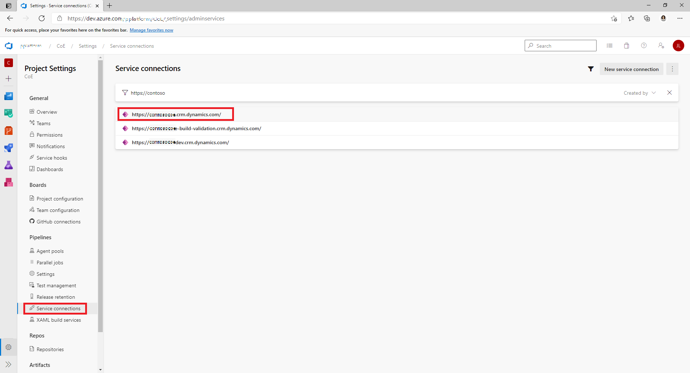
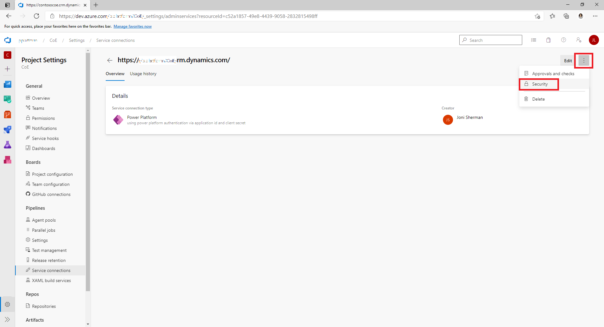

# ALM Accelerator for Advanced Maker User Setup (Preview)

>  [!NOTE] ALM Accelerator for Advanced Makers is currently in public preview. Please see Issues currently tagged as [vnext](https://github.com/microsoft/coe-starter-kit/issues?q=is%3Aopen+is%3Aissue+label%3Aalm-accelerator+label%3Avnext) for the Roadmap to be completed prior to general availability. While in Public Preview it can be expected that there will be breaking changes and frequent updates to address feedback from preview members. Additionally, the Public Preview is reliant on the experimental [Power Apps Source File Pack and Unpack Utility](https://github.com/microsoft/PowerApps-Language-Tooling) that is being developed separately from AA4AM.

The AA4AM App is intended to be used by makers to increase productivity while developing solutions in Power Platform. The following is instructions for the recommended setup of a maker's user account in Dataverse and Azure DevOps. It's recommended that you use Azure AD groups and Dataverse Group Teams to control access to Dataverse resources and Azure DevOps Groups to control access to Azure DevOps resources. However, assigning permissions on a user by user basis is possible as well.

## Dataverse User Setup

In order for users to be able to access the appropriate resources in Dataverse when running the AA4AM app. They must be assigned the appropriate roles in Dataverse. The recommended way of achieving this is to create a Group Team in Dataverse to which all of your makers will be added and assign the appropriate role(s) to the team. Setup a group team as follows and you will be able to manage your makers using Azure AD by adding and removing them from a Group.
1. Navigate to https://admin.powerplatform.microsoft.com/

1. **Select the Environment** in which the user exists
1. **Select See all under Teams** under the Access section
   
1. Select Create Team
   
1. Enter a **Team name, Business unit, Administrator and Select AAD Security Group as the Team type and Select a Membership Type and Select Next**.
   
1. On the Manage security roles page select the **ALM Power App Access** and **Basic User** role and **select Save**.

   

## Azure DevOps User Setup

In order for users to be able to use the service connection from the ALM Accelerator App the Service Connections must provide **User** permissions to all users to be able to use the Service Connections. Update Permissions as follows for environments that user's should be able to access from the App e.g. Development environment(s):

1. Select the **Service Connection** to be **shared with users** from the **Service Connections** list.
   
1. Select the **3 dots** in the top right corner and Select **Security**.
   
1. Select the **Group or User** you want to provide User permissions to in the Dropdown.
1. Select the **User** **Role** and Select **Add**
   