# Set up ALM Accelerator for Advanced Makers (AA4AM) components (Preview)

> [!NOTE] ALM Accelerator for Advanced Makers is currently in public preview. Please see Issues currently tagged as [vnext](https://github.com/microsoft/coe-starter-kit/issues?q=is%3Aopen+is%3Aissue+label%3Aalm-accelerator+label%3Avnext) for the Roadmap to be completed prior to general availability. While in Public Preview it can be expected that there will be breaking changes and frequent updates to address feedback from preview members. Additionally, the Public Preview is reliant on the experimental [Power Apps Source File Pack and Unpack Utility](https://github.com/microsoft/PowerApps-Language-Tooling) that is being developed separately from AA4AM.

The ALM Accelerator components enable makers to apply source control strategies using Azure DevOps and use automated builds and deployment of solutions to their environments without the need for manual intervention by the maker, administrator, developer, or tester. In addition the ALM Accelerator provides makers the ability to work without intimate knowledge of the downstream technologies and to be able to switch quickly from developing solutions to source controlling the solution and ultimately pushing their apps to other environments with as few interruptions to their work as possible.

The ALM Accelerator components solution doesn't have a dependency on other components of the CoE Starter Kit. It can be used independently.

## Before you start...

The following documentation is intended to be a step-by-step process for setting up AA4AM manually. However, **it is recommended that you use the [Center of Excellence Command Line Interface (coe-cli)](https://github.com/microsoft/coe-starter-kit/tree/main/coe-cli#readme) to assist in automating these steps**. This document will provide details and context for the actions that are performed by the coe-cli and act as a reference for those who want to know the specifics of each step in the process.


## Document structure

The GETTINGSTARTED.md is structured into 7 main sections

- **Prerequisites** - Considerations and requirements in order to complete the setup.
- **Foundational Setup** - This sections walks through the base setup of the AA4AM. The base setup consist of the steps and configurations required.
- **Development Project Setup** - This sections includes the steps required to set up a new Development Project covering project specific setup of Azure DevOps, generic build and deployment pipelines, Service Connections, Power Platform Environments and Application Users
- **Solution Setup** - These steps are specific to each solution you wish to support with the ALM Accelerator. The section covers setting up the solution specific pipelines, branch policies, deployment variables to support connections references, environment variables and AAD group sharing.
- **Importing the Solution and Configuring the App** - This section takes you through the steps required to import the actual AA4AM canvas app and configuring the included custom connector.
- **Using the ALM Accelerator App** - A short introduction to using the AA4AM canvas app
- **Troubleshooting** - A few pointers on some know issues and how to remediate these.

## Table of Contents

- Set up ALM Accelerator for Advanced Makers (AA4AM) components (Preview)
  * [Document structure](#document-structure)
  * [Table of Contents](#table-of-contents)
  * [Prerequisites](#prerequisites)
    + [Environments](#environments)
    + [Users and Permissions](#users-and-permissions)
    + [Connectors and DLPs](#connectors-and-dlps)
  * [Foundational Setup](#foundational-setup)
    + [Create an App Registration in your AAD Environment](#create-an-app-registration-in-your-aad-environment)
    + [Give Power App Management Permission to your App](#give-power-app-management-permission-to-your-app)
    + [Install Azure DevOps Extensions](#install-azure-devops-extensions)
    + [Clone the YAML Pipelines from GitHub to your Azure DevOps instance](#clone-the-yaml-pipelines-from-github-to-your-azure-devops-instance)
    + [Create Pipelines for Import, Delete and Export of Solutions](#create-pipelines-for-import-delete-and-export-of-solutions)
    + [Create Export Pipeline variables (Optional)](#create-export-pipeline-variables-optional)
    + [Create Pipeline global variables](#create-pipeline-global-variables)
    + [Update Permissions for the Project Build Service](#update-permissions-for-the-project-build-service)
  * [Development Project Setup](#development-project-setup)
    + [Create Service Connections for DevOps to access Power Platform](#create-service-connections-for-devops-to-access-power-platform)
    + [Create an App User in your Dataverse Environments](#create-an-app-user-in-your-dataverse-environments)
  * [Solution Setup](#solution-setup)
    + [Validate Your Setup Using the ALM Accelerator Sample Solution (Optional)](#validate-your-setup-using-the-alm-accelerator-sample-solution-optional)
    + [Create the Solution Build and Deployment Pipeline(s)](#create-the-solution-build-and-deployment-pipelines)
    + [Create the Solution Deployment Pipeline (Optional)](#create-the-solution-deployment-pipeline-optional)
    + [Setting Deployment Pipeline Variables](#setting-deployment-pipeline-variables)
      - [Create Environment and Service Connection (Required)](#create-environment-and-service-connection-required)
      - [Create EnableFlows Variable (Optional)](#create-enableflows-variable-optional)
    + [Setting Branch Policies for Pull Request Validation](#setting-branch-policies-for-pull-request-validation)
    + [Create Deployment Configuration (Optional)](#create-deployment-configuration-optional)
  * [Importing the Solution and Configuring the App](#importing-the-solution-and-configuring-the-app)
    + [Install ALM Accelerator Solution in Dataverse](#install-alm-accelerator-solution-in-dataverse)
    + [Configure the Azure DevOps Custom Connector](#configure-the-azure-devops-custom-connector)
  * [Setup Makers to Use the ALM Accelerator App](#setup-makers-to-use-the-alm-accelerator-app)
  * [Using the ALM Accelerator App](#using-the-alm-accelerator-app)
  * [Troubleshooting](#troubleshooting)


## Prerequisites

### Dataverse Environments

The application will manage deploying solutions from Development to Validation to Testing and to Production. The environment into which you are deploying the ALM Accelerator app will need to be created with a Dataverse database. Additionally, any target environment requires a Dataverse database in order to deploy your solutions.

> [!NOTE] Currently the ALM Accelerator is not compatible with Dataverse for Teams. Both the AA4AM App and the associated AzDO pipelines assume the full version of Dataverse is being used in all environments.

You'll need to **create an environment in which to set up the AA4AM Solution**. It's recommended to install AA4AM in the same environment as other CoE Starter Kit Solutions. For more information about how to decide on the best strategy for your organization, go [Establishing an Environment Strategy for Microsoft Power Platform](https://docs.microsoft.com/en-us/power-platform/guidance/adoption/environment-strategy) and [Environment strategy for ALM](https://docs.microsoft.com/en-us/power-platform/alm/environment-strategy-alm).

## Azure DevOps Environment

This solution uses Azure DevOps for source control and deployments (pipelines). You can sign up for Azure DevOps for free for up to 5 users on the [Azure DevOps](https://azure.microsoft.com/en-us/services/DevOps/) site.

### Users and Permissions

In order to complete the steps below you will need the following users and permissions in Power Platform, Azure DevOps and Azure.

- A licensed **Azure user** with Permissions to **create and view AAD Groups**, **create App Registrations** and **Grant Admin consent** to App Registrations in Azure Active Directory.
- A licensed **Azure DevOps** user with Permissions to **create and manage Pipelines, Service Connections, Repos and Extensions**.
- A licensed **Power Platform** user with Permissions to **create Application Users** and **grant Administrative Permissions** to the Application User.
- Ability to assign **Power Platform Admin level permissions** to an App Registration in Azure. See [Give Power App Management Permission to your App](#give-power-app-management-permission-to-your-app) for more information.

### Connectors and DLPs

For the AA4AM Canvas App to work as expected the following connectors must be available to be used together in the environment into which the ALM Accelerator solution is imported.

- [Dataverse (Legacy)](https://docs.microsoft.com/en-us/connectors/commondataservice/)
- [Power Apps for Makers](https://docs.microsoft.com/en-us/connectors/powerappsforappmakers/)
- [HTTP with Azure AD](https://docs.microsoft.com/en-us/connectors/webcontents/)
- ALM Accelerator Custom Azure DevOps

## Foundational Setup

The following steps will guide you through setting up the foundations of AA4AM. These steps are general to the functionality of the ALM Accelerator and not project or solution specific.

### Create an App Registration in your AAD Environment

Creating an App Registration for the ALM Accelerator is a one time setup step to grant permissions to the App and the associated pipelines the permissions required to perform operations in **Azure DevOps** and **Power Apps / Dataverse**. The steps below demonstrate creating a single app registration with the appropriate permissions for both Dataverse and Azure DevOps. However, you may **choose to separate responsibilities into specifically Dataverse and Azure DevOps as separate app registrations**.
Sign in to [portal.azure.com](https://portal.azure.com).

1. Go to **Azure Active Directory** > **App registrations**.
    

1. Select **New Registration** and give the registration a name (e.g. ALMAcceleratorServicePrincipal) leave all other options as default and select **Register**.

1. Select **API Permissions** > **+ Add a permission**.

1. Select **Dynamics CRM**, and configure permissions as follows:
    

1. Select **Delegated permissions**, and then select **user_impersonation**.
    

1. Select **Add permissions**.

1. Repeat adding permissions steps above for
    - **PowerApps-Advisor (Analysis All)** (Required for running static analysis via App Checker https://docs.microsoft.com/en-us/power-platform/alm/checker-api/overview). This permission can be found under **APIs my organization uses**.
      

    - **Azure DevOps**. (Required for connecting to Azure DevOps via the custom connector in the ALM Accelerator App). This permission can be found under **APIs my organization uses**.

    - <a name="azdoappid"></a>When adding the Azure DevOps permission go to APIs my organization uses and search for Azure DevOps and **copy the Application (client) ID**.

      > [!IMPORTANT] Disambiguation: We'll use this value later and specifically call it out as the **Azure DevOps Application (client) ID** which is different from the **Application (client) ID** copied in Step 12 [below](#appid)

    - 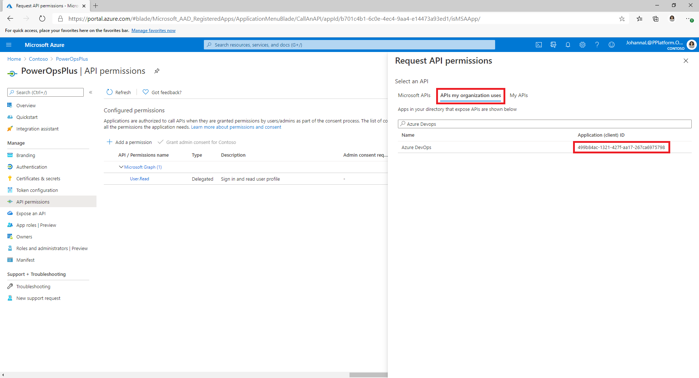

1. After adding permissions in your App Registration select **Grant Admin consent for (your tenant)**

1. Select **Certificates & Secrets** and select **New client secret**.

1. Set the **Expiration** and select **Add**.

1. <a name="appsecret"></a>After adding the secret **copy the value** and store for safe keeping to be used later.

1. <a name="appid"></a>Return to the **Overview** section of your App Registration and copy the **Application (client) ID** and **Directory (tenant) ID**.

     > [!IMPORTANT] Disambiguation: We'll use this value later and call it out as the **Application (client) ID** which is different from the **Azure DevOps Application (client) ID** copied in Step 7 [above](#azdoappid)

1. Select **Add a Redirect URI** > **Add a Platform** > **Web**

1. <a name="appredirect"></a>Set the **Redirect URI** to https://global.consent.azure-apim.net/redirect 

    >[!NOTE] You may need to update this later when configuring your custom connector after installing the app if this URL is different than the Redirect URL populated in the Custom Connector

1. Select **Configure**

### Give Power App Management Permission to your App

In order for the pipelines to perform certain actions against the environments in your Power Platform tenant you will need to grant Power App Management permissions to your App registration. To do so you will need to run the following PowerShell commandlet as an interactive user that has Power Apps administrative privileges. You will need to run this command once, using an interactive user, in PowerShell after your app registration has been created. The command gives permissions to the Service Principal to be able to execute environment related functions including querying for environments and connections via Microsoft.PowerApps.Administration.PowerShell (https://docs.microsoft.com/en-us/powershell/module/microsoft.powerapps.administration.powershell/new-powerappmanagementapp?view=pa-ps-latest). For more information on the **New-PowerAppManagementApp** cmdlet see here https://docs.microsoft.com/en-us/powershell/module/microsoft.powerapps.administration.powershell/new-powerappmanagementapp?view=pa-ps-latest

> [IMPORTANT!] Currently this commandlet gives elevated permissions (e.g. Power Platform Admin) to the app registration. Your organization's security policies may not allow for these types of permissions. Ensure that these permissions are allowed before continuing. In the case that these elevated permissions are not allowed you will not be able to use the AA4AM pipelines.

```powershell
Install-Module -Name Microsoft.PowerApps.Administration.PowerShell
Install-Module -Name Microsoft.PowerApps.PowerShell -AllowClobber
New-PowerAppManagementApp -ApplicationId [the Application (client) ID you copied when creating your app registration]
```

### Install Azure DevOps Extensions

The ALM Accelerator uses several Azure DevOps extensions, including some third-party Extensions that are available in the Azure DevOps marketplace. Under Organization Settings in Azure DevOps install the following extensions. For more information regarding Microsoft and third-party Azure DevOps extensions see here https://docs.microsoft.com/en-us/azure/devops/marketplace/trust?view=azure-devops. In addition, each of the thrid-party extensions web pages and the link to their source code are provided below.

1. Go to https://dev.azure.com and select **Organization settings**
1. Select **General** > **Extension**
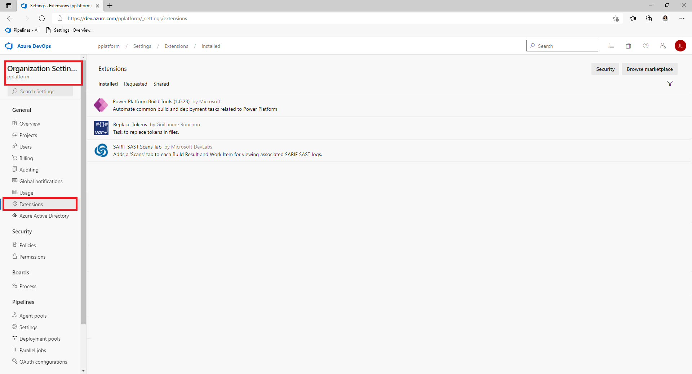
1. Install the following Extensions
   - **Power Platform Build Tools (required)**: This extension contains the first-party build tasks for Dataverse. (https://marketplace.visualstudio.com/items?itemName=microsoft-IsvExpTools.PowerPlatform-BuildTools)

   - **Replace Tokens (required)**: This extension is used by the pipelines to replace tokens in configuration files in order to be able to store secure values in private variables configured for a pipeline. (https://marketplace.visualstudio.com/items?itemName=qetza.replacetokens | https://github.com/qetza/vsts-replacetokens-task)

   - **SARIF SAST Scans Tab (optional)**: This extension can be used to visualize the .**sarif files** that get generated by the **Solution Checker** during a build. ([SARIF SAST Scans Tab - Visual Studio Marketplace](https://marketplace.visualstudio.com/items?itemName=sariftools.scans))
   
      
   


### Clone the YAML Pipelines from GitHub to your Azure DevOps instance

1. Go to https://dev.azure.com/ and **sign in to Azure DevOps (AzDO)**.
1. Create a **new project** or select an **existing project**.
1. Go to **Repos** and select **Import repository** from the repository dropdown

   

1. Enter https://github.com/microsoft/coe-alm-accelerator-templates as the **Clone URL** and select **Import**
1. Check that the default branch for this repo is `main`. Choose **Repos** and **Branches** and ensure that the `main` branch is tagged as the default:
   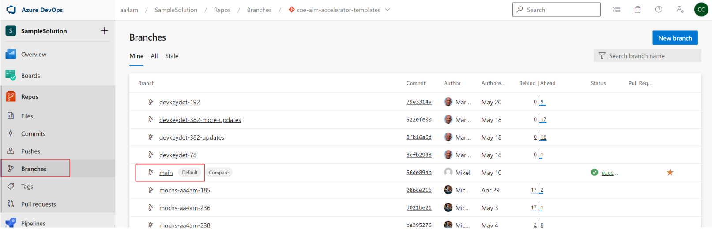
   If it is not, select the 3 vertical dots corresponding to the `main` branch and from the **More options** menu, choose **Set as default branch**
   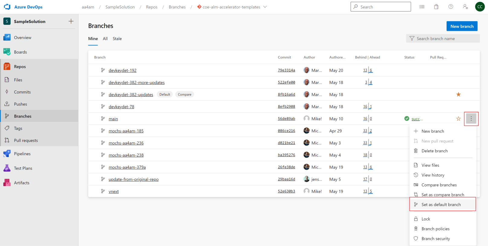

   > [!NOTE] The AzDO repo you created above will be where the Solution Pipeline Templates and the Export / Import Pipelines will run. Later when you create the Pipelines for your solutions you may need to reference this specific Project/Repo if you choose to source control your solutions in another repo in AzDO.

### Create Pipelines for Import, Delete and Export of Solutions

Following the steps below to create the following pipelines based on the YAML in the DevOps Repo. These pipelines will run when you **Commit to Git**, **Import a Solution** or **Delete a Solution** from the App, respectively. 

> [!NOTE] If all of your exports are expected to perform the same actions regardless of the solution for which the pipeline is running it's sufficient to create a single export pipeline as described below. However, there may be circumstances where you want to do things differently based on the specific solution when exporting. In that case you can append the Solution name to the export-solution-to-git pipeline to have the app execute your specific solution pipeline(s) when you perform the actions in the app (e.g. export-solution-to-git-SampleSolution).

| YAML File                                    | Pipeline Name                            |
| -------------------------------------------- | ---------------------------------------- |
| export-solution-to-git.yml                   | export-solution-to-git                   |
| import-unmanaged-to-dev-environment.yml      | import-unmanaged-to-dev-environment      |
| delete-unmanaged-solution-and-components.yml | delete-unmanaged-solution-and-components |

1. In Azure DevOps go to **Pipelines** and **Create a New Pipeline**
1. Select **Azure Repos Git** for your code Repository and point to Azure DevOps repo you created and seeded with the pipeline templates in the steps above.
    
1. On the **Configure your pipeline** page select **Existing Azure Pipelines YAML file** and point to **/Pipelines/export-solution-to-git.yml**, **/Pipelines/import-unmanaged-to-dev-environment.yml** or **/Pipelines/delete-unmanaged-solution-and-components.yml**  and Select **Continue**.
    
1. On the next screen Select **Save** and then Select the **3 dots next to Run Pipeline** and Select **Rename/Move**.
    
1. Update the pipeline name to **export-solution-to-git**, **import-unmanaged-to-dev-environment** or **delete-unmanaged-solution-and-components** and select **Save**.

### Create Export Pipeline variables (Optional)

There are a few optional pipeline variables that can be set on the export-solution-to-git pipeline to control what information is persisted to source control. If you want to **apply these settings globally** you can set the following variables on your export-solution-to-git pipeline or in the case that you want to **apply these to specific solutions on export** you can create a specific export pipeline for your solution as described above and setting the following variables on your solution specific export pipeline.

The **DoNotExportCurrentEnvironmentVariableValues** variable can be used to ensure that the current value of environment variables are never committed to source control during the export process. 

>  [!IMPORTANT] This pipeline variable is recommended in order to use the deployment configuration functionality in the AA4AM App.


The **VerifyDefaultEnvironmentVariableValues** can be used to ensure that specific default environment variable values are set during the export of a solution. The default environment variable values can be configured as part of the customDeploymentSettings.json configuration in the [Configuration and Data Deployment in Pipelines](DEPLOYMENTCONFIGGUIDE)

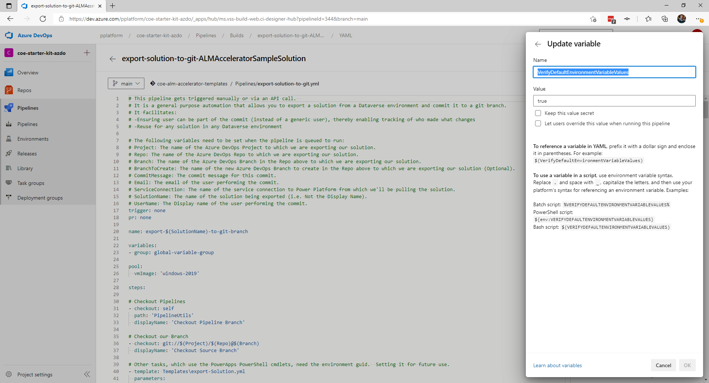

### Create Pipeline global variables

1. In Azure DevOps Select **Pipelines** > **Library** > **Create a new Variable Group**
1. Name the Variable Group **alm-accelerator-variable-group**.

    >[!NOTE] The pipelines reference this specific variable group so it has to be named exactly as what's shown. If you decide to use a different naming convention for your Variable Group you will need to modify parts of the pipeline(s) to reference the name you use instead.
1. Add the following Variables to the variable group

    |Name| Value |
    |--|--|
    | CdsBaseConnectionString  | AuthType=ClientSecret;ClientId=\$(ClientId);ClientSecret=\$(ClientSecret);Url= |
    | ClientId  | [The Application (client) ID you copied when creating the App Registration] |
    | ClientSecret | [The Application (client) Secret you copied when creating the App Registration] NOTE: It's recommeded that you secure this value by selecting the lock next to the value so others can't see your secret. |
    | TenantID  | [The Directory (tenant) ID you copied when creating the App Registration] |

### Update Permissions for the Project Build Service

> [!IMPORTANT] There are a number of "Build Service" accounts in Azure DevOps that may confuse the steps below. Pay close attention to the names / format specified in Step 3 and 5 below. You may need to search for the specific account if it doesn't show up in the initial list.

1. In Azure DevOps Select **Project Settings** in the left hand navigation.

1. Select **Repositories** > **Security**.

1. Find and select **Project Collection Build Service ([Your Organization Name])** under Users.

   > [!NOTE: In some cases you may not see Your Organization Name after the Project Collection Build Service user. In some cases it may just be a unique identifier and you may need to use the search function to find this user. Select this user]

1. Set the following permissions for the Build Service user.

   | Permission | Value |
   |--|--|
   | Contribute | Allow |
   | Contribute to pull requests | Allow |
   | Create branch | Allow |
   
   
   
1. Find and select the user name **[Your Project Name] Build Service ([Your Organization Name])** under Users and set the **same values as above**.

1. Select **Pipelines** and Select **Manage Security**

   

1. Set the following permissions for the Build Service user.

   | Permission                            | Value |
   | ------------------------------------- | ----- |
   | Edit build pipeline                   | Allow |
   | Edit build quality                    | Allow |
   | Manage build queue                    | Allow |
   | Override check-in validation by build | Allow |
   | Update build information              | Allow |
   | View build pipeline                   | Allow |
   | View builds                           | Allow |

   

## Development Project Setup

The following section will guide you through the setup steps required for each of the Development Projects you will support. In this context a Development Project signifies the required infrastructure and configuration needed to support healthy ALM including configuration of you Dataverse environment that will support the ALM process.

### Create Service Connections for DevOps to access Power Platform

Each Dataverse environment (e.g Development, Validation, Test and Production) will need to have a **Power Platform service connection in DevOps**. For each of your environments follow the steps below to setup the service connection.

>[!NOTE] Users of the AA4AM app will only see environments for which they have either User or Administrator role on the Service Connection in Azure DevOps. If using personal development environments all developers should have User or Administrator role for the Service Connection for their own development environment.
>
>Validation, Test and Production environment service connections only need permissions granted to pipelines (e.g. Build Service)

1. Go to https://dev.azure.com and select your **Project**

1. Under **Project Settings** in your Azure DevOps project select the **Service connections** menu item.

1. Select **Create/New service connection** and Search for Power Platform and select the **Power Platform** Service connection type and Select **Next**.
    

1. In the **Server URL** put your environment URL (e.g. https://myorg.crm.dynamics.com/). **NOTE: You must include the trailing forward slash see below**

1. Enter the same value as above for the **Service Connection Name**.  **NOTE: You must include the trailing forward slash**

    >[!IMPORTANT] AA4AM will use the Service connection name to identify the service connection to use per environment so this needs to be the same URL you entered above **including the trailing forward slash**).

1. Enter the **Tenant ID**, **Application (client) ID** and **Client Secret** you copied from AAD when you created your App Registration and select **Grant access permissions to all pipelines** then select **Save**.

    

1. In order for users to be able to use the service connection from the ALM Accelerator App the Service Connections must provide **User** permissions to all users to be able to **use** the Service Connections. Update Permissions as follows for environments that user's should be able to access from the App e.g. Development environment(s):

    - Select the **Service Connection** to be **shared with users** from the **Service Connections** list.

      

    - Select the **3 dots** in the top right corner and Select **Security**.

      

    - Select the **Group or User** you want to provide User permissions to in the Dropdown.

    - Select the **User** **Role** and Select **Add**

      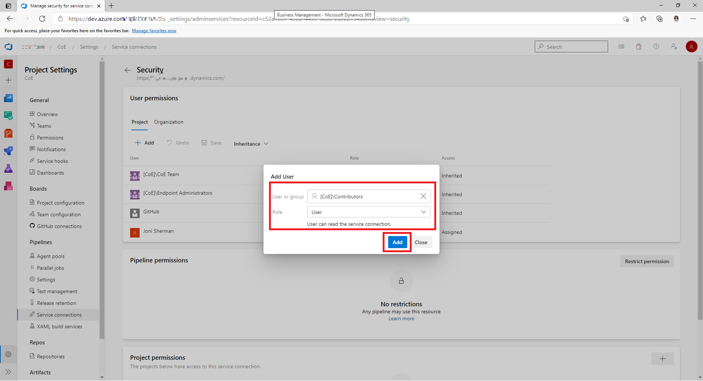

1. Repeat these steps as needed for each of your environments (i.e. Development, Validation, Test and Production).

### Create an App User in your Dataverse Environments

**Each environment (i.e. Development, Validation, Test and Production) will need to have an Application User.** For each of your environments follow the steps below to setup the Application User.

1. Go to Power Platform Admin Center [https://aka.ms/ppac](https://aka.ms/ppac)

1. Select your environment

1. Select **Settings**
   

1. Select **Users + permissions** > **Application users**
   

1. Select **New app user** to add a new Application user
   

1. Select the **Azure App Registration** you created, **Business Unit** and **Security Role**
   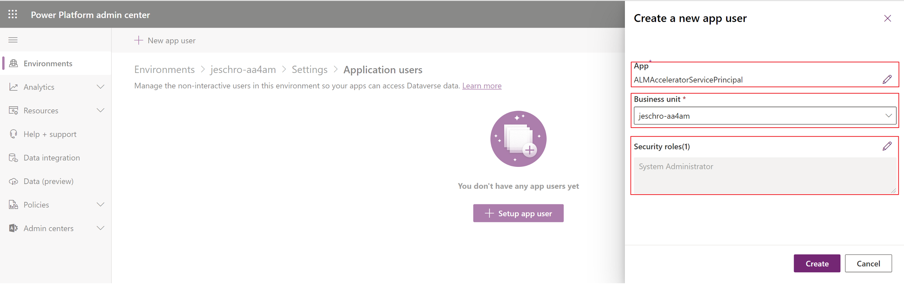

    >[!NOTE] It's recommended you give this user System Administrator rights to be able to perform the required functions in each of the environments.

1. Repeat these steps as needed for each of your environments (i.e. Development, Validation, Test and Production).

## Solution Setup

When you create a solution in Dataverse you'll need to **create pipelines specifically for that solution**. Follow these steps for creating pipelines for your solution in Azure DevOps. There are sample pipelines included in the Pipeline directory in the CoE ALM Templates repo.

- https://github.com/microsoft/coe-alm-accelerator-templates/blob/main/Pipelines/build-deploy-validation-SampleSolution.yml
- https://github.com/microsoft/coe-alm-accelerator-templates/blob/main/Pipelines/build-deploy-test-SampleSolution.yml
- https://github.com/microsoft/coe-alm-accelerator-templates/blob/main/Pipelines/build-deploy-prod-SampleSolution.yml

The sample pipelines provides flexibility for organizations to store their pipeline templates in a separate project or repo from the specific solution pipeline YAML. Follow the steps below to configure your **solution pipeline**. Repeat the steps for each of the solutions you will be source controlling with the ALM Accelerator.

> [!IMPORTANT] The pipeline YAML for your solution pipeline will always be stored in the same repo to which you will be source controlling your solution. However, the pipeline templates (i.e. the folder Pipeline\Templates) can exist in either the same repo as your solution pipeline YAML or in a separate repo and/or project. 

### Validate Your Setup Using the ALM Accelerator Sample Solution (Optional)

The steps below provide generic step-by-step instructions on how to create pipelines to handle the application lifecycle of your solution. Since these steps are generic and can be difficult to follow without context. We've create a similar step-by-step setup guide for getting started with a Sample Solution that we've created. This will provide specific context for when you are ready to create and configure your own pipelines for your solution and validate the setup steps performed above. To validate your setup and complete the Sample Solution walkthrough follow the steps in the [Sample Solution Setup Guide](SAMPLESOLUTIONSETUPGUIDE.md).

### Create the Solution Build and Deployment Pipeline(s)

Solution Pipelines are used to build and deploy your source controlled solutions to environments in your tenant. You can create as many solution pipelines as needed based on your organization's environment strategy. The sample pipelines provided assume only 3 environments (Validation, Test, Production). However, more or less can be created as needed with specific triggers in the pipelines or without triggers that can be run manually as well. The sample deployment pipelines trigger off of changes to a branch (i.e. Test and Production) or as a part of a branch policy in Azure DevOps (i.e. Validation). See [Setting Branch Policies for Pull Request Validation](#setting-branch-policies-for-pull-request-validation) below for more information on Branch Policies.

The following steps show how to **create a pipeline from the sample pipeline YAML**. Follow these steps to create all of your deployment pipelines. For reference your pipelines will follow this configuration

| Pipeline YAML File Name                   | Pipeline Name                   | Branch Policy Enabled | Required              |
| ----------------------------------------- | ------------------------------- | --------------------- | --------------------- |
| build-deploy-validation-MyNewSolution.yml | deploy-validation-MyNewSolution | Yes                   | Yes                   |
| build-deploy-test-MyNewSolution.yml       | deploy-test-MyNewSolution       | No                    | Yes                   |
| build-deploy-prod-MyNewSolution.yml       | deploy-prod-MyNewSolution       | No                    | No (See next section) |

> [!NOTE] The following steps will create pipelines that **build and deploy for each environment** (Validation, Test and Production). However, you may want to only build and deploy for Validation and Test and then deploy the artifacts from the Test build to Production. Included in [the section following this section](#create-the-solution-deployment-pipelines-optional) are instructions for doing the latter. If this is your preferred method of setting up the pipelines follow the steps below for **only the Validation and Test environment** and then skip to the next section to see how to configure your release pipeline.

1. In Azure DevOps go to the **Repo** that contains the [Pipelines folder you committed](#copy-the-YAML-pipelines-from-github-to-your-azure-devops-instance) and select the Pipelines folder

1. Open the sample deployment pipeline (i.e. **build-deploy-validation-SampleSolution.yml, build-deploy-test-SampleSolution.yml or build-deploy-prod-SampleSolution.yml**) and copy the YAML to use in your new Pipeline. **Note the name of this repo** for use in your pipeline.

   

1. Navigate to the **Repo where you want to source control your solution**.
   
1. Create a new Branch based on **your default branch** in the Repo with the name of your solution (e.g. **MyNewSolution**) 

    > [!NOTE] This branch will be your next version (v-next) branch for your Solution in the repo. All development work should be branched from this branch to a developers personal working branch and then merged into the v-next branch in order to push to Validation and Testing. Later when a release is ready the v-next branch can be merged into the main or default branch.

    

    

1. Select **New** from the top menu and then **Folder**
   
   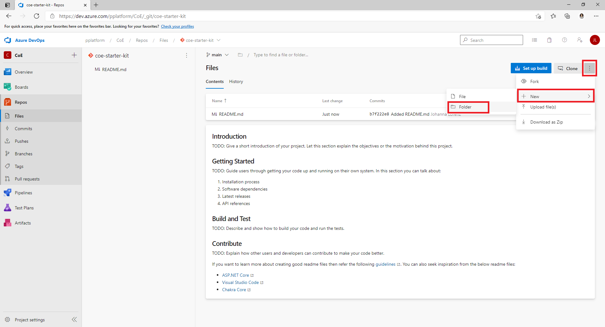
   
1. Give the new **Folder the same name as your solution** (e.g. MyNewSolution) and the new Pipeline YAML file a name (e.g. **build-deploy-validation-SampleSolution.yml**, **build-deploy-test-SampleSolution.yml** or **build-deploy-prod-SampleSolution.yml**). Select **Create**.

   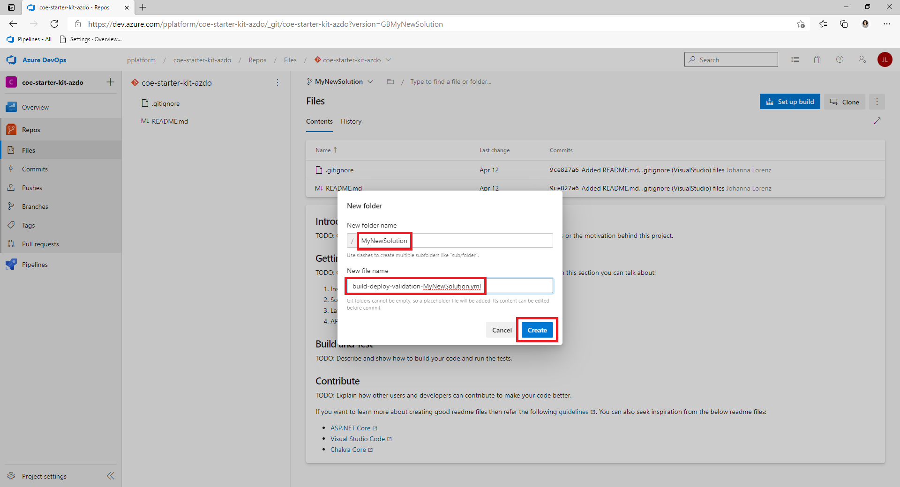

1. Paste the YAML from **build-deploy-validation-SampleSolution.yml**, **build-deploy-test-SampleSolution.yml** or **build-deploy-prod-SampleSolution.yml** into your new Pipeline YAML file.

   

1. Update the following values in your new Pipeline YAML.

   - Change the **resources -> repositories -> name**  to the repo name that contains your pipeline templates. If your template repository is in another AzDO project you can use the format **projectname/reponame** here. In this case the repo is called **coe-alm-accelerator-templates** and it exists in the same project as our MyNewSolution repo. Additionally, you can specify a branch for where your templates live using the **ref** parameter if required.

      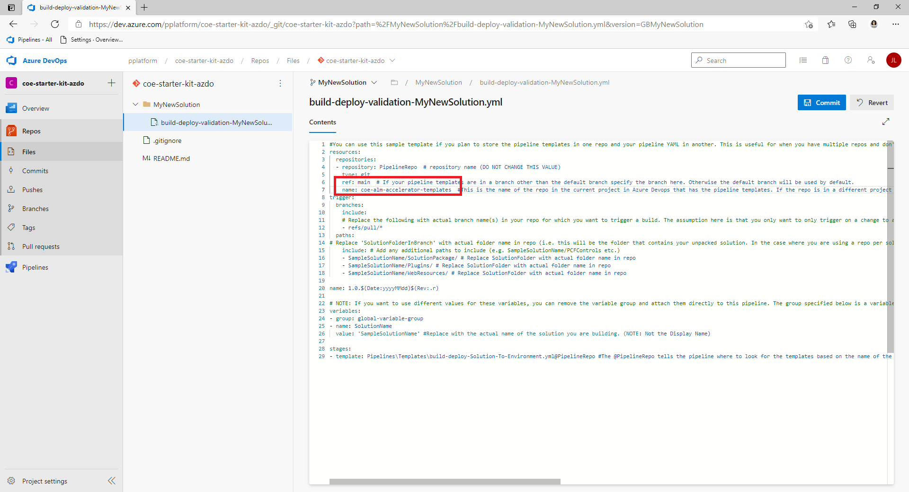

    - Change any value that references **SampleSolutionName** to the unique name of your Solution (e.g. MyNewSolution).

      

    - Select **Commit** to save your changes.

1. In Azure DevOps go to **Pipelines** and **Create a New Pipeline**

1. Select **Azure Repos Git** for your code Repository.
   

1. Select the **Azure DevOps repo** which contains the deployment Pipeline YAML.

    

1. On the **Configure your pipeline** page select **Existing Azure Pipelines YAML file**, point to the **YAML File in your repo that you created in step 5** and Select **Continue**.
   

1. On the next screen Select **Save** and then Select the 3 dots next to Run Pipeline and Select **Rename/Move**.
   

1. Update the pipeline name to **deploy-validation-MyNewSolution**, **deploy-test-MyNewSolution** or **deploy-prod-MyNewSolution** (where 'MyNewSolution' is the name of your solution) and select **Save**.

   

1. Update the **Default branch for manual and scheduled builds** for more information see the documentation here 

      > [!NOTE] If your new pipeline was not created in the default branch of the repo you may need to update the **Default branch for manual and scheduled builds**. See the following link for more information on **Default branch for manual and scheduled builds**. [Configure pipeline triggers - Azure Pipelines | Microsoft Docs](https://docs.microsoft.com/en-us/azure/devops/pipelines/process/pipeline-triggers?view=azure-devops&tabs=YAML#branch-considerations-for-pipeline-completion-triggers)

      - Select Edit on your new Pipeline

      - **Select the 3 dots** on the top right and **Select Triggers**

        

      - **Select the YAML tab** and **Select Get Sources**. 

      - Update the **Default branch for manual and scheduled builds** to point to your **Solution branch**

        

1. Repeat the steps above to create a deployment pipeline for each of your environments referencing the sample deployment pipeline YAML from the **coe-alm-accelerator-templates repo** (i.e. deploy-validation-SampleSolution.yml, deploy-test-SampleSolution.yml and deploy-prod-SampleSolution.yml).

1. **Select Save and Queue** and **Select Save**

     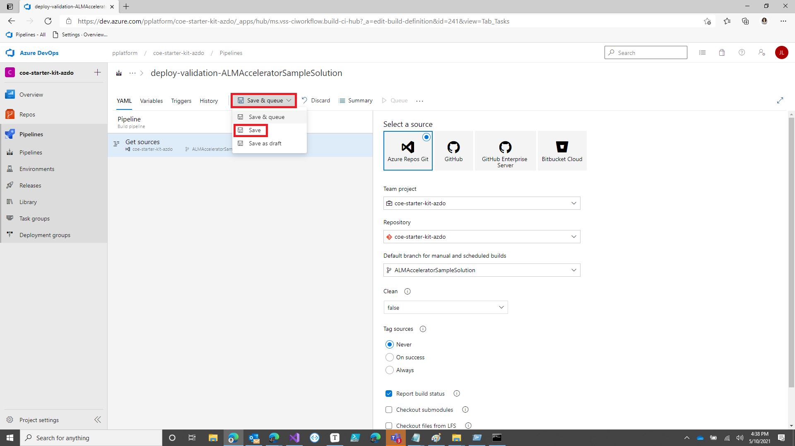

### Create the Solution Deployment Pipeline (Optional)

As mentioned in the note above, the previous section allows you to create pipelines that **build and deploy for each environment** (Validation, Test and Production). However, if you want to only build and deploy for Validation and Test and then **deploy the artifacts from the Test build to Production** you can follow these instructions to create your production deployment pipeline after you've created your build and deploy pipeline for Validation and Test above. For reference your pipeline will be configured as follows.

| Pipeline YAML File Name       | Pipeline Name             | Branch Policy Enabled |
| ----------------------------- | ------------------------- | --------------------- |
| deploy-prod-MyNewSolution.yml | deploy-prod-MyNewSolution | No                    |

1. In Azure DevOps go to the **Repo** that contains the [Pipelines folder you committed](#copy-the-YAML-pipelines-from-github-to-your-azure-devops-instance) and select the Pipelines folder

1. Open the sample deployment pipeline (i.e. **deploy-prod-pipelineartifact-SampleSolution.yml**) and copy the YAML to use in your new Pipeline. **Note the name of this repo** for use in your pipeline.

   

1. Navigate to the **Repo where you want to source control your solution**.

5. Select **New** from the top menu and then **File**

   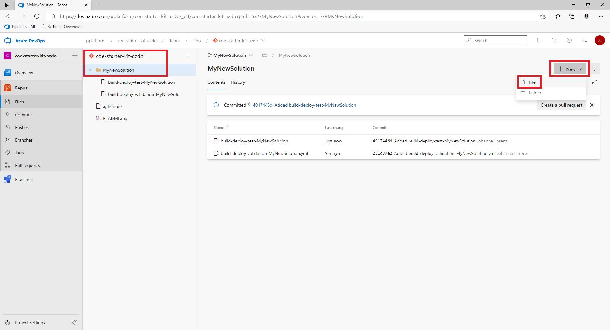

6. Give the new Pipeline YAML file a name (e.g. **deploy-prod-MyNewSolution.yml**). Select **Create**

   

7. Paste the YAML from **deploy-prod-pipelineartifact-SampleSolution.yml** into your new Pipeline YAML file.

   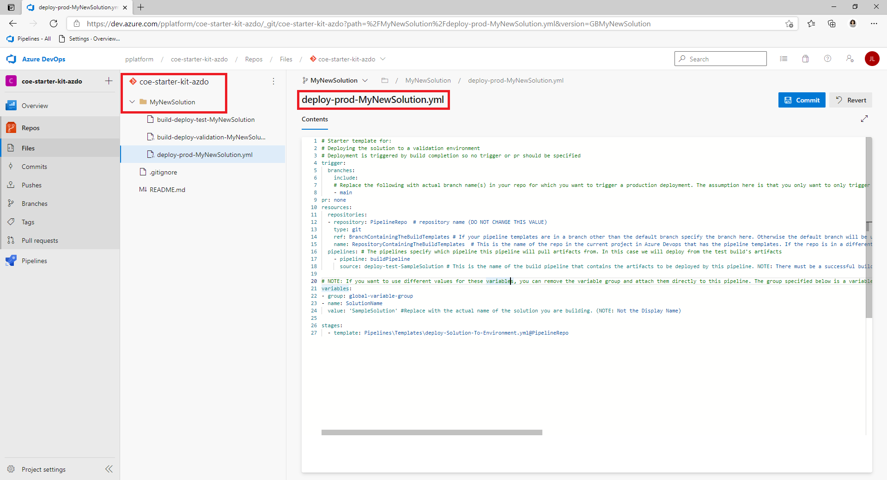

8. Update the following values in your new Pipeline YAML.

   - Update the **trigger -> branches -> include** to the branch(es) for which changes would trigger a deployment to production. 

   - Change the **resources -> repositories -> name** to the repo name that contains your pipeline templates. If your template repository is in another AzDO project you can use the format **projectname/reponame** here. In this case the repo is called **coe-alm-accelerator-templates** and it exists in the same project as our MyNewSolution repo. Additionally, you can specify a branch for where your templates live using the **ref** parameter if required.

     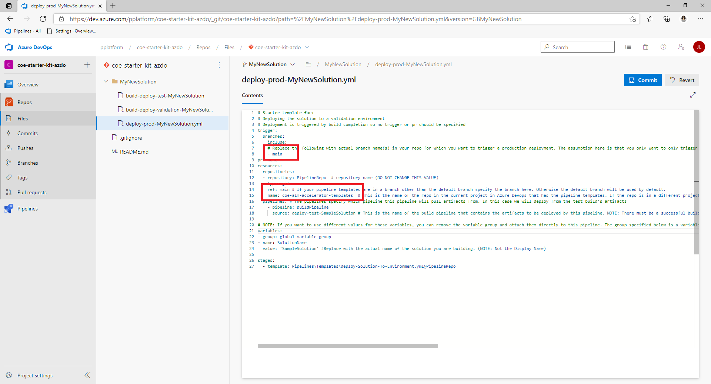

   - Update **resources -> pipelines -> source** to specify **the build pipeline that contains the artifacts to be deployed** by this pipeline. In this case we are going to deploy the artifacts from our Test pipeline, created above, that built and deployed our Solution to the Test environment.

     

   - Change any value that references **SampleSolutionName** to the unique name of your Solution (e.g. MySolutionName).

     

9. Repeat the same steps 9-17 performed for **deploy-validation-ALMAcceleratorSampleSolution** and **deploy-test-ALMAcceleratorSampleSolution** to create a pipeline from the new production pipeline YAML called **deploy-prod-ALMAcceleratorSampleSolution**.

### Setting Deployment Pipeline Variables

**EnvironmentName** and **ServiceConnection** variables are **required** for each pipeline. These pipeline variables will be set for each **deployment pipeline** you've configured above based on the environment to which your pipeline deploys.

#### Create Environment and Service Connection (Required)

These variables are required by every deployment pipeline. The Environment variable is **EnvironmentName** and the Service Connection variable is **ServiceConnection**.

The **EnvironmentName** variable is used to specify the Azure DevOps environment being deployed to in order to enable tracking deployment history and set permissions and approvals for deployment to specific environments. Depending on the environment to which you're deploying set this value to **Validate, Test or Production** For more information on Environments in AzureDevOps see https://docs.microsoft.com/en-us/azure/devops/pipelines/process/environments.


The **ServiceConnection** variable is used to specify how the deployment pipeline connects to the Power Platform. The values used for the Service Connection variable are the names of the Service Connections created above [Create a Service Connection for DevOps to access Power Platform](#create-service-connections-for-devops-to-access-power-platform)


#### Create EnableFlows Variable (Optional)

You can optionally set a pipeline variable on your deployment pipelines to turn off the automatic enabling of Flows after your solution is imported. This variable is **EnableFlows**. Setting EnableFlows to 'false' will result in the pipeline skipping the steps to enable Power Automate Flows as part of your deployment. The default of the EnableFlows variable value is 'true'. **You only need to set this variable if you want to skip enabling flows after your solution is imported.**

### Setting Branch Policies for Pull Request Validation

In order to leverage executing the build pipeline for your solution when a **Pull Request is created** you'll need to create a **Branch Policy** to execute the Pipeline you created in the previous step. Use the following steps to set your Branch Policy. For more information on Branch Policies see here https://docs.microsoft.com/en-us/azure/devops/repos/git/branch-policies?view=azure-devops

1. In Azure DevOps go to **Repos** and select the **Branches** folder

1. Locate the **target branch** on which you want to run the **Pull Request policy** and select the ellipsis to the right of the target branch and Select **Branch Policies**.

   

1. On the **Branch Policies** screen go to **Build Validation**

1. Select the **+ Button** to add a **new Branch Policy**

   

1. Select the Pipeline you just created from the **Build pipeline** dropdown

1. Specify a **Path filter** (if applicable). The path filter will ensure that only changes to the path specified will trigger the pipeline for your Pull Request.

1. Set the **Trigger** to **Automatic**

1. Set the **Policy requirement** to **Required**

1. Set the **Build expiration** to **Immediately**

1. Set a **Display name** for your Branch Policy (e.g. PR Build Validation)

1. Select **Save**

   

### Create Deployment Configuration (Optional)

There are a number of configurations that need to made in a target environment after a solution is deployed. These configurations are specific to the environment into which the solution is being deployed. Included are **connection references, environment variables, setting permissions for AAD Groups and Dataverse teams** as well as **sharing Canvas Apps and updating ownership of solution components** such as Power Automate flows. In addition to these configurations many times **sample or configuration data associated with Dataverse Tables** in the solution is required in a target environment in order to provide a full end to end ALM experience.

If your solution requires these additional configuration settings and / or data follow the [Configuration and Data Deployment in Pipelines](DEPLOYMENTCONFIGGUIDE) guide to configure your pipelines based on the environment(s) to which you are deploying.

## Importing the Solution and Configuring the App

### Install ALM Accelerator Solution in Dataverse

Download the **latest managed solution**(s) from GitHub (https://github.com/microsoft/coe-starter-kit/releases).

1. > [!NOTE] The screenshot below is for reference as to where the managed solution exists under a release. The actual version should be the most recent release.

   

2. Go to https://make.powerapps.com and select the environment you want to use to host the ALM Accelerator App

3. Select **Solutions** from the left navigation.

4. Select **Import** and Browse to the location of the managed solution you downloaded.

5. Select **Next** and **Next** again.

6. On the Connections page select or create a new connection to use to connect to Dataverse for the **CDS DevOps connection**.

7. Select **Import** and wait for the solution to complete the import process.

### Configure the Azure DevOps Custom Connector

1. In the Power App maker portal select your **Environment** and Select **Data** > **Custom Connectors** > **CustomAzureDevOps**

1. Select **Edit** and go to the **Security** section and select **Edit** and set the following fields.
   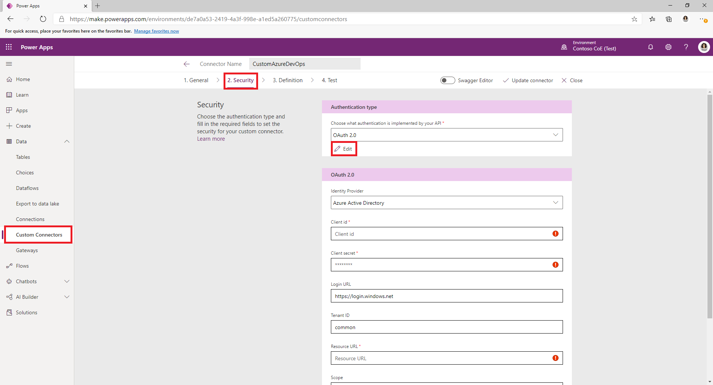

   | Name | Value |
   |--|--|
   | Client id | [The **Application (client) ID** you copied when [creating the App Registration](#appid)] |
   | Client secret | [The **Application (client) Secret** you copied when [creating the App Registration](#appid)] |
   | Tenant ID | leave as the default **common** |
   | Resource URL | [The **Azure DevOps Application (client) ID** you copied when [adding permissions to your App Registration](#azdoappid)] |

1. Select **Update Connector**

1. Verify that the **Redirect URL** is populated on the Security page with the URL https://global.consent.azure-apim.net/redirect. If the **Redirect URL is other than https://global.consent.azure-apim.net/redirect** copy the URL and [return to the app registration your created](#create-an-app-registration-in-your-aad-environment) and update the [Redirect URI](#appredirect) you set earlier to the updated URL.

1. Verify the connector from the **Test** menu once you've completed the steps above.
    - Navigate to the **Test** menu.

    - Select **New Connnection** and follow the prompts to create a new connection.

    - In the Power App maker portal select your **Environment** and Select **Data** > **Custom Connectors** > **CustomAzureDevOps**.

    - Select **Edit** and go to the **Test** section and find the **GetOrganizations** operation.

    - Select **Test operation** and verify you **Response Status returned is 200**.

    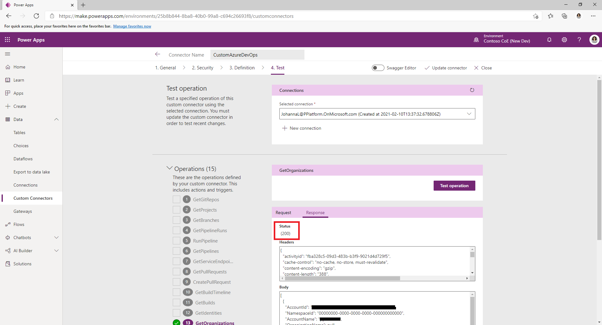

## Setup Makers to Use the ALM Accelerator App

See the [User Setup Guide](USERSETUPGUIDE.md) for the recommended setup of a maker's user account in Dataverse and Azure DevOps.

## Using the ALM Accelerator App

See the [User Guide](USERGUIDE.md) for using the ALM Accelerator App

## Troubleshooting

When you setup your pipelines such that the pipeline templates are stored in a different repository than the solution pipeline you may get the following message when trying to run your pipeline for the first time. To eliminate the error select the **Permit** button to grant the repo running the pipeline access to the template repository.


Alternatively, to disable this notification for all pipelines you can turn off Limit Job authorization scope to referenced Azure DevOps repositories in **Project -> Settings -> General**. This setting is turned on by default when you create a new project.  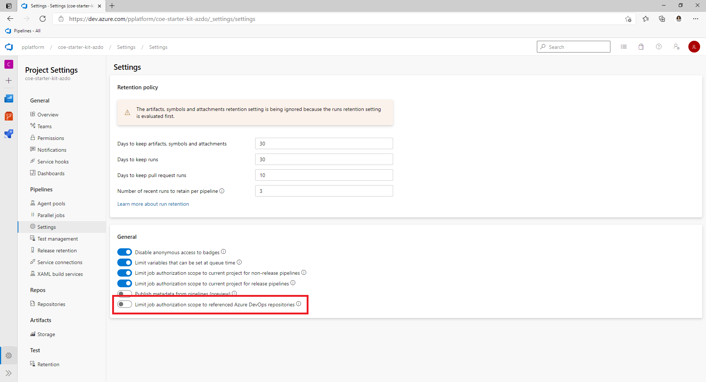

>  [!NOTE] that the project settings can be overridden at the Azure DevOps organization level, so if the option to change this is disabled in project settings, check in Organization Settings.
