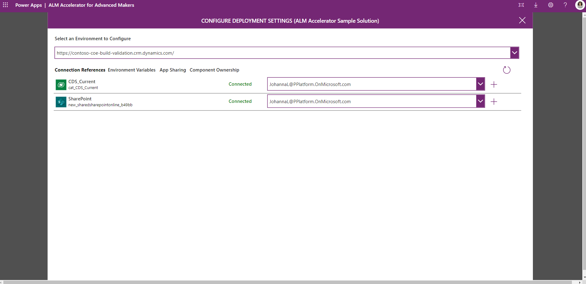
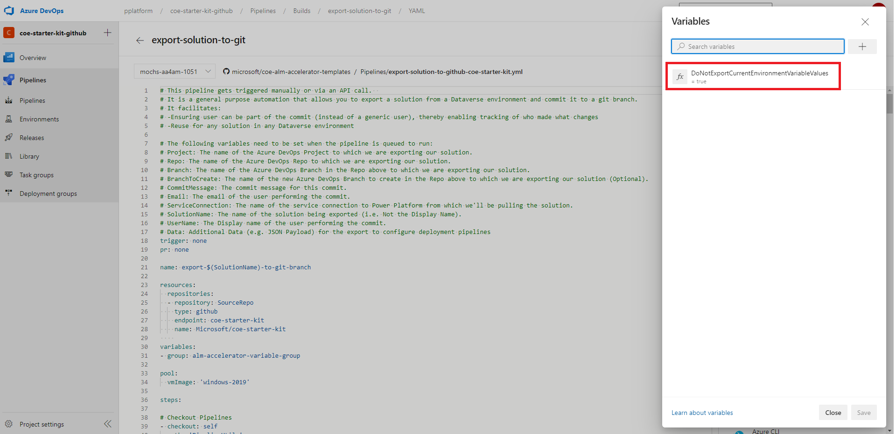

## Issues and new features in this release:

https://github.com/microsoft/coe-starter-kit/milestone/13?closed=1

## First Time Setup Instructions
To get started with the ALM Accelerator For Advanced Makers you can
1. Use the preview CoE CLI to automate the install at https://github.com/microsoft/coe-starter-kit/blob/main/coe-cli/docs/aa4am/readme.md or in the [Power Platform CoE CLI E-Book](https://aka.ms/coe-cli-ebook) (**Recommended**)
2. Use the  manual setup documentation can be found at https://github.com/microsoft/coe-starter-kit/blob/main/ALMAcceleratorForAdvancedMakers/SETUPGUIDE.md

## Upgrade Instructions
If you are upgrading to the latest release you will need to perform the following steps.
- Import the latest AA4AM Solution https://github.com/microsoft/coe-starter-kit/releases/download/ALMAcceleratorForAdvancedMakers-September2021/ALMAcceleratorForAdvancedMakers.zip

- Update your pipeline templates repo with the latest from https://github.com/microsoft/coe-alm-accelerator-templates/archive/refs/tags/ALMAcceleratorForAdvancedMakers-September2021.zip

- We've removed the dependency on the **Power DevOps Tools extension** in this release. Any extension that has been removed from this list can be safely removed [Install Azure DevOps Extensions](https://github.com/microsoft/coe-starter-kit/blob/main/ALMAcceleratorForAdvancedMakers/SETUPGUIDE.md#install-azure-devops-extensions).

- Ensure that you have the latest version of **Power Platform Build Tools (1.0.35)** installed.

- Update the Azure DevOps Build Service Permissions to allow the pipelines to configure other pipelines (e.g. setting variables for deployment configuration). Follow the [SETUPGUIDE.md](https://github.com/microsoft/coe-starter-kit/blob/main/ALMAcceleratorForAdvancedMakers/SETUPGUIDE.md#update-permissions-for-the-project-build-service) to set the permissions.

- In this release we have updated the pipelines to use deployment configuration files stored in source control rather than using Pipeline variables for the json configuration of Connection References, Environment Variables, Component Ownership, App Sharing etc. We've also split the configuration between a **customDeploymentSettings.json and deploymentSettings.json** in order to use the built in import task to set environment variables and connection references. Please see [DEPLOYMENTCONFIGGUIDE.md](https://github.com/microsoft/coe-starter-kit/blob/main/ALMAcceleratorForAdvancedMakers/DEPLOYMENTCONFIGGUIDE.md) for more details.

  > [!NOTE] If you have previously configured your pipelines using pipeline variables your pipeline variables will no longer work. However, with the addition of functionality to auto generate the deployment configuration files and configure deployment settings via the app in the latest version this should be a simple transition. 

  

- To take advantage of the new deployment configuration functionality 

  - It is recommended that you **delete all of your existing deployment pipeline variables except ServiceConnection and EnvironmentName** and reconfigure your solutions for each target environment using the new deployment configuration functionality in the app.

  - Update your **export-solution-to-git pipeline** to include the following variable

    

  - Once you've updated the pipeline variable(s) go to the AA4AM App. Configure your solution deployment and export the solution to source control to ensure your deployment settings are stored appropriately in source control and the associated pipeline variables are created.