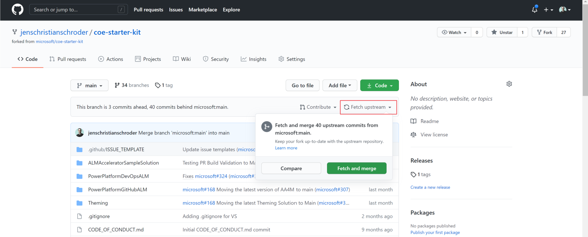

# Contributing

This project welcomes contributions and suggestions. Most contributions require you to
agree to a Contributor License Agreement (CLA) declaring that you have the right to,
and actually do, grant us the rights to use your contribution. For details, visit
[Contributor License Agreement](https://cla.opensource.microsoft.com/).

When you submit a pull request, a CLA-bot will automatically determine whether you need
to provide a CLA and decorate the PR appropriately (e.g., label, comment). Simply follow the
instructions provided by the bot. You will only need to do this once across all repositories using our CLA.

This project has adopted the [Microsoft Open Source Code of Conduct](https://opensource.microsoft.com/codeofconduct/).
For more information see the [Code of Conduct FAQ](https://opensource.microsoft.com/codeofconduct/faq/)
or contact [opencode@microsoft.com](mailto:opencode@microsoft.com) with any additional questions or comments.

## Branching Strategy

The CoE Starter Kit uses feature branches from the main branch.

When creating new releases for the CoE Starter Kit the main branch is tagged with the version of the release (e.g. [CoEStarterKit-July2021](https://github.com/microsoft/coe-starter-kit/releases/tag/CoEStarterKit-July2021)). Hotfixes are made to the tagged version while on-going development of new features and bug fixes are made via Pull Requests into main.

Following the branching strategy means that **all Pull Requests are made to the main branch.**

## Getting your own copy of the source code

Any code (documentation, solution components, yaml pipelines etc.) contribution you want to make to CoE Starter Kit should be made in your own copy of the source code.

> [!NOTE]There are many ways to interact with github depending on your development workflow and the tools and software you use. The steps to create your own copy of the source code will differ depending on your tools and software.

To create a copy of the repository you should fork the CoE Starter Kit repository to your own github account.
Any contributions you make should be made in your own fork.

> [!NOTE]To learn about GitHub forks visit the GitHub docs: [Working with forks](https://docs.github.com/en/github/collaborating-with-pull-requests/working-with-forks/about-forks)

You should always ensure that your fork is up-to-date with the upstream repository by regularly synchronizing your fork.

The simplest way to synchronize your fork with the upstream repository is via the **Fetch upstream** feature on your fork github page as in below screenshot.

Selecting **Compare** will allow you to compare the changes in the upstream repository against your own fork and create a pull request to merge these into your own fork.

Selecting **Fetch and merge** will fetch all upstream changes and merge into your own fork without a pull request work flow.

To manage the synchronization of upstream changes on the command line please refer to the GitHub documentation on [Syncing a fork](https://docs.github.com/en/github/collaborating-with-pull-requests/working-with-forks/syncing-a-fork)

## Local branch strategy

When implementing your contributions in your forked repository it is recommended that you employ a feature branch strategy. This means that you will have a branch for each feature or bug fix that your contribute. This approach helps keep the review process as simple as possible.
We recommend naming your feature branches in a way that identify the feature or bug fix your are working on by having the issue id in the branch name (e.g. yourgithubhandle-projectname-issuenumber **jenschristianschroeder-aa4am-123**).

## Pull Requests

When your contribution is complete and you are ready to submit your changes to the CoE Starter Kit repository you should make a Pull Request from your feature branch in your own fork into the main branch in the CoE Starter Kit repository.

Before we can accept a pull request from you, you'll need to sign a Contributor License Agreement (CLA). It is an automated process and you only need to do it once.
To enable us to quickly review and accept your pull requests, always create one pull request per issue and link the issue in the pull request. Never merge multiple requests in one unless they have the same root cause.

## Where to Contribute

To improve the chances to get a pull request merged you should select an issue that is labelled with the help-wanted or bug labels. If the issue you want to work on is not labelled with help-wanted or bug, you can start a conversation with the issue owner asking whether an external contribution will be considered.
To avoid multiple pull requests resolving the same issue, let others know you are working on it by saying so in a comment.
