# Set up ALM Accelerator for Advanced Maker components

The ALM Accelerator components enable makers to apply source control strategies using Azure DevOps and use automated builds and deployment of solutions to their environments without the need for manual intervention by the maker, administrator, developer, or tester. In addition the ALM Accelerator provides makers the ability to work without intimate knowledge of the downstream technologies and to be able to switch quickly from developing solutions to source controlling the solution and ultimately pushing their apps to other environments with as few interruptions to their work as possible.

This solution uses Azure DevOps for source control and deployments. You can sign up for Azure DevOps for free for up to 5 users on the [Azure DevOps](https://azure.microsoft.com/en-us/services/DevOps/) site.

**The ALM Accelerator components solution doesn't have a dependency on other components of the CoE Starter Kit. It can be used independently.**

>[!NOTE] The pipelines in the ALM Accelerator components rely on some third party extensions to fill gaps in areas where native utilities are not available or the effort to recreate the functionality is prohibitive. We recognize that this isn't ideal and are working toward eliminating these utilities as we grow the solution and native capabilities become available. However, in the interest of providing a sample implementation of full end to end Power Platform Pipelines it was decided that this would be necessary at the moment. Where possible the documentation calls out these third party tools, their purpose and their documentation / source code.

## Document structure

The GETTINGSTARTED.md is structured into 7 main sections

- **Prequisites** - Considerations and requirements in order to complete the setup.
- **Foundational Setup** - This sections walks through the base setup of the ALM Accelerator for Advanced Makers. The base setup consist of the steps and configurations required.
- **Development Project Setup** - This sections includes the steps required to set up a new Development Project covering project specific setup of Azure DevOps, generic build and deployment pipelines, Service Connections, Power Platform Environments and Application Users
- **Solution Setup** - These steps are specific to each solution you wish to support with the ALM Accelerator. The section covers setting up the solution specific pipelines, branch policies, deployment variables to support connections references, environment variables and AAD group sharing.
- **Importing the Solution and Configuring the App** - This section takes you through the steps required to import the actual ALM Accelerator for Advanced Makers canvas app and configuring the included custom connector.
- **Using the ALM Accelerator App** - A short introduction to using the AA4AM canvas app
- **Troubleshooting** - A few pointers on some know issues and how to remediate these.

## Table of Contents

- [Set up ALM Accelerator for Advanced Maker components](#set-up-alm-accelerator-for-advanced-maker-components)
  - [Document structure](#document-structure)
  - [Table of Contents](#table-of-contents)
  - [Prerequisites](#prerequisites)
    - [Environments](#environments)
    - [Users and Permissions](#users-and-permissions)
  - [Foundational Setup](#foundational-setup)
    - [Create an App Registration in your AAD Environment](#create-an-app-registration-in-your-aad-environment)
    - [Give Power App Management Permission to your App](#give-power-app-management-permission-to-your-app)
    - [Install Azure DevOps Extensions.](#install-azure-devops-extensions)
    - [Copy the YAML Pipelines from GitHub to your Azure DevOps instance](#copy-the-yaml-pipelines-from-github-to-your-azure-devops-instance)
    - [Create Pipelines for Import, Delete and Export of Solutions](#create-pipelines-for-import-delete-and-export-of-solutions)
    - [Get the Pipeline ID for the Export Solution Pipeline to use for global variables](#get-the-pipeline-id-for-the-export-solution-pipeline-to-use-for-global-variables)
    - [Create Pipeline global variables](#create-pipeline-global-variables)
    - [Update Permissions for the Project Build Service](#update-permissions-for-the-project-build-service)
  - [Development Project Setup](#development-project-setup)
    - [Create an App User in your Dataverse Environments](#create-an-app-user-in-your-dataverse-environments)
    - [Create Service Connections for DevOps to access Power Platform](#create-service-connections-for-devops-to-access-power-platform)
  - [Solution Setup](#solution-setup)
    - [Create the Build Pipeline](#create-the-build-pipeline)
    - [Create the Deployment Pipeline(s)](#create-the-deployment-pipelines)
    - [Importing Data from your Pipeline](#importing-data-from-your-pipeline)
    - [Setting Branch Policies for Pull Request Validation](#setting-branch-policies-for-pull-request-validation)
    - [Setting Deployment Pipeline Variables](#setting-deployment-pipeline-variables)
      - [Create Environment and Service Connection (Required)](#create-environment-and-service-connection-required)
      - [Create Connection Reference Pipeline Variable (Optional)](#create-connection-reference-pipeline-variable-optional)
      - [Create Environment Variable Pipeline Variable (Optional)](#create-environment-variable-pipeline-variable-optional)
      - [Create AAD Group Canvas Configuration Pipeline Variable (Optional)](#create-aad-group-canvas-configuration-pipeline-variable-optional)
      - [Create AAD Group / Team Configuration Pipeline Variable (Optional)](#create-aad-group--team-configuration-pipeline-variable-optional)
      - [Create Solution Component Ownership Pipeline Variable (Optional)](#create-solution-component-ownership-pipeline-variable-optional)
  - [Importing the Solution and Configuring the App](#importing-the-solution-and-configuring-the-app)
    - [Install ALM Accelerator Solutions in Dataverse](#install-alm-accelerator-solutions-in-dataverse)
    - [Configure the Azure DevOps Custom Connector.](#configure-the-azure-devops-custom-connector)
  - [Using the ALM Accelerator App](#using-the-alm-accelerator-app)
  - [Troubleshooting](#troubleshooting)

## Prerequisites

### Environments

The application will manage deploying solutions from Development to Validation to Testing and to Production. While you can setup your pipelines to use two environments  initially (e.g. one for your Development / Deploying the ALM Accelerator Solution and one for Validation, Test and Production. Ultimately, you will want to have separate environments setup for each of at least Development, Validation, Test and Production.

- The environment into which you are deploying the ALM Accelerator app will need to be created with a Dataverse database. Additionally, any target environment requires a Dataverse database in order to deploy your solutions.

### Users and Permissions

In order to complete the steps below you will need the following users and permissions in Power Platform, Azure DevOps and Azure.

- A licensed **Azure user** with Permissions to **create and view AAD Groups**, **create App Registrations** and **Grant Admin consent** to App Registrations in Azure Active Directory.
- A licensed **Azure DevOps** user with Permissions to **create and manage Pipelines, Service Connections, Repos and Extensions**.
- A licensed **Power Platform** user with Permissions to **create Application Users** and **grant Administrative Permissions** to the Application User

## Foundational Setup

The following steps will guide you through setting up the foundations of the ALM Accelerator for Advanced Makers. These steps are general to the functionality of the ALM Accelerator and not project or solution specific.

### Create an App Registration in your AAD Environment

Creating an App Registration for the ALM Accelerator is a one time setup step to grant permissions to the App and the associated pipelines the permissions required to perform operations in **Azure DevOps** and **Power Apps / Dataverse**
Sign in to [portal.azure.com](https://portal.azure.com).

1. Go to **Azure Active Directory** > **App registrations**.
    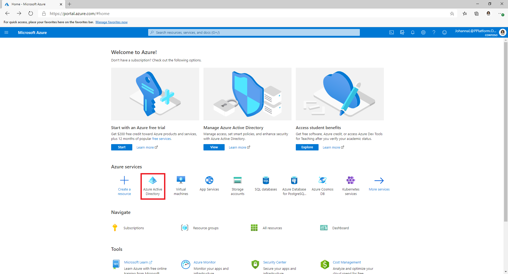

1. Select **New Registration** and give the registration a name (e.g. ALMAcceleratorServicePrincipal) leave all other options as default and select **Register**.

1. Select **API Permissions** > **+ Add a permission**.

1. Select **Dynamics CRM**, and configure permissions as follows:
    

1. Select **Delegated permissions**, and then select **user_impersonation**.
    

1. Select **Add permissions**.

1. Repeat adding permissions steps above for
    - **PowerApps-Advisor (Analysis All)** (Required for running static analysis via App Checker https://docs.microsoft.com/en-us/power-platform/alm/checker-api/overview). This permission can be found under **APIs my organization uses**.
      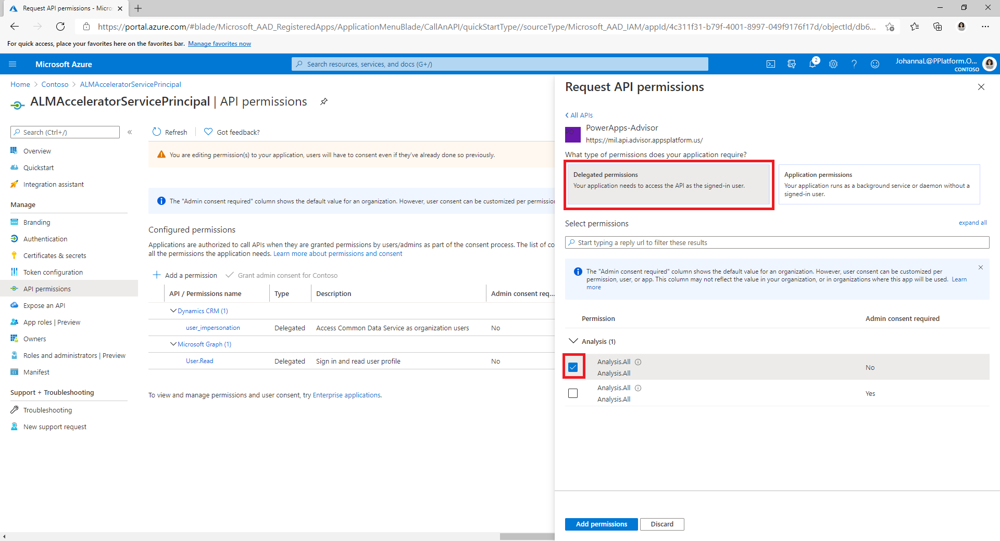

    - **Azure DevOps**. (Required for connecting to Azure DevOps via the custom connector in the ALM Accelerator App). This permission can be found under **APIs my organization uses**.

    - <a name="azdoappid"></a>When adding the Azure DevOps permission go to APIs my organization uses and search for Azure DevOps and **copy the Application (client) ID**.

      > [!IMPORTANT] Disambiguation: We'll use this value later and specifically call it out as the **Azure DevOps Application (client) ID** which is different from the **Application (client) ID** copied in Step 12 [below](#appid)

    - 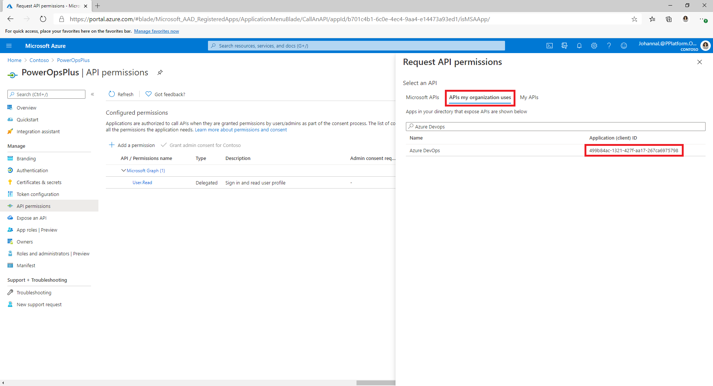

1. After adding permissions in your App Registration select **Grant Admin consent for (your tenant)**

1. Select **Certificates & Secrets** and select **New client secret**.

1. Set the **Expiration** and select **Add**.

1. <a name="appsecret"></a>After adding the secret **copy the value** and store for safe keeping to be used later.

1. <a name="appid"></a>Return to the **Overview** section of your App Registration and copy the **Application (client) ID** and **Directory (tenant) ID**.

     > [!IMPORTANT] Disambiguation: We'll use this value later and call it out as the **Application (client) ID** which is different from the **Azure DevOps Application (client) ID** copied in Step 7 [above](#azdoappid)

1. Select **Add a Redirect URI** > **Add a Platform** > **Web**

1. <a name="appredirect"></a>Set the **Redirect URI** to https://global.consent.azure-apim.net/redirect 

    >[!NOTE] You may need to update this later when configuring your custom connector after installing the app if this url is different than the Redirect URL populated in the Custom Connector

1. Select **Configure**

### Give Power App Management Permission to your App

In order for the pipelines to perform certain actions against the environments in your Power Platform tenant you will need to grant Power App Management permissions to your App registration. To do so you will need to run the following PowerShell commandlet as an interactive user that has Power Apps administrative privileges. You will need to run this command once, using an interactive user, in PowerShell after your app registration has been created. The command gives permissions to the Service Principal to be able to execute environment related functions including querying for environments and connections via Microsoft.PowerApps.Administration.PowerShell (https://docs.microsoft.com/en-us/powershell/module/microsoft.powerapps.administration.powershell/new-powerappmanagementapp?view=pa-ps-latest).

```powershell
Install-Module -Name Microsoft.PowerApps.Administration.PowerShell
Install-Module -Name Microsoft.PowerApps.PowerShell -AllowClobber
New-PowerAppManagementApp -ApplicationId [the Application (client) ID you copied when creating your app registration]
```

### Install Azure DevOps Extensions.

The ALM Accelerator uses several Azure DevOps extensions, including some third-party Extensions that are available in the Azure DevOps marketplace. Under Organization Settings in Azure DevOps install the following extensions. For more information regarding Microsoft and third-party Azure DevOps extensions see the following https://docs.microsoft.com/en-us/azure/devops/marketplace/trust?view=azure-devops. In addition, each of the thrid-party extensions web pages and the link to their source code are provided below.

1. Go to https://dev.azure.com and select **Organization settings**
1. Select **General** > **Extension**
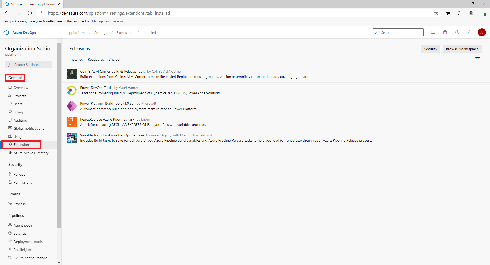
1. Install the following Extensions
   - **Power Platform Build Tools**: This extension contains the first-party build tasks for Dataverse. (https://marketplace.visualstudio.com/items?itemName=microsoft-IsvExpTools.PowerPlatform-BuildTools)

   - **Power DevOps Tools**: This extension contains several build tasks not currently supported by the first party build tools. (https://marketplace.visualstudio.com/items?itemName=WaelHamze.xrm-ci-framework-build-tasks | https://github.com/WaelHamze/dyn365-ce-vsts-tasks)

   - **Colin's ALM Corner Build & Release Tools**: This extension is used by the pipelines to tag builds based on the solution name so they can be identified by the specific solution that ran the general purpose export pipeline when deploying to environments. (https://marketplace.visualstudio.com/items?itemName=colinsalmcorner.colinsalmcorner-buildtasks | https://github.com/colindembovsky/cols-agent-tasks)

   - **RegexReplace Azure Pipelines Task**: This extension is used by the pipelines to replace strings in files by matching them against a regular expression. (https://marketplace.visualstudio.com/items?itemName=knom.regexreplace-task | https://github.com/knom/vsts-regex-tasks)

   - **Variable Tools for Azure DevOps Services**: This extension is used by the pipelines to save variables passed to a pipeline for use in other pipelines. Specifically, this tool is used to determine if an upgrade or update should be performed when solutions are imported to the various environments. (https://marketplace.visualstudio.com/items?itemName=nkdagility.variablehydration | https://github.com/nkdAgility/azure-devops-variable-tools)

   - **SARIF SAST Scans Tab (optional)**: This extension can be used to visualize the .**sarif files** that get generated by the **Solution Checker** during a build. ([SARIF SAST Scans Tab - Visual Studio Marketplace](https://marketplace.visualstudio.com/items?itemName=sariftools.scans))

     

### Copy the YAML Pipelines from GitHub to your Azure DevOps instance

> [!NOTE] You could also clone the GitHub repo directly into a new repo in Azure DevOps if you choose. However, the steps below will ensure that only the assets required are copied to your Azure DevOps repo.

1. Go to https://github.com/microsoft/coe-alm-accelerator-templates/ and clone the repo to a local folder.

1. Now go to https://dev.azure.com/ and **sign in to Azure DevOps (AzDO)**.

1. Create a **new project** or select an **existing project**.

1. Go to **Repos** and **create a new Repo** for the ALM Accelerator Components or **use the default repo** created with the project. 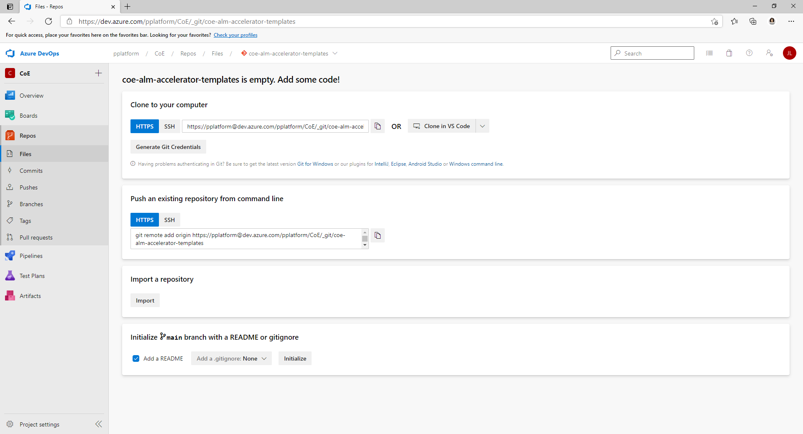

1. **Clone** the AzDO repo to a new local folder

1. Copy the **Pipelines** folder cloned from GitHub to the solution folder for the AzDO repo you created.

1. Commit the source code to your AzDO repo and push the code to AzDO.

   > [!NOTE] The AzDO repo you choose above will be where the Solution Pipeline Templates and the Export / Import Pipelines will run. Later when you create the Pipelines for your solutions you may need to reference this specific Project/Repo if you choose to source control your solutions in another repo in AzDO.

### Create Pipelines for Import, Delete and Export of Solutions

Following the steps below to create the following pipelines based on the YAML in the DevOps Repo. These pipelines will run when you **Commit to Git**, **Import a Solution** or **Delete a Solution** from the App, respectively.

| YAML File                                    | Pipeline Name                            |
| -------------------------------------------- | ---------------------------------------- |
| export-solution-to-git.yml                   | export-solution-to-git                   |
| import-unmanaged-to-dev-environment.yml      | import-unmanaged-to-dev-environment      |
| delete-unmanaged-solution-and-components.yml | delete-unmanaged-solution-and-components |

1. In Azure DevOps go to **Pipelines** and **Create a New Pipeline**
1. Select **Azure Repos Git** for your code Repository and point to Azure DevOps repo you created and seeded with the pipeline templates in the steps above.
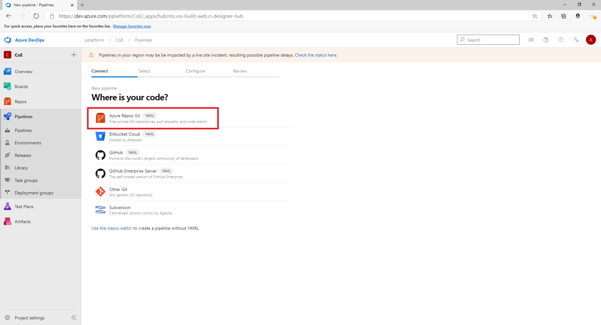
1. On the **Configure your pipeline** page select **Existing Azure Pipelines YAML file** and point to **/Pipelines/export-solution-to-git.yml**, **/Pipelines/import-unmanaged-to-dev-environment.yml** or **/Pipelines/delete-unmanaged-solution-and-components.yml**  and Select **Continue**.
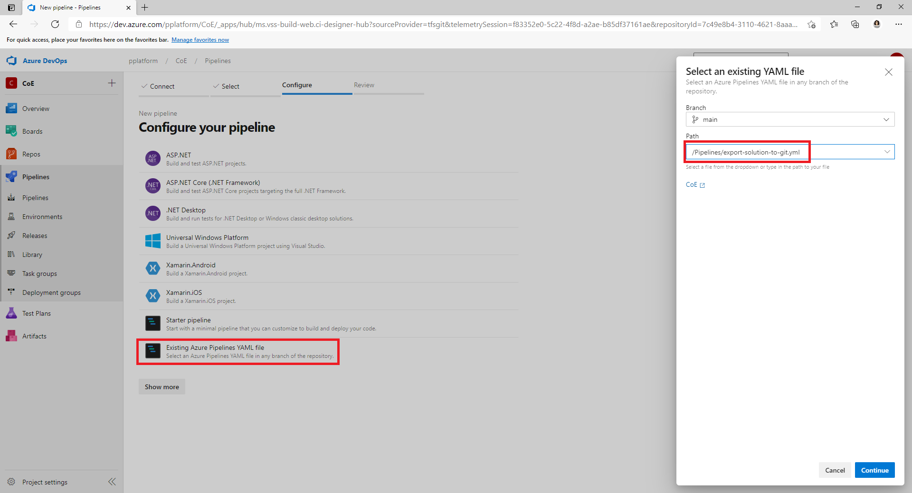
1. On the next screen Select **Save** and then Select the **3 dots next to Run Pipeline** and Select **Rename/Move**.
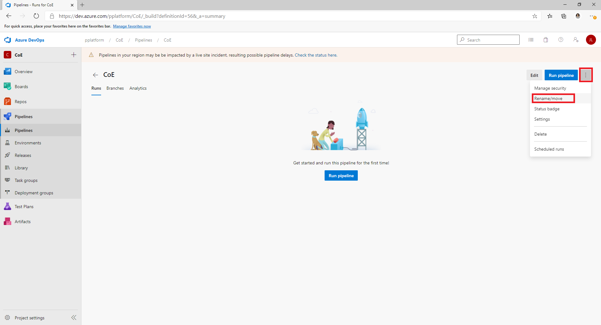
1. Update the pipeline name to **export-solution-to-git**, **import-unmanaged-to-dev-environment** or **delete-unmanaged-solution-and-components** and select **Save**.

### Get the Pipeline ID for the Export Solution Pipeline to use for global variables

For the next step you will need to get the **Pipeline ID** that the build pipelines use to find resources required for the build process.

 1. Open the **export-solution-to-git** pipeline and **copy the pipeline ID** from the address bar (e.g. If the URL for the Pipeline is (https://dev.azure.com/org/project/_build?definitionId=**39**) the **Pipeline ID** for this pipeline would be **39**)

### Create Pipeline global variables

1. In Azure DevOps Select **Pipelines** > **Library** > **Create a new Variable Group**
1. Name the Variable Group **global-variable-group**.

    >[!NOTE] The pipelines reference this specific variable group so it has to be named exactly as what's shown. Also, be sure to create all of the variables below as the pipelines depend on them to be present and configured in order to execute (i.e. if you don't have a production environment while configuring the variable group, for example, use the Test Service Connection for the time being).
1. Add the following Variables to the variable group

    |Name| Value |
    |--|--|
    | CdsBaseConnectionString  | AuthType=ClientSecret;ClientId=\$(ClientId);ClientSecret=\$(ClientSecret);Url= |
    | ClientId  | [The Application (client) ID you copied when creating the App Registration] |
    | ClientSecret | [The Application (client) Secret you copied when creating the App Registration] NOTE: It's recommeded that you secure this value by clicking the lock next to the value so others can't see your secret. |
    | TenantID  | [The Directory (tenant) ID you copied when creating the App Registration] |
    | PipelineIdToLoadJsonValuesFrom  | [The pipeline ID for export-solution-to-git copied in the previous step] |
    | ProductionSourceBranch         | [The branch you want to use to trigger a **Production Release**] NOTE: Generally this would be the **main** branch but could be setup to only release when merging to another branch of your choosing. When changes are made to the branch specified in this variable a release to Production will begin. |
    | ValidationServiceConnection | [The url of the validation instance of Dataverse e.g. https://deploy.crm.dynamics.com/] NOTE: This must be **identical** to the Azure DevOps **Validation Environment** **Service Connection** name you specified previously including any trailing forward slash. This environment will be used to run solution checker during the build process. |

### Update Permissions for the Project Build Service

> [!IMPORTANT] There are a number of "Build Service" accounts in Azure DevOps that may confuse the steps below. Pay close attention to the names / format specified in Step 3 and 5 below. You may need to search for the specific account if it doesn't show up in the initial list.

1. In Azure DevOps Select **Project Settings** in the left hand navigation.

1. Select **Repositories** > **Security**.

1. Find and select **Project Collection Build Service ([Your Organization Name])** under Users.

   > [!NOTE: In some cases you may not see Your Organization Name after the Project Collection Build Service user. In some cases it may just be a unique identifier and you may need to use the search function to find this user. Select this user]

1. Set the following permissions for the Build Service user.

   | Permission | Value |
   |--|--|
   | Contribute | Allow |
   | Contribute to pull requests | Allow |
   | Create branch | Allow |
   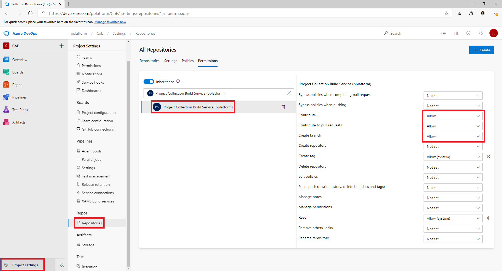

1. Find and select the user name **[Your Project Name] Build Service ([Your Organization Name])** under Users and set the **same values as above**.

## Development Project Setup

The following section will guide you through the setup steps required for each of the Development Projects you will support. In this context a Development Project signifies the required infratructure and configuration needed to support healthy ALM including configuraiton of you Dataverse environment that will support the ALM process.

### Create an App User in your Dataverse Environments

**Each environment (i.e. Development, Validation, Test and Production) will need to have an Application User.** For each of your environments follow the steps below to setup the Application User.

1. Go to https://make.powerapps.com and select your environment
1. Select the **COG** in the upper right hand corner and select **Advanced Settings**.
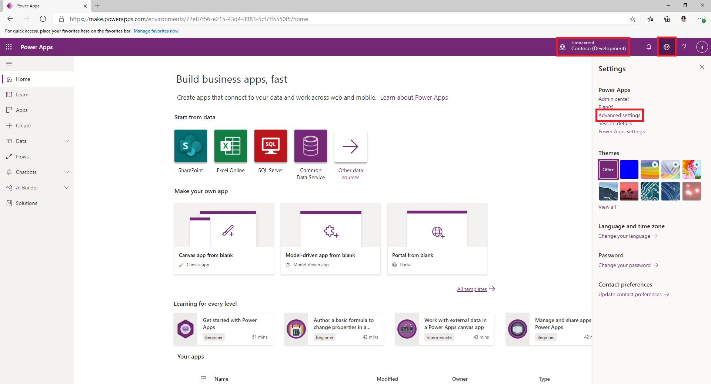
1. Select **Settings** > **Security** > **Users.**
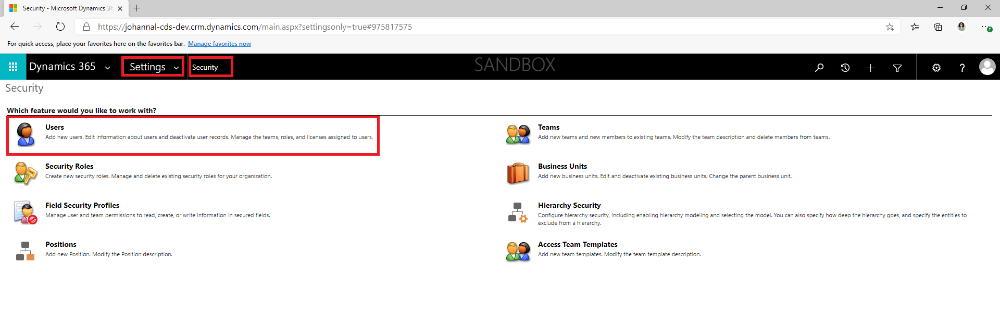
1. Under System Views select the **Application User view**.
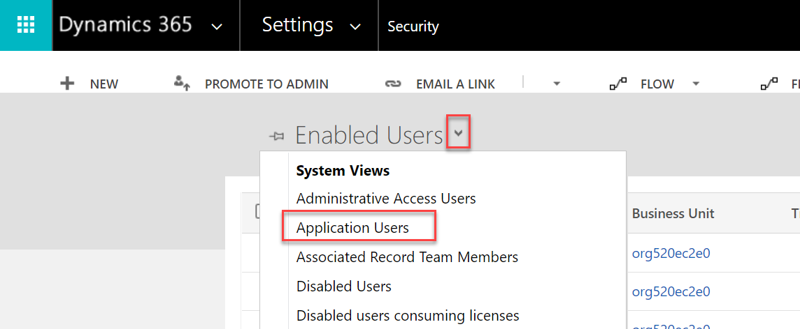
1. Select **New** then select the **Application User form** when the user form loads
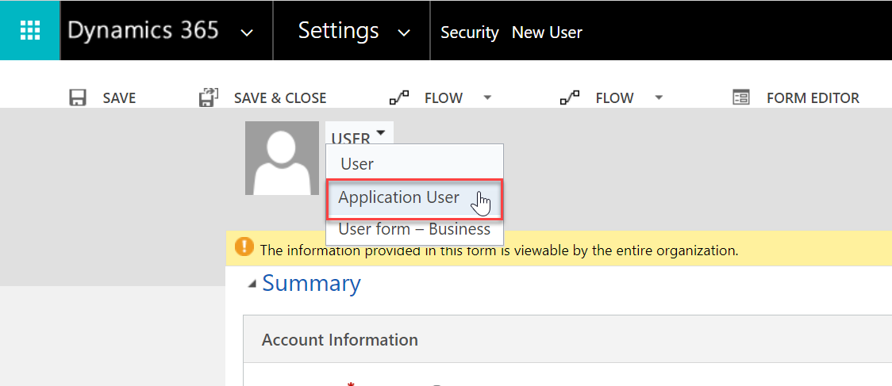
1. In the **Application ID** field copy and paste the **Application (client) ID** you copied when [creating your App Registration](#appid) then select **Save**.
1. After the user is created assign the user a Security Role.

    >[!NOTE] It's recommended you give this user System Administrator rights to be able to perform the required functions in each of the environments.
1. Repeat these steps as needed for each of your environments (i.e. Development, Validation, Test and Production).

### Create Service Connections for DevOps to access Power Platform

Each Dataverse environment (i.e. Development, Validation, Test and Production) will need to have a **Power Platform service connection in DevOps**. For each of your environments follow the steps below to setup the service connection.

1. Go to https://dev.azure.com and select your **Project**

1. Under **Project Settings** in your Azure DevOps project select the **Service connections** menu item.

1. Select **Create/New service connection** and Search for Power Platform and select the **Power Platform** Service connection type and Select **Next**.
    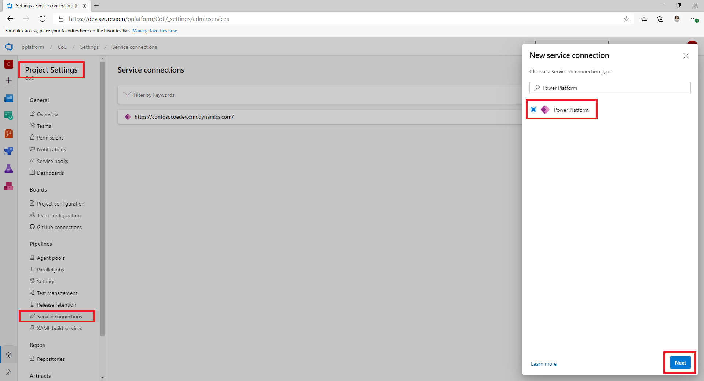

1. In the **Server URL** put your environment url (e.g. https://myorg.crm.dynamics.com/). **NOTE: You must include the trailing forward slash see below**

1. Enter the same value as above for the **Service Connection Name**.  **NOTE: You must include the trailing forward slash**

    >[!IMPORTANT] Currently ALM Accelerator will use the Service connection name to identify the service connection to use per environment so this needs to be the same url you entered above **including the trailing forward slash**).

1. Enter the **Tenant ID**, **Application (client) ID** and **Client Secret** you copied from AAD when you created your App Registration and select **Save**.

1. In order for users to be able to use the service connection from the ALM Accelerator App the Service Connections must provide permissions to all users to be able to **Read** the Service Connections. Update Permissions as follows:

    - Select the **Service Connection** to be **shared with users** from the **Service Connections** list.

      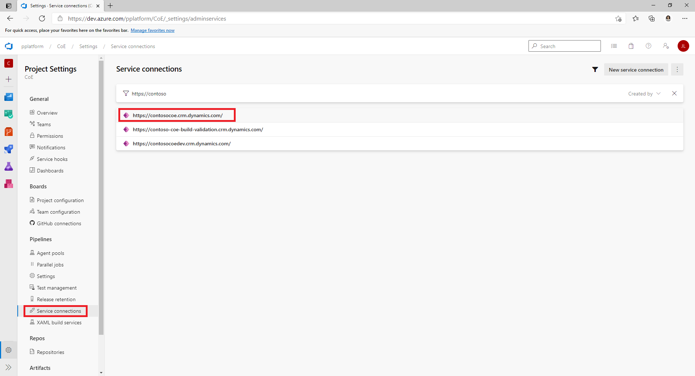

    - Select the **3 dots** in the top right corner and Select **Security**.

      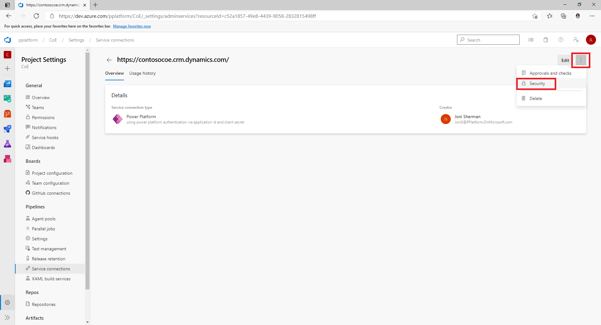

    - Select the **Group or User** you want to provide Read permissions to in the Dropdown.

    - Select the **Reader** **Role** and Select **Add**

      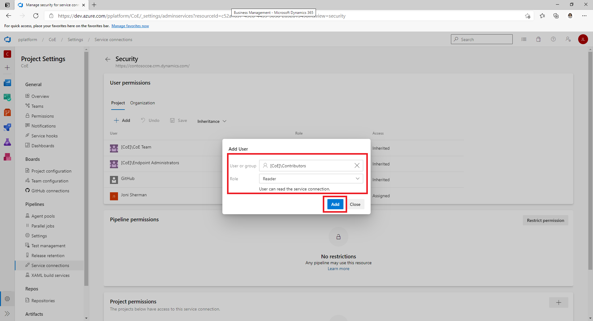

1. Repeat these steps as needed for each of your environments (i.e. Development, Validation, Test and Production).

## Solution Setup

When you create a solution in Dataverse you'll need to create a pipeline specifically for that solution. Follow these steps for creating a pipeline for your solution in Azure DevOps. There are sample pipelines included in the Pipeline directory in the CoE ALM Templates repo

- https://github.com/microsoft/coe-alm-accelerator-templates/blob/main/Pipelines/build-SampleSolution.yml
- https://github.com/microsoft/coe-alm-accelerator-templates/blob/main/Pipelines/deploy-validation-SampleSolution.yml
- https://github.com/microsoft/coe-alm-accelerator-templates/blob/main/Pipelines/deploy-test-SampleSolution.yml
- https://github.com/microsoft/coe-alm-accelerator-templates/blob/main/Pipelines/deploy-prod-SampleSolution.yml

The sample pipelines provides flexibility for organizations to store their pipeline templates in a separate project or repo from the specific solution pipeline YAML. Follow the steps below to configure your **solution pipeline**. Repeat the steps for each of the solutions you will be source controlling with the ALM Accelerator.

> [!IMPORTANT] The pipeline YAML for your solution pipeline will always be stored in the same repo to which you will be source controlling your solution. However, the pipeline templates (i.e. the folder Pipeline\Templates) can exist in either the same repo as your solution pipeline YAML or in a separate repo and/or project. 

### Create the Build Pipeline

The build pipeline is used to build a previously exported and unpacked solution to be deployed using the deployment pipelines created in the next step. 

1. In Azure DevOps go to the **Repo** that contains the [Pipelines folder you committed](#copy-the-yaml-pipelines-from-github-to-your-azure-devops-instance) and select the Pipelines folder

1. Open the sample build pipeline (i.e. **build-SampleSolution.yml**) and copy the YAML to use in your new Pipeline. **Note the name of this repo** for use in your pipeline.

   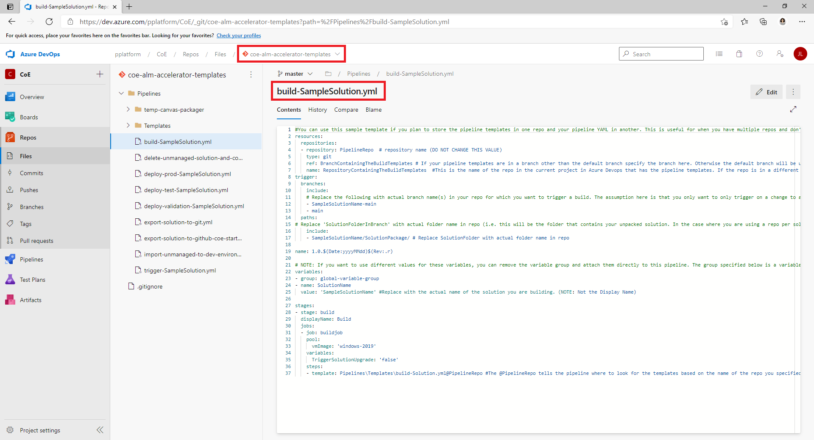

1. Navigate to the **Repo where you want to source control your solution**.

1. Select **New** from the top menu and then **Folder**

   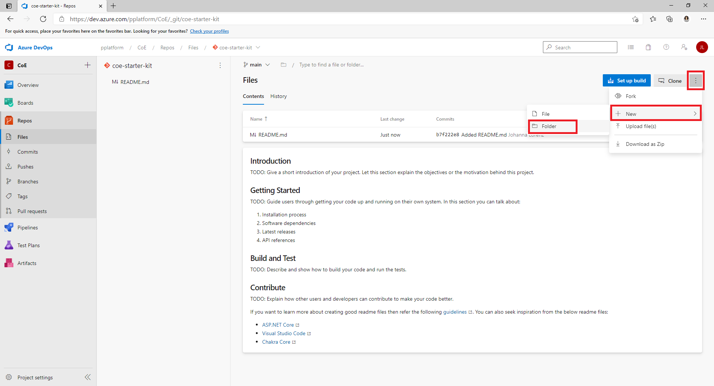

1. Give the new **Folder the same name as your solution** (e.g. MyNewSolution) and the new Pipeline YAML file a name (e.g. build-MyNewSolution.yml). Select **Create**

   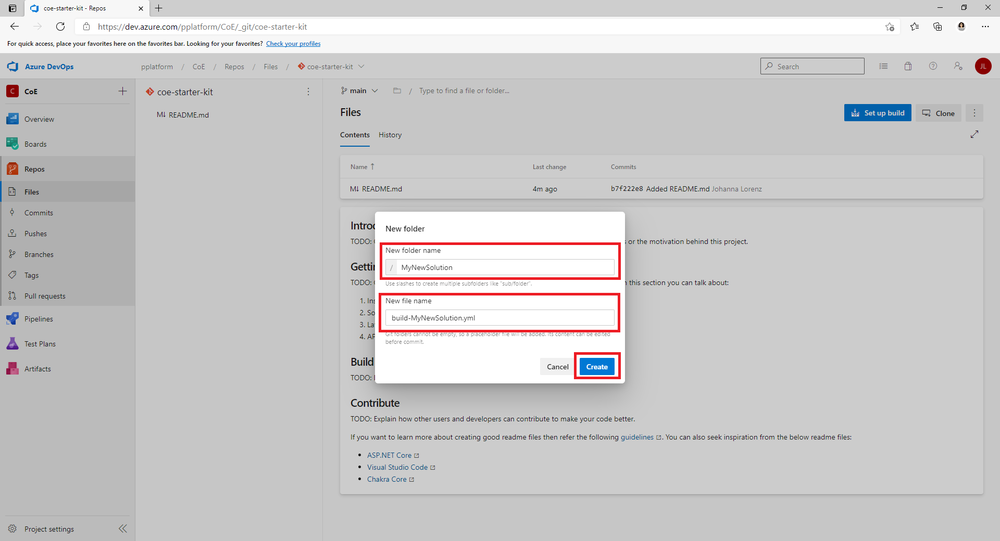

1. Paste the YAML from **build-SampleSolution.yml** into your new Pipeline YAML file.

   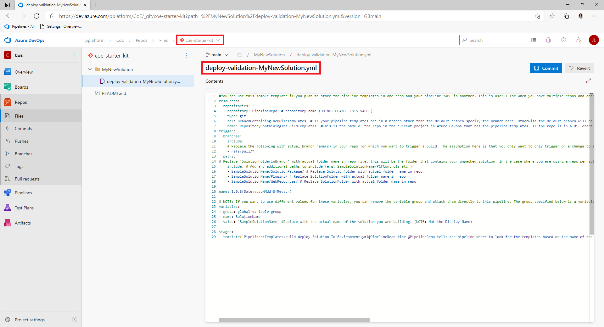

1. Update the following values in your new Pipeline YAML.

   - Change the **resources -> repositories -> name**  to the repo name that contains your pipeline templates. If your template repository is in another AzDO project you can use the format **projectname/reponame** here. In this case the repo is called **coe-alm-accelerator-templates** and it exists in the same project as our MyNewSolution repo. Additionally, you can specify a branch for where your templates live using the **ref** parameter if required.
   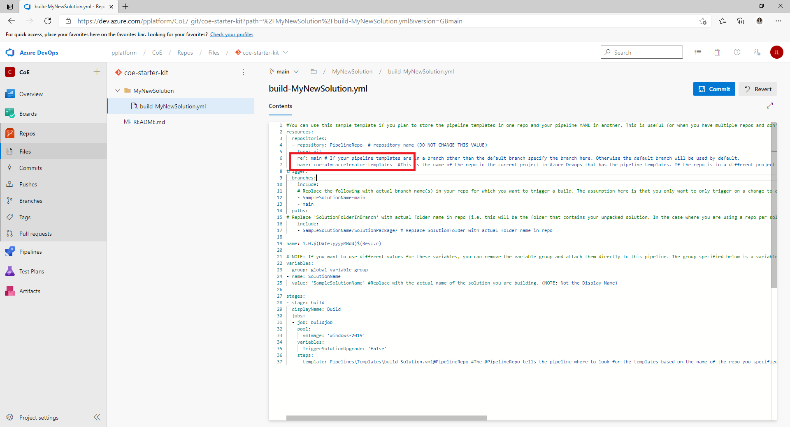

   - Change or remove the branch name(s) under **trigger -> branches -> include** depending on your branching strategy. The branch(es) you specify here will be the branch(es) on which the build triggers. Depending on your branching strategy you may want to specify something **other than main**. We're specifying **MyNewSolution-main and main** here for demonstration purposes based on our branching strategy. In our case we pull our development branches into a branch specific to the solution (i.e. **MyNewSolution-main**) prior to merging into our **main** branch for release.

   - Update the **include** and **exclude** paths for the trigger as needed. In the sample we are only triggering when the folder for our specific solution is changed and certain sub-folders that contain buildable assets.

   - Change any value that references **SampleSolutionName** to the unique name of your Solution (e.g. MySolutionName).

     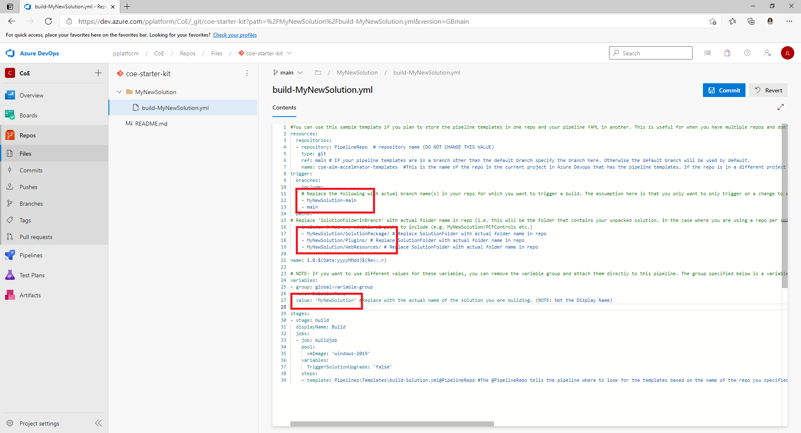

   - **Commit** your changes.

1. In Azure DevOps go to **Pipelines** and **Create a New Pipeline**

1. Select **Azure Repos Git** for your code Repository.
   

1. Select the **Azure DevOps repo** which contains the Pipeline YAML you created in step 4.

   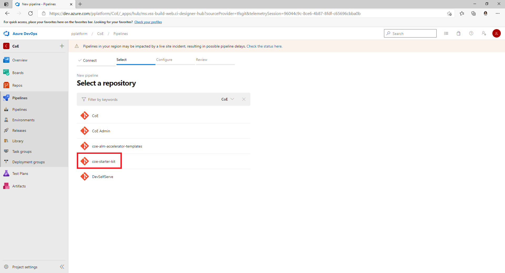

1. On the **Configure your pipeline** page select **Existing Azure Pipelines YAML file**, point to the **YAML File in your repo that you created in step 5** and Select **Continue**.

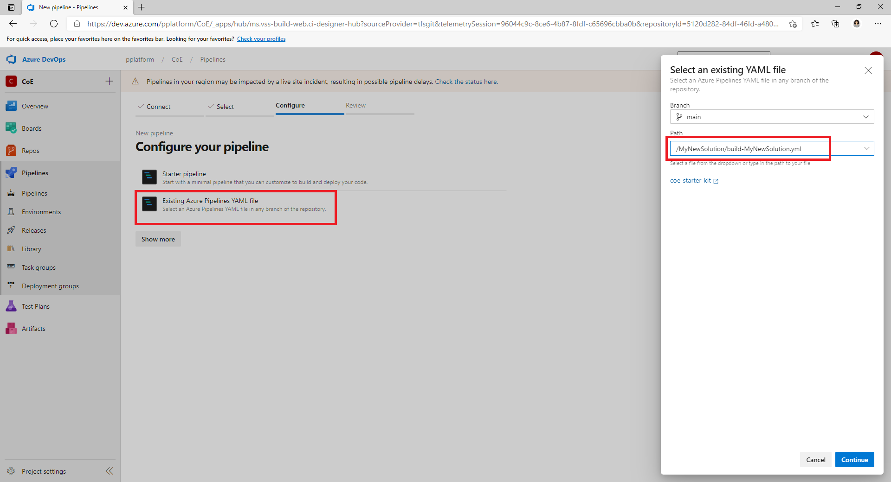

1. On the next screen Select **Save** and then Select the 3 dots next to Run Pipeline and Select **Rename/Move**.
   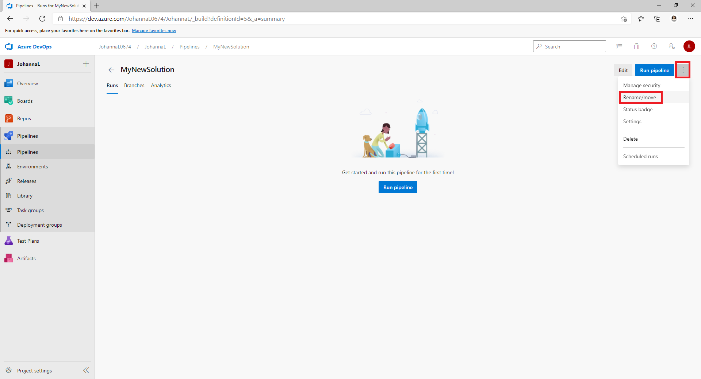

1. Update the pipeline name to **build-MyNewSolution** (where 'MyNewSolution' is the name of your solution) and select **Save**.

   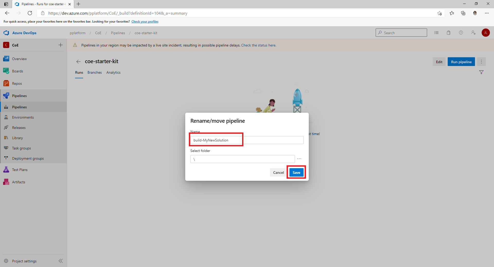

### Create the Deployment Pipeline(s)

Deployment Pipelines are used to deploy builds created by the build pipeline to environments in your tenant. You can create as many deployment pipelines as needed based on your organization's environment strategy. The sample pipelines provided assume only 3 environments (Validation, Test, Production). However, more or less can be created as needed with specific triggers. The sample deployment pipelines trigger off of build completion and the specific branches associated with the builds.

The following steps show how to create a pipeline from the sample pipeline YAML (**deploy-validation-SampleSolution.yml**). Follow these steps to create all of your deployment pipelines.

1. In Azure DevOps go to the **Repo** that contains the [Pipelines folder you committed](#copy-the-yaml-pipelines-from-github-to-your-azure-devops-instance) and select the Pipelines folder

1. Open the sample deployment pipeline (i.e. **deploy-validation-SampleSolution.yml, deploy-test-SampleSolution.yml or deploy-prod-SampleSolution.yml**) and copy the YAML to use in your new Pipeline. **Note the name of this repo** for use in your pipeline.

   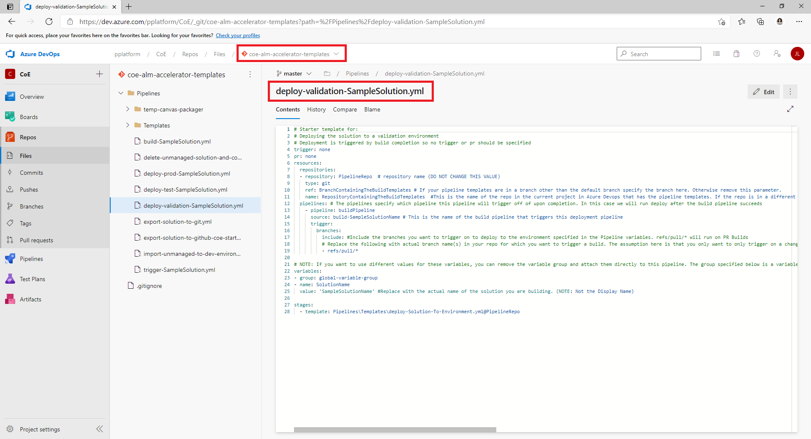

1. Navigate to the **Repo where you want to source control your solution** and select the folder you created when creating your build pipeline.

1. Select **New** from the top menu and then **File**

   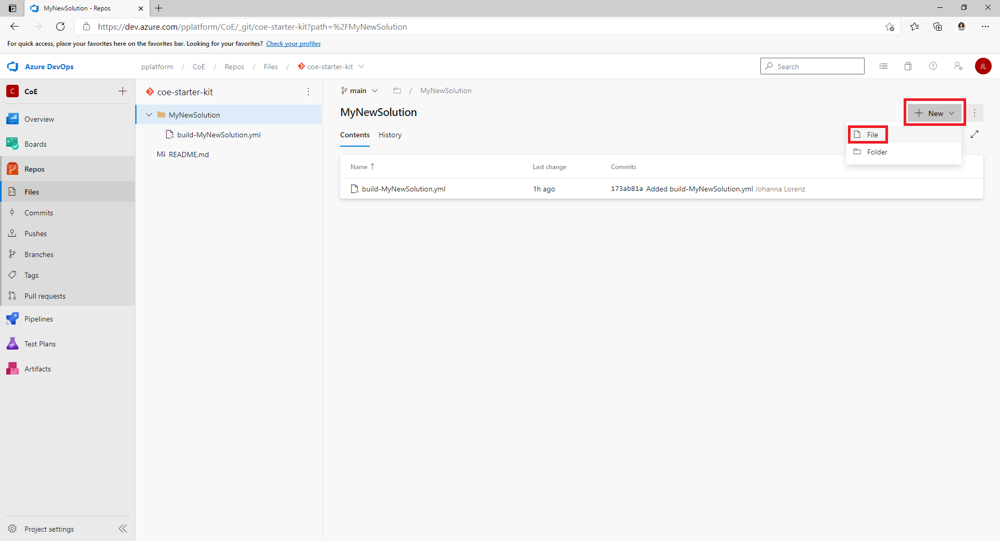

1. Give the new Pipeline YAML file a name (e.g. **deploy-validation-SampleSolution.yml**, **deploy-test-SampleSolution.yml** or **deploy-prod-SampleSolution.yml**). Select **Create**

   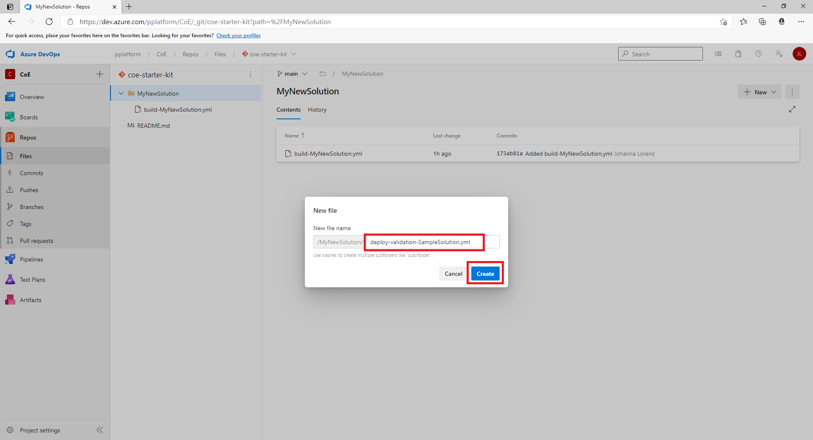

1. Paste the YAML from **deploy-validation-SampleSolution.yml**, **deploy-test-SampleSolution.yml** or **deploy-prod-SampleSolution.yml** into your new Pipeline YAML file.

1. 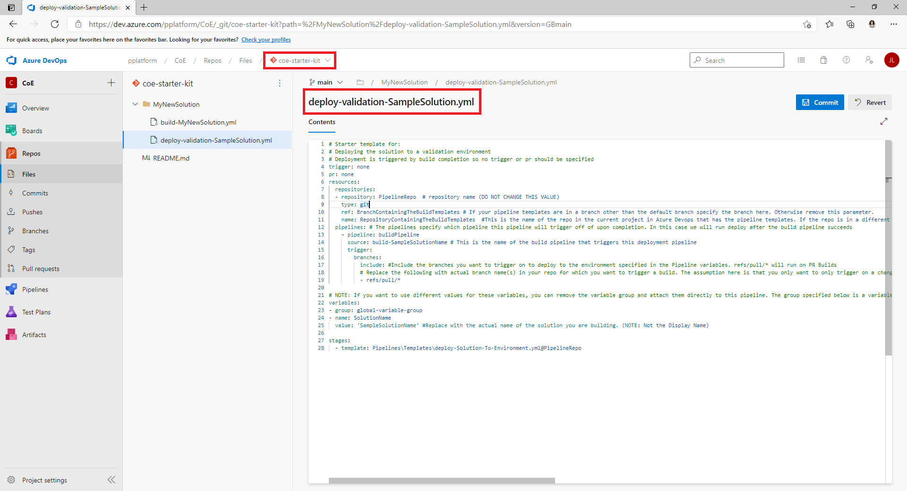

1. Update the following values in your new Pipeline YAML.

   - Change the **resources -> repositories -> name**  to the repo name that contains your pipeline templates. If your template repository is in another AzDO project you can use the format **projectname/reponame** here. In this case the repo is called **coe-alm-accelerator-templates** and it exists in the same project as our MyNewSolution repo. Additionally, you can specify a branch for where your templates live using the **ref** parameter if required.

   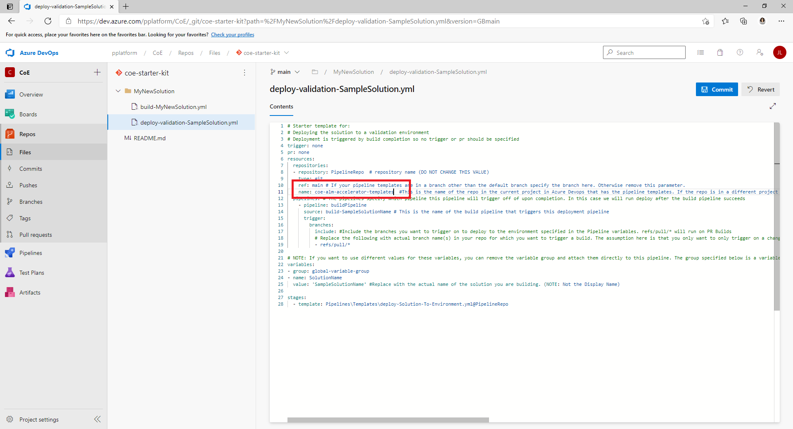

    - Change or remove the branch name(s) under **resources -> pipelines -> trigger -> branches -> include** depending on your branching strategy. The branch(es) you specify here will be the branch(es) on which the deployment triggers based on the build branch. Depending on your branching strategy you may want to specify something **other than what is specified in the sample**. In the above screenshot we have specified refs/pull/* because we want to run the validation deployment on Pull Requests prior to merging.

    - Change any value that references **SampleSolutionName** to the unique name of your Solution (e.g. MySolutionName).

      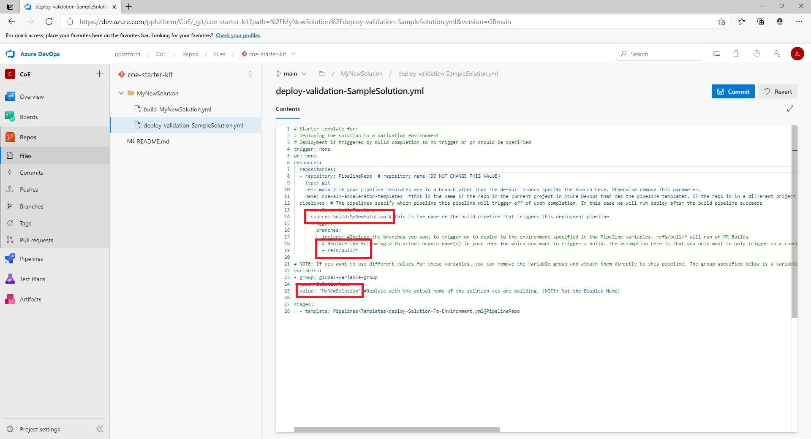

    - **Commit** your changes.

1. In Azure DevOps go to **Pipelines** and **Create a New Pipeline**

1. Select **Azure Repos Git** for your code Repository.
   

1. Select the **Azure DevOps repo** which contains the deployment Pipeline YAML.

    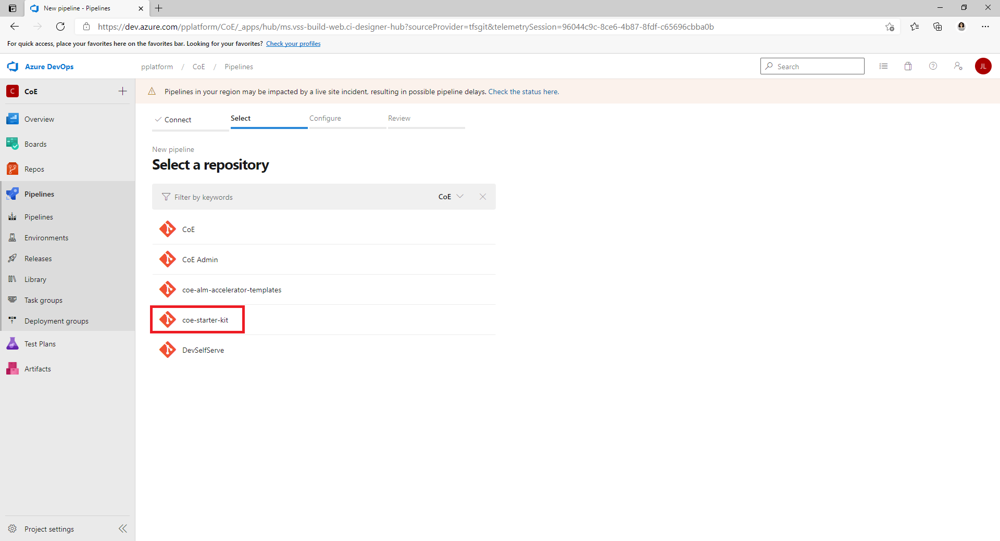

1. On the **Configure your pipeline** page select **Existing Azure Pipelines YAML file**, point to the **YAML File in your repo that you created in step 5** and Select **Continue**.


1. On the next screen Select **Save** and then Select the 3 dots next to Run Pipeline and Select **Rename/Move**.
   

1. Update the pipeline name to **deploy-validation-MyNewSolution** (where 'MyNewSolution' is the name of your solution) and select **Save**.

   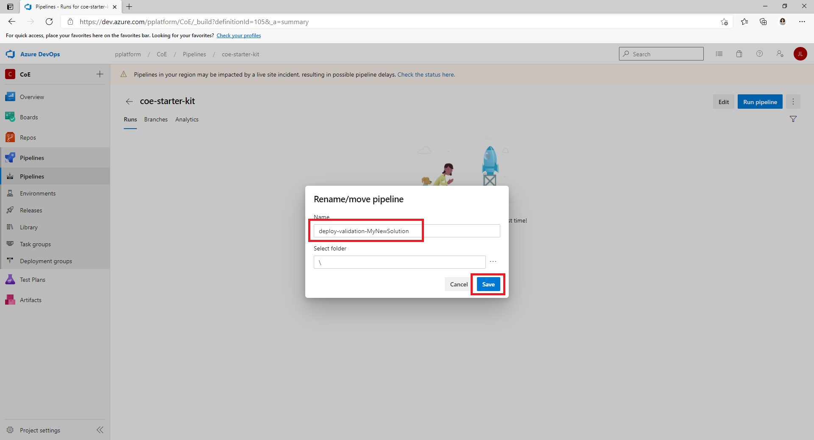

   > [!NOTE] If your new pipeline was not created in the default branch of the repo you may need to update the **Default branch for manual and scheduled builds**. See the following link for setting the **Default branch for manual and scheduled builds**. [Configure pipeline triggers - Azure Pipelines | Microsoft Docs](https://docs.microsoft.com/en-us/azure/devops/pipelines/process/pipeline-triggers?view=azure-devops&tabs=yaml#branch-considerations-for-pipeline-completion-triggers)

1. Repeat the steps above to create a deployment pipeline for each of your environments referencing the sample deployment pipeline yaml from the **coe-alm-accelerator-templates repo** (i.e. deploy-validation-SampleSolution.yml, deploy-test-SampleSolution.yml and deploy-prod-SampleSolution.yml).

### Importing Data from your Pipeline

In many cases there will be configuration or seed data that you will want to import into your Dataverse environment initially after deploying your solution to the target environment. The pipelines are configured to import data using the **Configuration Migration tool** available via nuget https://www.nuget.org/packages/Microsoft.CrmSdk.XrmTooling.ConfigurationMigration.Wpf. To add configuration data for your pipeline use the following steps.

1. Install the **Configuration Migration tool** per the instructions here https://docs.microsoft.com/en-us/dynamics365/customerengagement/on-premises/developer/download-tools-nuget

1. Open the **Configuration Migration tool** select **Create schema** and select **Continue**

   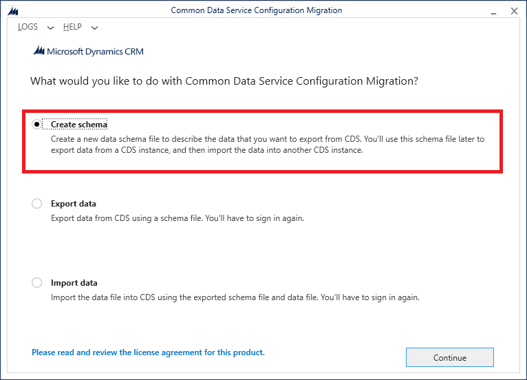

1. **Login to the tenant** from which you want to **export your configuration data**

   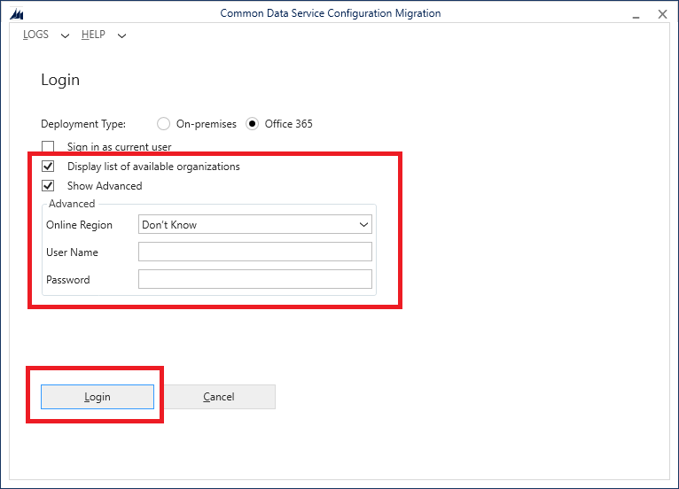

1. Select your **environment**

   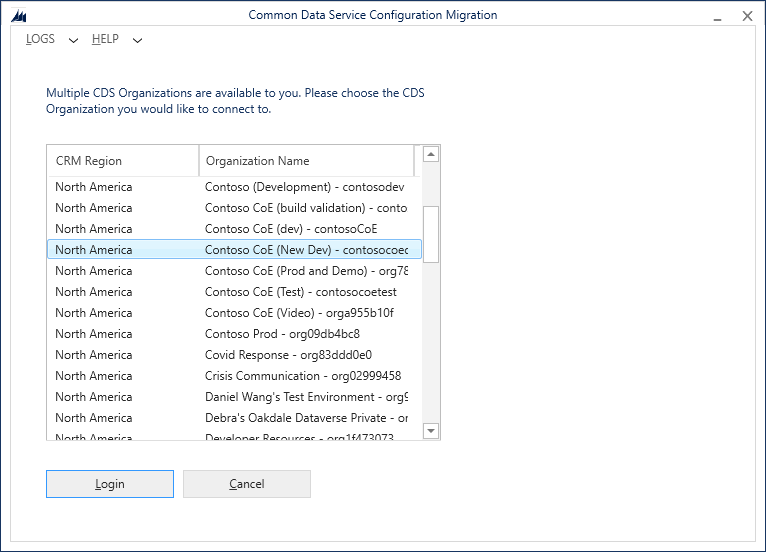

1. Select the specific **Tables and Columns** you want to export for your configuration data.

   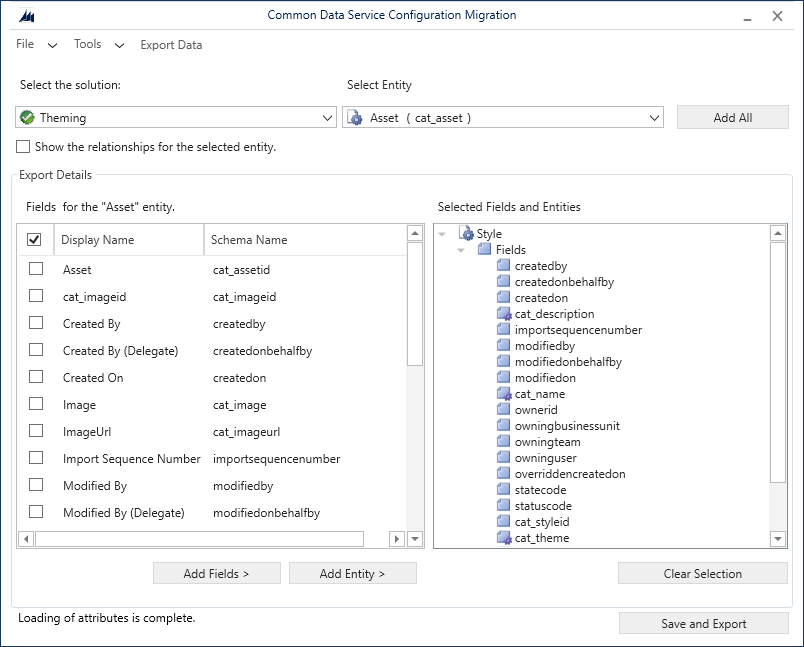

1. Select **Save and Export** and save the data to a folder called **ConfigurationMigrationData** in your **local Azure DevOps repo** under the **solution folder** for which this configuration data is to be imported.

   > [!NOTE] The pipeline will look for this specific folder to run the import after your solution is imported. Ensure that the name of the folder and the location are the same as the screenshot below.

   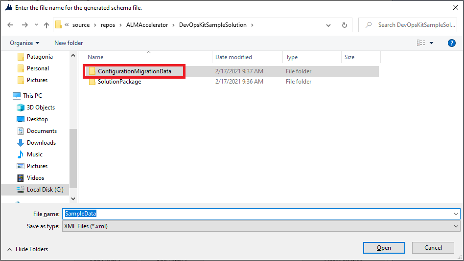

   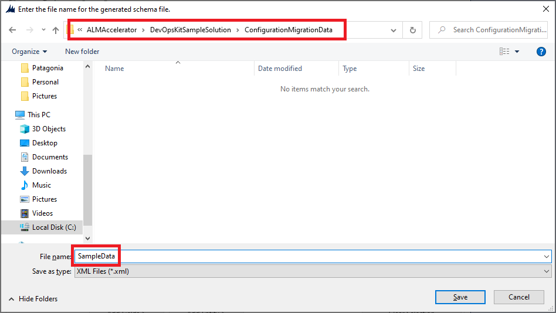

1. When prompted to **export the data** select **Yes**

   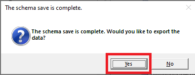

1. Choose the **same location** for your exported data and **select Save** then **Export Data**.

   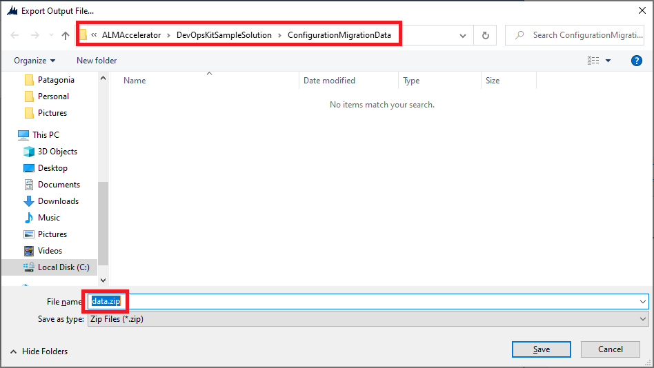

   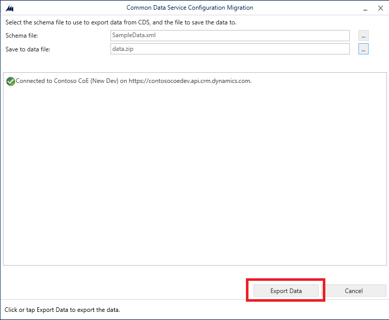

1. When the export is complete **unzip the files from the data.zip** file to the ConfigurationMigrationData directory and **delete the data.zip** file.

   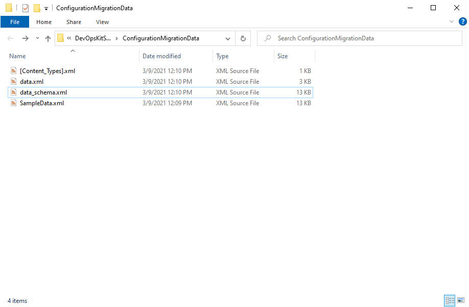

1. Finally, **Commit the changes** with your data to Azure DevOps.

### Setting Branch Policies for Pull Request Validation

In order to leverage executing the build pipeline for your solution when a **Pull Request is created** you'll need to create a **Branch Policy** to execute the Pipeline you created in the previous step. Use the following steps to set your Branch Policy.

1. In Azure DevOps go to **Repos** and select the **Branches** folder

1. Locate the **target branch** on which you want to run the **Pull Request policy** and select the ellipsis to the right of the target branch and Select **Branch Policies**.

   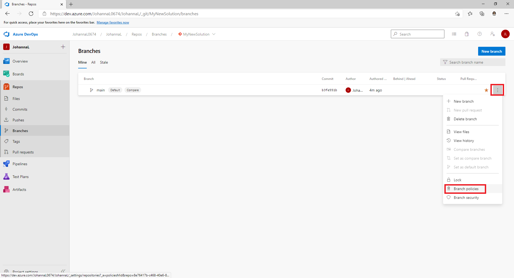

1. On the **Branch Policies** screen go to **Build Validation**

1. Click the **+ Button** to add a **new Branch Policy**

   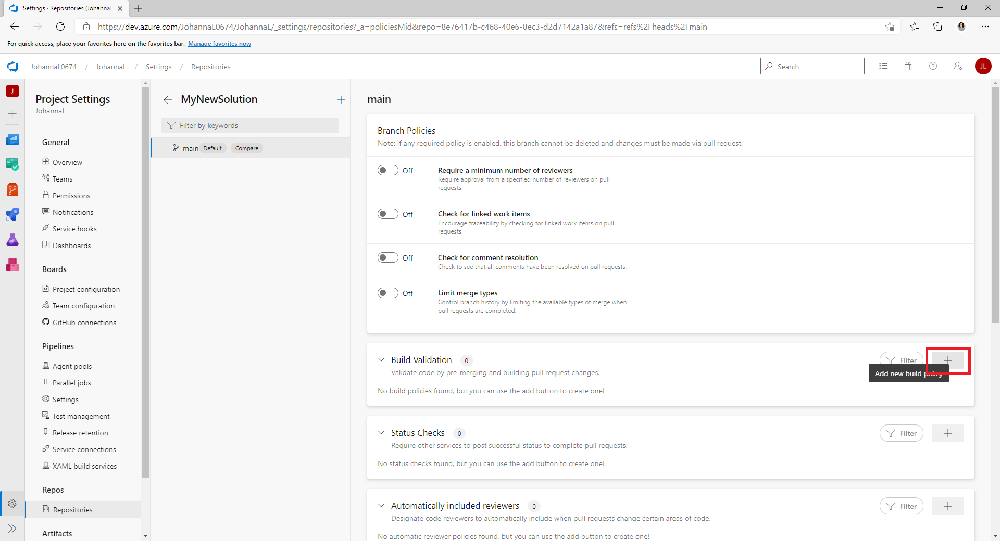

1. Select the Pipeline you just created from the **Build pipeline** dropdown

1. Specify a **Path filter** (if applicable). The path filter will ensure that only changes to the path specified will trigger the pipeline for your Pull Request.

1. Set the **Trigger** to **Automatic**

1. Set the **Policy requirement** to **Required**

1. Set the **Build expiration** to **Immediately**

1. Set a **Display name** for your Branch Policy (e.g. PR Build Validation)

1. Click **Save**

   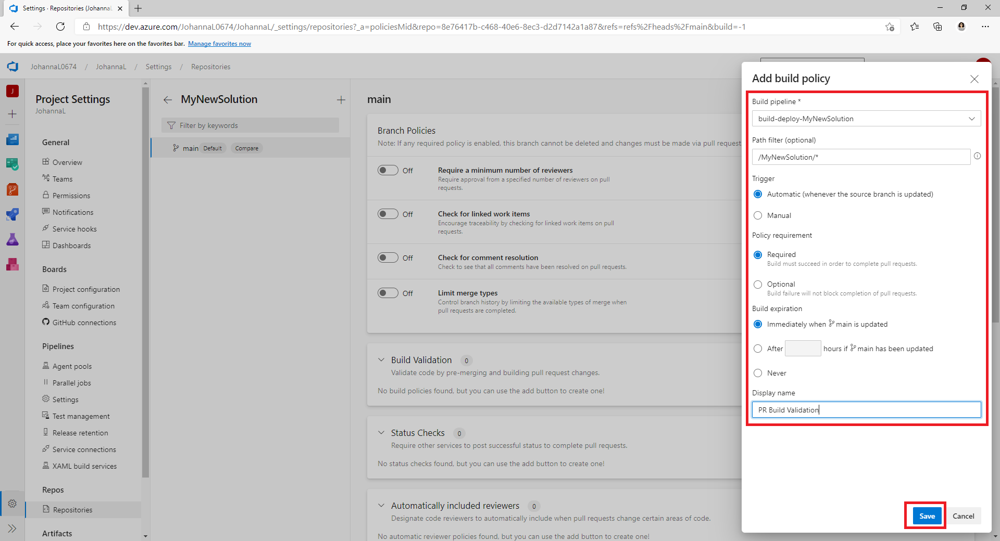

### Setting Deployment Pipeline Variables

The ALM Accelerator uses JSON formatted Pipeline variables for updating **connection references, environment variables, setting permissions for AAD Groups and Dataverse teams** as well as **sharing Canvas Apps and updating ownership of solution components** such as Power Automate flows. **EnvironmentName** and **ServiceConnection** variables are **required** for each pipeline. All other pipeline variables are **optional** and depend on what type of components your solution pipelines deploy. For instance, if your solutions only contain Dataverse Tables, Columns and Model Driven Apps **some of these steps may not be necessary** and can be skipped. The following variables allow you to fully automate the deployment of your solutions and specify how to configure items that are specific to the environment to which the solution is being deployed.

> [!IMPORTANT] These pipeline variables will be set for each **deployment pipeline** you've configured above based on the environment to which your pipeline deploys.

#### Create Environment and Service Connection (Required)

These variables are required by every deployment pipeline. The Environment variable is **EnvironmentName** and the Service Connection variable is **ServiceConnection**.

The **EnvironmentName** variable is used to specify the Azure DevOps environment being deployed to in order to enable tracking deployment history and set permissions and approvals for deployment to specific environments. Depending on the environment to which you're deploying set this value to **Validate, Test or Production** For more information on Environments in AzureDevOps see https://docs.microsoft.com/en-us/azure/devops/pipelines/process/environments.


 The **ServiceConnection** variable is used to specify how the deployment pipeline connects to the Power Platform. The values used for the Service Connection variable are the names of the Service Connections created above [Create a Service Connection for DevOps to access Power Platform](#create-service-connections-for-devops-to-access-power-platform)

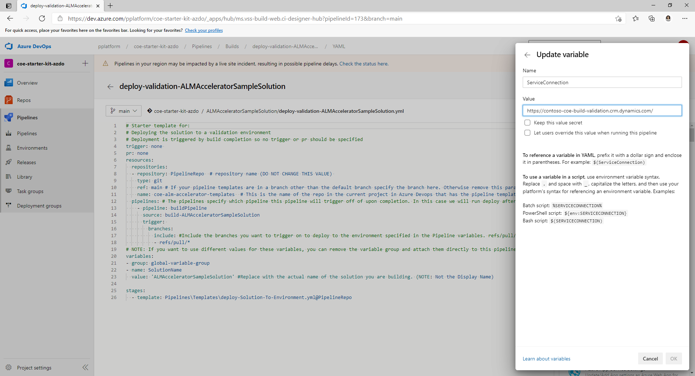

#### Create Connection Reference Pipeline Variable (Optional)

The connection reference variable is **ConnectionReferences**. This pipeline variable is used for setting connection references in your solution to specific connections configured in a target environment after the solution is imported into an environment.

1. You will need to create the connections manually in your target environments and copy the IDs for the connection to use in the JSON value below

1. The format of the JSON for these variables take the form of an array of name/value pairs.

   ```json
      [
        "connection reference1 schema name",
        "my environment connection ID1"
      ],
      [
        "connection reference2 schema name",
        "my environment connection ID2"
      ]
   ]
   ```

   - The **schema name** for the connection reference can be obtained from the **connection reference component** in your solution.
     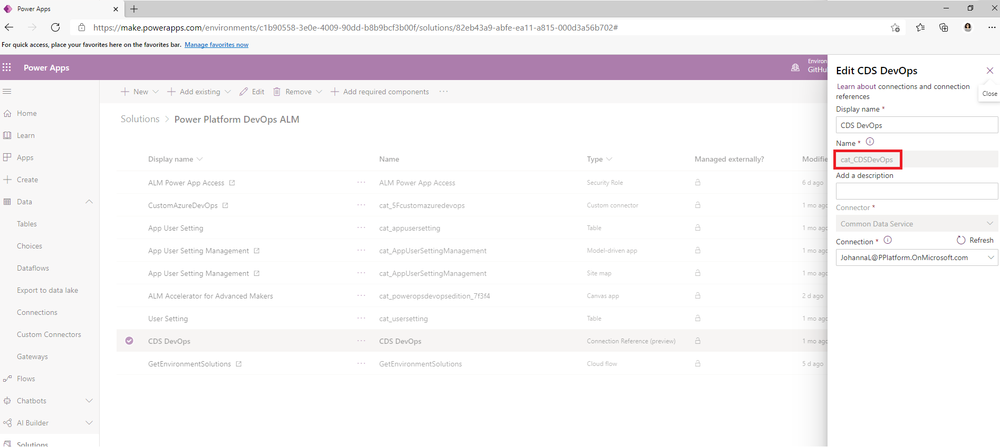

   - The **connection id** can be obtained via the url of the connection after you create it. For example the id of the connection below is **9f66d1d455f3474ebf24e4fa2c04cea2** where the url is https://.../connections/shared_commondataservice/9f66d1d455f3474ebf24e4fa2c04cea2/details#
   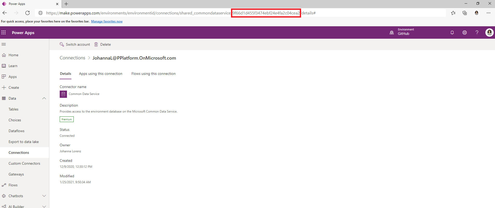

1. Once you've gathered the connection reference schema names and connection ids go to the pipeline for your solution that you created above Select **Edit -> Variables**

1. On the **Pipeline Variables** screen create the **ValidationConnectionReferences**, **TestConnectionReferences** and **ProdConnectionReferences** pipeline variables.

1. Set the value to the json formatted array of connection reference schema and connection ids.

   - For the example above the values look like the following
     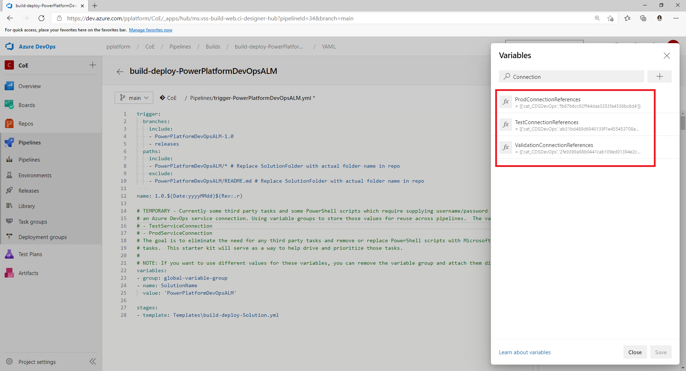

1. Where applicable repeat the steps above for each solution / pipeline you create.

#### Create Environment Variable Pipeline Variable (Optional)

The environment variable pipeline variable is **EnvironmentVariables**. This pipeline variable is used for setting Dataverse **Environment variables** in your solution after the solution is imported into an environment.

1. The format of the JSON for these variables take the form of an array of name/value pairs.

   ```json
   [
      [
         "environment variable1 schema name",
         "environment variable1 value"
      ],
      [
         "environment variable2 schema name",
         "environment variable2 value"
      ]
   ]
   ```

   - The **schema name** for the environment variable can be obtained from the **environment variable component** in your solution.
     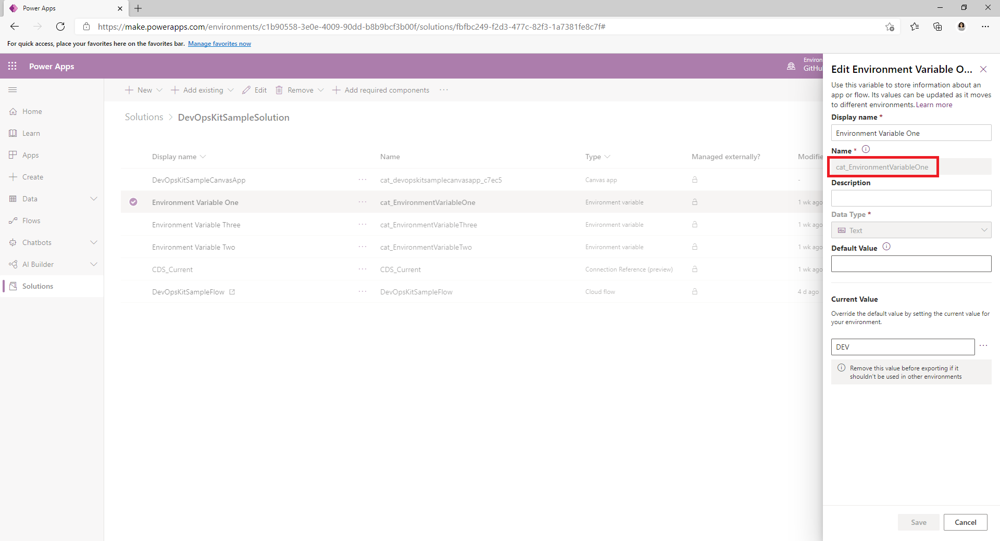

1. Once you've gathered the environment variable schema names and connection ids go to the pipeline for your solution that you created above

1. Click Edit -> Variables

1. On the Pipeline Variables screen create the **ValidationEnvironmentVariables**, **TestEnvironmentVariables** and **ProdEnvironmentVariables** pipeline variables.

1. Set the value to the json formatted array of environment variable schema and values.

1. For the example above the values look like the following
   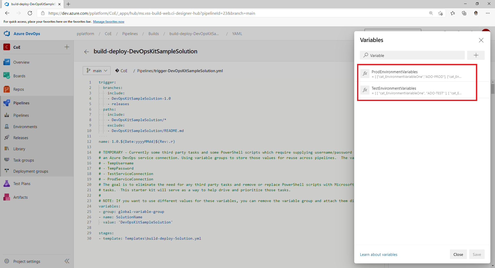

1. Where applicable repeat the steps above for each solution / pipeline you create.

#### Create AAD Group Canvas Configuration Pipeline Variable (Optional)

The aad group canvas configuration pipeline variable is **AadGroupCanvasConfiguration**. This pipeline variable is used for **sharing canvas apps** in your solution with specific **Azure Active Directory Groups** after the solution is imported into an environment.

1. The format of the JSON for these variables take the form of an array of objects. The **roleName** can be one of **CanView**, **CanViewWithShare** and **CanEdit**

   ```json
   [
    {
        "aadGroupId": "azure active directory group id",
        "canvasNameInSolution": "canvas app schema name1",
        "roleName": "CanView"
    },
    {
        "aadGroupId": "azure active directory group id",
        "canvasNameInSolution": "canvas app schema name2",
        "roleName": "CanViewWithShare"
    },
    {
        "aadGroupId": "azure active directory group id",
        "canvasNameInSolution": "canvas app schema name1",
        "roleName": "CanEdit"
    }
   ]
   ```

   - The **schema name** for the Canvas App can be obtained from the **Canvas App component** in your solution.
     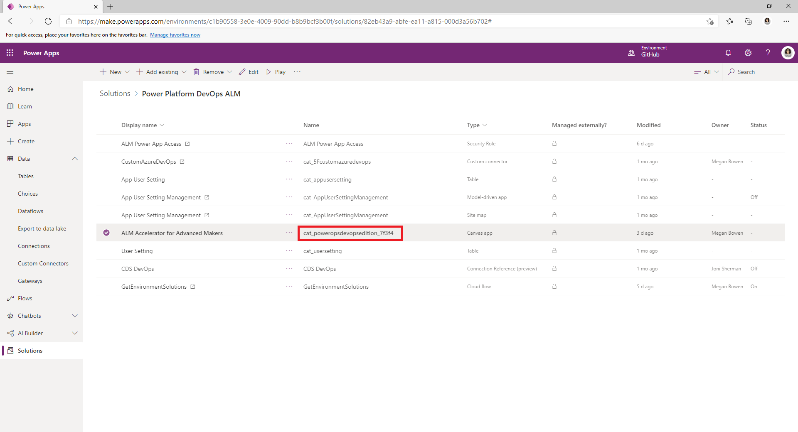

   - The **azure active directory group id** can be obtained from the **Group blade in Azure Active Directory** from the Azure Portal.
     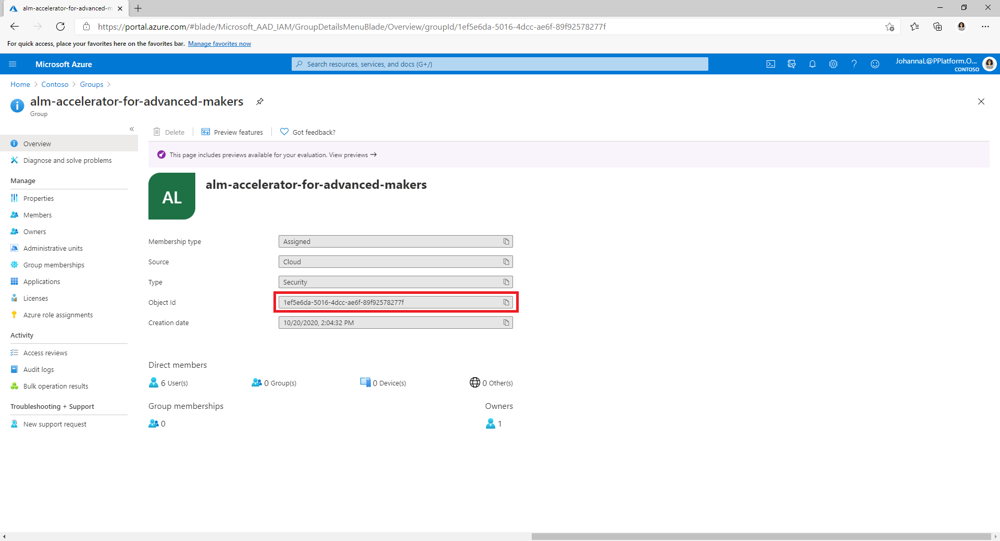

1. Once you've gathered the Canvas App schema names and aad group ids go to the pipeline for your solution that you created above

1. Click Edit -> Variables

1. On the Pipeline Variables screen create the **ValidationAadGroupCanvasConfiguration**, **TestAadGroupCanvasConfiguration** and **ProdAadGroupCanvasConfiguration** pipeline variables.

1. Set the value to the json formatted array of objects per the sample above.

1. For the example above the values look like the following
   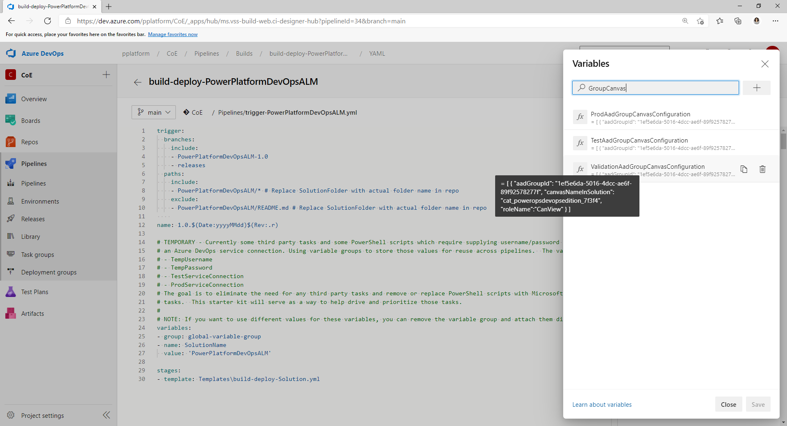
   Where applicable repeat the steps above for each solution / pipeline you create.

#### Create AAD Group / Team Configuration Pipeline Variable (Optional)

The pipeline variable is **AadGroupTeamConfiguration**. This pipeline variable is used for mapping **Dataverse Teams and Roles** to specific **Azure Active Directory Groups** after the solution is imported into an environment. The security roles will need to added to your solution if they are not manually created in the target environment.

1. The format of the JSON for these variables take the form of an array of objects. One or many roles can be applied to any given team and these roles provide permissions to solution components required by the users in the group.

   ```json
   [
    {
        "aadGroupTeamName": "dataverse team1 name to map",
        "aadSecurityGroupId": "azure active directory group id1",
        "dataverseSecurityRoleNames": [
            "dataverse role1 to apply to the team"
        ]
    },
    {
        "aadGroupTeamName": "dataverse team2 name to map",
        "aadSecurityGroupId": "azure active directory group id2",
        "dataverseSecurityRoleNames": [
            "dataverse role2 to apply to the team"
        ]
    }
   ]
   ```

   - The **Dataverse team name** can be any **existing team or a new team** to be created in Dataverse and mapped to an AAD Group after the solution is imported via the pipeline.

   - The **azure active directory group id** can be obtained from the **Group blade in Azure Active Directory** from the Azure Portal.

   

   - The **Dataverse role** can be any **Security Role in Dataverse** that would be applied to the **existing or newly created Team** after the solution is imported via the pipeline. The role should have permissions to the resources required by the solution (e.g. Tables and Processes)

1. Once you've gathered the team names, aad group ids and roles go to the pipeline for your solution that you created above. Click Edit -> Variables
1. On the Pipeline Variables screen create the **ValidationAadGroupTeamConfiguration**, **TestAadGroupTeamConfiguration** and **ProdAadGroupTeamConfiguration** pipeline variables.
1. Set the value to the json formatted array of environment variable schema and values.
1. For the example above the values look like the following
   
1. Where applicable repeat the steps above for each solution / pipeline you create.

#### Create Solution Component Ownership Pipeline Variable (Optional)

The  pipeline variable is **SolutionComponentOwnershipConfiguration**. This variable is used for assigning ownership of solution components to Dataverse Users after the solution is imported into an environment. This is particularly useful for components such as Flows that will be owned by default by the Service Principal user when the solution is imported by the pipeline and organizations want to reassign them after import.

>[!NOTE] The current pipeline only implements the ability to set ownership of Flows. The ability to assign other components to users could be added in the future.

1. The format of the JSON for these variables take the form of an array of objects.

   ```json
   [
    {
        "solutionComponentType": solution component1 type code,
        "solutionComponentUniqueName": "unique id of the solution component1",
        "ownerEmail": "new owner1 email address"
    },
    {
        "solutionComponentType": solution component2 type code,
        "solutionComponentUniqueName": "unique id of the solution component2",
        "ownerEmail": "new owner2 email address"
    }
   ]
   ```

   - The **solution component type code** is based on the component types specified in the following doc https://docs.microsoft.com/en-us/dynamics365/customer-engagement/web-api/solutioncomponent?view=dynamics-ce-odata-9 (e.g. a Power Automate Flow is component type 29). The component type should be specified as an integer value (i.e. with no quotes)
   - The **unique name of the solution component**, in the case of a Power Automate Flow, has to be taken from the unpacked solution. This is a limitation of flows currently not requiring unique names when they are created. As such the only true unique identifier for a Flow is the internal ID the system uses to identify it in a solution.
     
      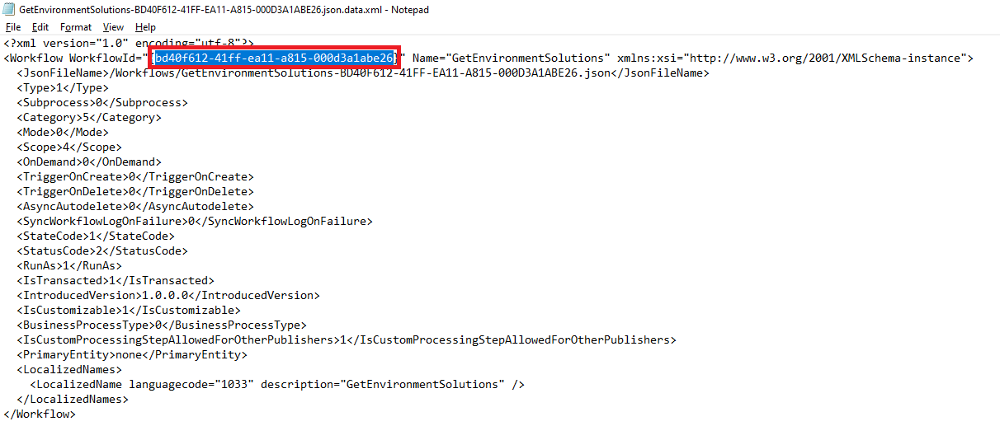
   - The **owner email** can be gathered from the user's record in Dataverse or Office 365.

1. Once you've gathered the component type codes, unique name of the components and owner emails go to the pipeline for your solution that you created above

1. Click Edit -> Variables

1. On the Pipeline Variables screen create the **ValidationSolutionComponentOwnershipConfiguration**, **TestSolutionComponentOwnershipConfiguration** and **ProdSolutionComponentOwnershipConfiguration** pipeline variables.

1. Set the value to the json formatted array of environment variable schema and values.

1. For the example above the values look like the following
   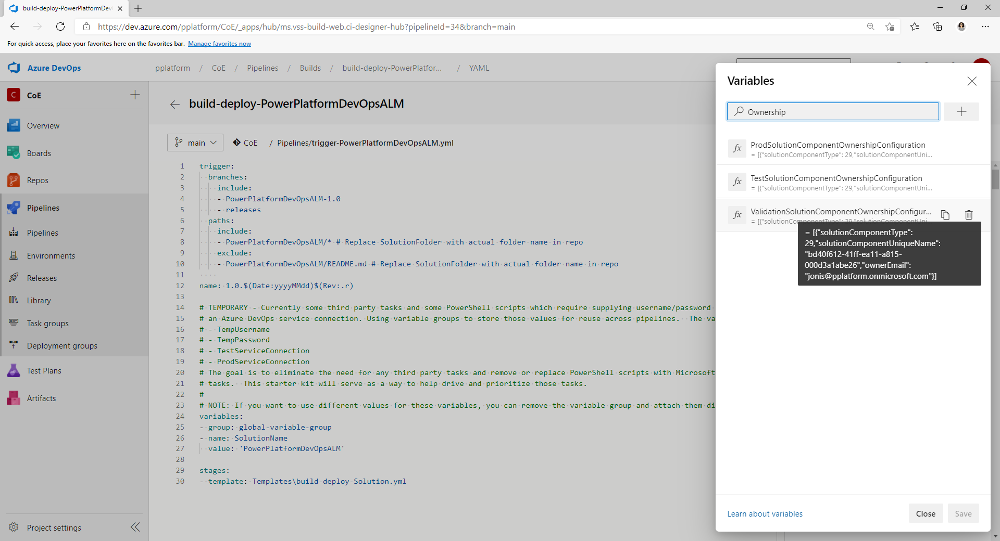

1. Where applicable repeat the steps above for each deployment solution / pipeline you create.

## Importing the Solution and Configuring the App

### Install ALM Accelerator Solutions in Dataverse

> [!NOTE] As of January 2021, before installing the solutions you will need to **enable Power Apps Component Framework for Canvas apps** from the Power Platform Admin Center by going to https://admin.powerplatform.microsoft.com/ selecting your environment and selecting **Settings** - **Product** - **Features**. From here select the toggle for **Power Apps component framework for canvas apps** to turn it on.
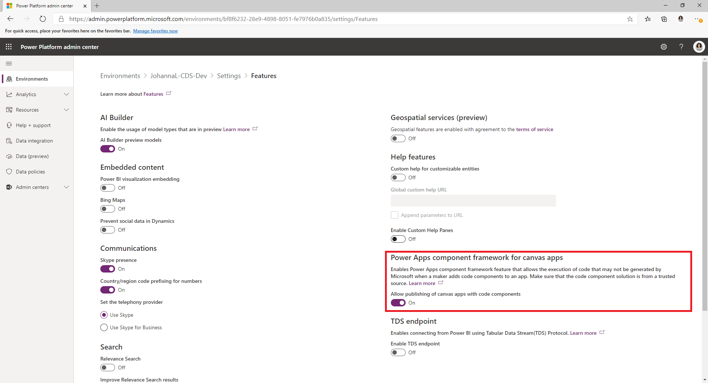

1. Download the **latest managed solution** from GitHub (https://github.com/microsoft/coe-starter-kit/releases)
2. Go to https://make.powerapps.com and select the environment you want to use to host the ALM Accelerator App
3. Select **Solutions** from the left navigation.
4. Click **Import** and Browse to the location of the managed solution you downloaded.
5. Click **Next** and **Next** again.
6. On the Connections page select or create a new connection to use to connect to Dataverse for the **CDS DevOps connection**.
7. Click **Import** and wait for the solution to complete the import process.

### Configure the Azure DevOps Custom Connector.

1. In the Power App maker portal select your **Environment** and Select **Data** > **Custom Connectors** > **CustomAzureDevOps**

1. Select **Edit** and go to the **Security** section and select **Edit** and set the following fields.
   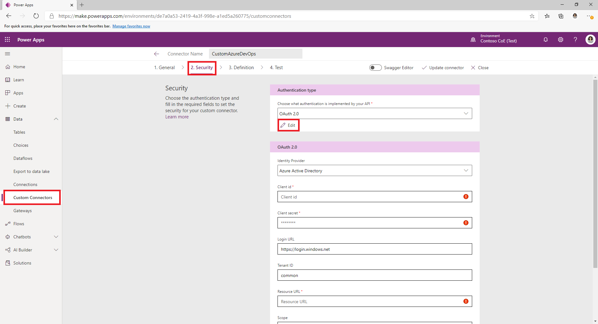

   | Name | Value |
   |--|--|
   | Client id | [The **Application (client) ID** you copied when [creating the App Registration](#appid)] |
   | Client secret | [The **Application (client) Secret** you copied when [creating the App Registration](#appid)] |
   | Tenant ID | leave as the default **common** |
   | Resource URL | [The **Azure DevOps Application (client) ID** you copied when [adding permissions to your App Registration](#azdoappid)] |

1. Select **Update Connector**

1. Verify that the **Redirect URL** is populated on the Security page with the url https://global.consent.azure-apim.net/redirect. If the **Redirect URL is other than https://global.consent.azure-apim.net/redirect** copy the URL and [return to the app registration your created](#create-an-app-registration-in-your-aad-environment) and update the [Redirect URI](#appredirect) you set earlier to the updated url.

1. Verify the connector from the **Test** menu once you've completed the steps above.
    - Navigate to the **Test** menu.

    - Select **New Connnection** and follow the prompts to create a new connection.

    - In the Power App maker portal select your **Environment** and Select **Data** > **Custom Connectors** > **CustomAzureDevOps**.

    - Select **Edit** and go to the **Test** section and find the **GetOrganizations** operation.

    - Select **Test operation** and verify you **Response Status returned is 200**.

    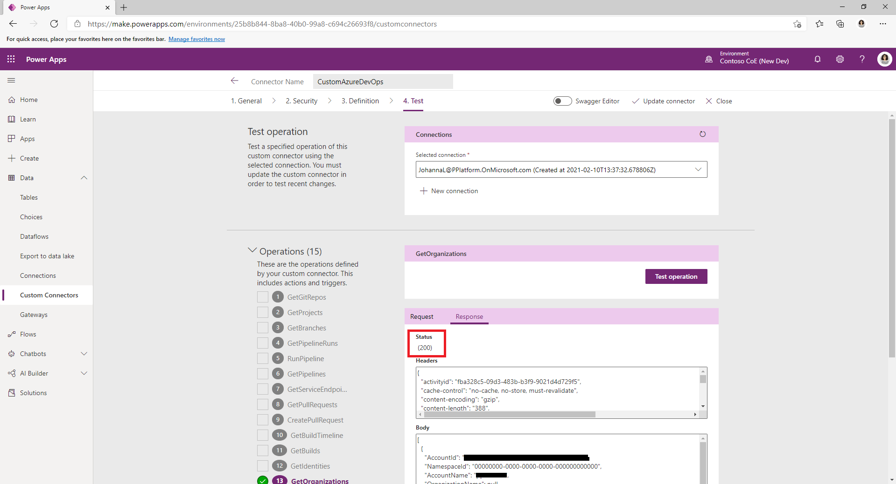

## Using the ALM Accelerator App

1. Once the app is installed and configured launch it from your Environment under Apps.

    > [!NOTE] When you first launch the app you may need to consent to the app using your connections.
1. Select the **Cog** in the top right to select your **Azure DevOps Environment**, **Project** and **Repo** to which you'll push your changes and submit your pull requests and select **Save**
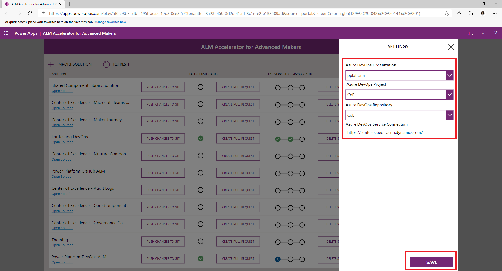

   > [!NOTE] If you don't see your DevOps Organization / Project in the dropdown double check that the Custom connector is working correctly after updating it's Security settings.
1. From the Environment Drop Down **Select the Dataverse Environment** in which you will be doing your development work.
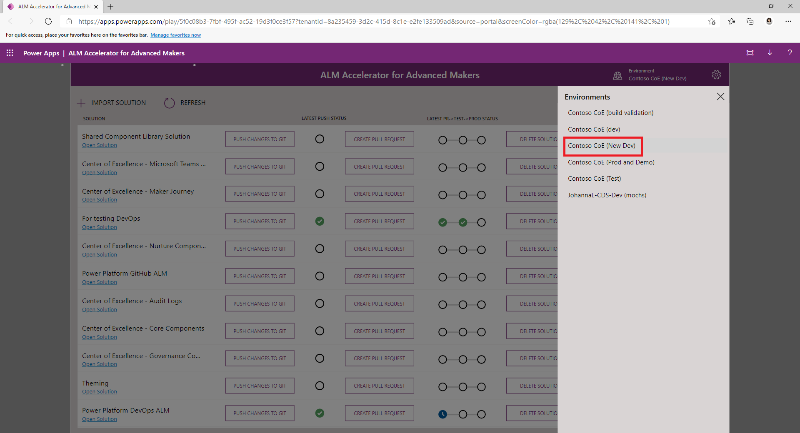

   > [!NOTE] In order for your Environment to show up in this drop down a service connection in the Azure DevOps project you just selected is required (see [Create a Service Connection for DevOps to access Power Platform](#create-service-connections-for-devops-to-access-power-platform). Additionally, verify that you've followed the steps to reconnect the flow above if you do not see any environments in the list.
1. By default the **unmanaged solutions** in your Environment should be displayed in the main window with buttons to **Push Changes** and **Create Pull Requests**.
1. To import an unmanaged solution from an existing Azure DevOps project to begin making changes select the **+ Import Solutions** button and select a solution and version.

   > [!NOTE] the solutions available are based on previous builds of your pipelines. The idea is that others have previously built the solutions and you are pulling the latest copy of the solution into your new development environment. If the solution has never been built previously you would begin with the next step.

   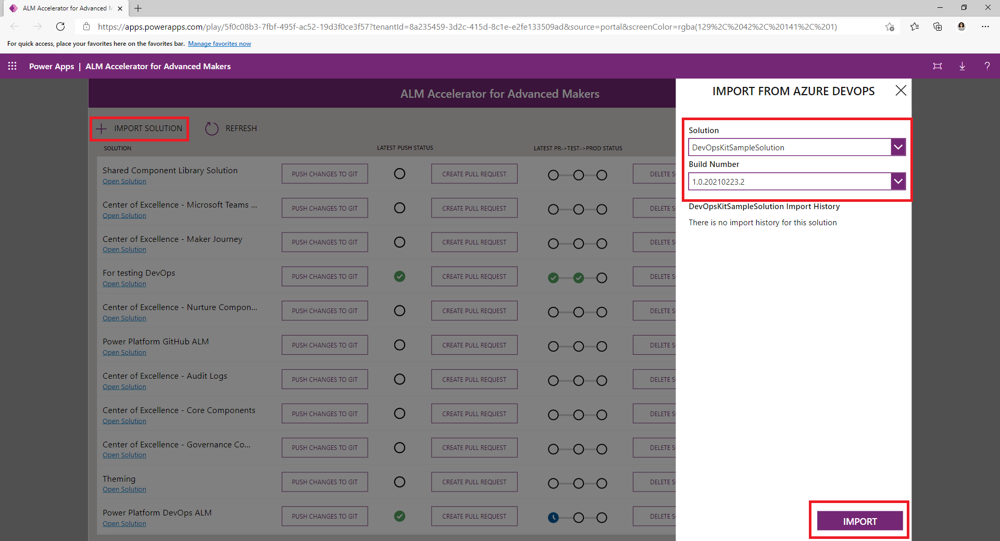
1. Once your solution is imported into Dataverse, or you've created a new unmanaged solution and made your customizations, you can push your changes to Git using the **Push Changes to Git** button for your solution.
   >[!NOTE]: Be sure to publish your changes before initiating the push. If a newly created solution doesn't show in your list immediately. Click the Refresh button to reload all solutions.
   - Select an **existing branch** or **create a new branch** based on an existing branch and enter a **comment**. Use the hashtag notation e.g. `#123` to link the changes to a specific work item in Azure DevOps and Select **Commit**.
   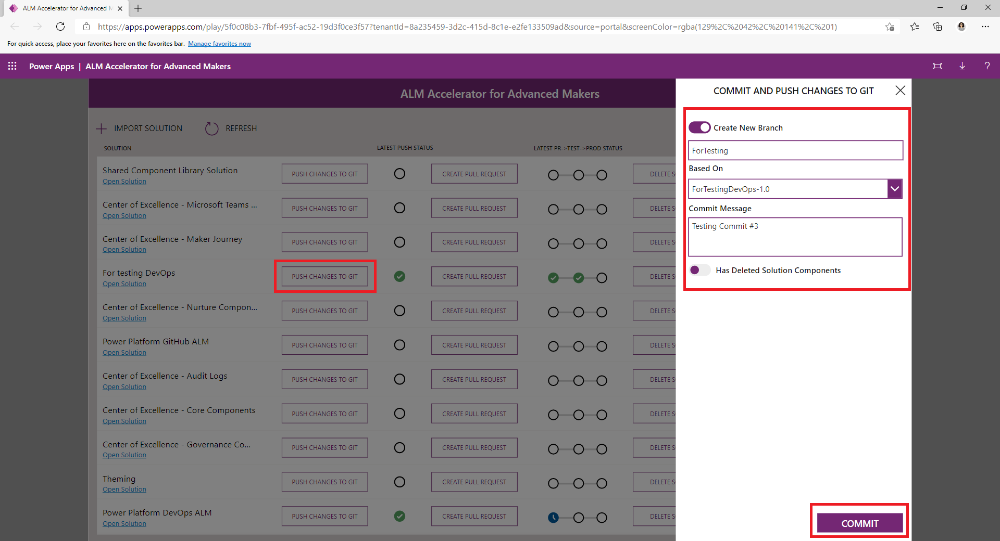
   >[!NOTE]: There is an option to specify if the latest changes contain Delete Components. This allows the user to specify whether to perform an **update** or an **upgrade** of the solution when it is deployed. The former will increase the performance of the pipelines and reduce the overall time to deploy.
   - When the push begins a waiting indicator will appear. If the push is successful a checkbox will appear otherwise a red x will appear. In order to see the progress of your push select the progress indicator which will take you to the running pipeline in Azure DevOps.
   - Repeat the pushes as you iterate on your solution.
1. When you are ready to create a pull request for the changes to your branch select the Create Pull Request button.
   >[!NOTE]: Be sure to publish your changes before initiating the push.
   - Specify the Source and Target branch and enter a Title and Comment for your Pull Request and Select Create.**
   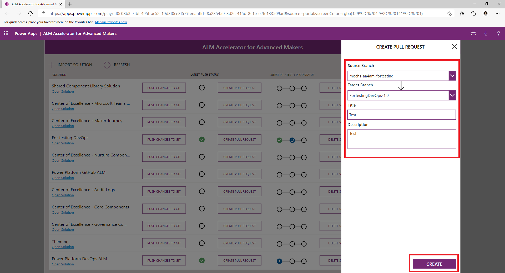

1. Once a Pull Request is created for your changes the remaining steps to Merge and Release to Test occur in Azure DevOps. Depending on the Branch Policies and Triggers configured for your Target Branch, an Azure DevOps user can approve or reject your Pull Request based on their findings in the submitted changes and that status will appear in the App. Approving the PR will initiate the deployment of your solution to the Test environment. If the Pull Request is approved you will see the progress move to Test and a status based on the pipeline's success or failure in that stage.

   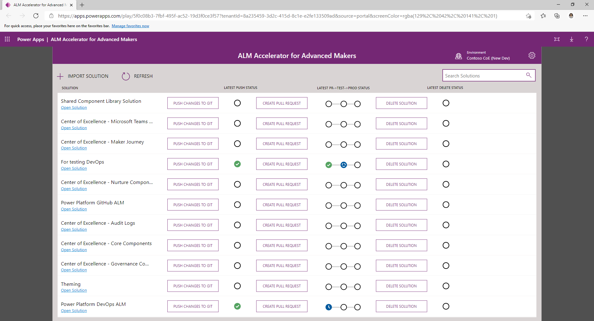

1. For Production a Pull Request will need to be created in Azure DevOps that merges the changes into your Production release branch. The same approval process will be required depending on your branch policies and once the PR is completed your solution will be pushed to Production. Once the pipeline for deploying to Production is finished you will see the status of the deployment in the App.

## Troubleshooting

1. Occasionally, you may see the following when launching the app. "The app stopped working. Try refreshing your browser." This generally happens after launching the app and then getting a prompt to login. To get around this issue use a **private browser session**. This isn't an issue with the app itself but an issue with credential caching in the browser.

   

1. When you setup your pipelines such that the pipeline templates are stored in a different repository than the solution pipeline you may get the following message when trying to run your pipeline for the first time. To eliminate the error select the **Permit** button to grant the repo running the pipeline access to the template repository.

   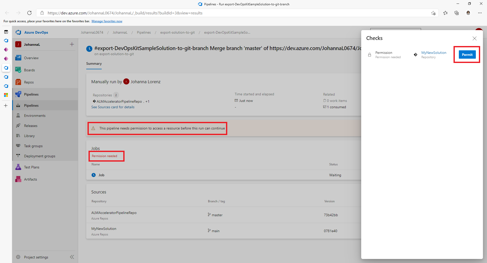
 
1. Build completion triggers not firing. There a few reasons the pipeline completion triggers may not fire depending on how you have setup your branches and build pipelines. **For troubleshooting tips see here https://docs.microsoft.com/en-us/azure/devops/pipelines/process/pipeline-triggers?view=azure-devops&tabs=yaml#branch-considerations-for-pipeline-completion-triggers**