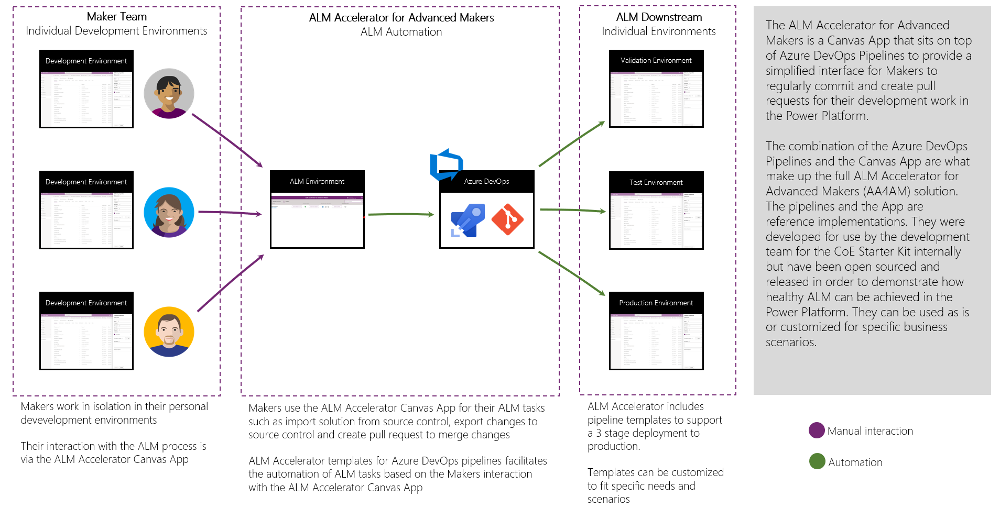
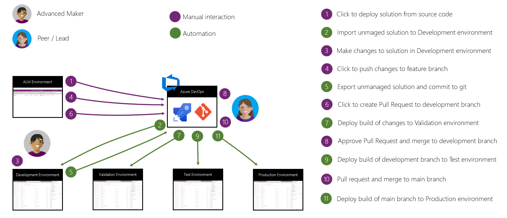

# ALM Accelerator for Advanced Makers

## Introduction

The ALM Accelerator for Advanced Makers is a Canvas App that sits on top of Azure DevOps Pipelines to provide a simplified interface for developers to regularly commit and create pull requests for their development work in the Power Platform. The combination of the Azure DevOps Pipelines and the App are what make up the full ALM Accelerator for Advanced Makers (AA4AM) solution. The pipelines and the App are **reference implementations**. They were developed for use by the development team for the CoE Starter Kit internally, but have been open sourced and released in order to demonstrate how healthy ALM can be achieved in the Power Platform. They can be used as is or customized for specific business scenarios.

Underlying, the entire solution is the Dataverse Solution System. All Application Lifecycle Management in the Power Platform is based on makers creating components within the scope of a Solution. In order to use the AA4AM your components (Apps, Flows, Customizations etc.) must first be included in a solution. A solution in Dataverse is intended to be a deployable package of components that AA4AM will unpack and store the source files in a Git source control (e.g. Azure DevOps Git or GitHub).

The target end user for AA4AM is the Power Platform Maker who is comfortable with Solutions as well as Git, Azure DevOps and ALM concepts (e.g. Source Control Pushes, Pull Requests, Merging and Pipelines). If you are not already familiar with these technologies and concepts, you should consider taking the following courses.

1. [Introduction to version control with Git](https://docs.microsoft.com/en-us/learn/paths/intro-to-vc-git/)
1. [Use Git version-control tools in Visual Studio Code](https://docs.microsoft.com/en-us/learn/modules/use-git-from-vs-code/)
1. [Build applications with Azure DevOps](https://docs.microsoft.com/en-us/learn/paths/build-applications-with-azure-devops/)
1. [Manage solutions in Power Apps and Power Automate](https://docs.microsoft.com/en-us/learn/modules/manage-solutions-power-automate/)

The target user for setting up AA4AM would generally be an Administrator with a deeper understanding of Power Platform Environments and Solutions, Azure DevOps Pipelines and Administration as well as familiarity with Azure Active Directory and Dataverse Admininstration.

## Pipelines

The AA4AM Pipelines are a set of YAML pipelines intended to be used with Azure DevOps. Eventually, these pipelines will be ported to support GitHub workflows, but currently only support Azure DevOps pipelines. These reference pipelines were written to demonstrate an end to end ALM process for Power Platform solutions. The pipelines utilize first-party tasks provided by Microsoft as well as some third party and low level PowerShell scripts in order to automate all of the ALM scenarios related to unpacking / source controlling / building and deploying a solution from a development environment. The pipelines support the ability to deploy to many environments, but only currently demonstrate deployment from a Development environment to a Build Validation to Test and ultimately to Production based on the ALM process used by the CoE Starter Kit development team. 

The Pipelines handle the following.

### Import Solution

1. Select an existing Solution from Source Control
1. Import a build of that Solution from Source Control
1. Future: Handle seeding environments with Data and configuring Connection References, Environment Variables, Sharing and Ownership

### Delete Unmanaged Solution

1. Export an Unmanaged Solution from a Development Environment as Managed.
1. Import Managed Solution to Development Environment
1. Delete the Managed Solution from a Development Environment.

### Export to Git

1. Create a New Branch Based on an Existing Branch
1. Export an Unmanaged Solution from a Development Environment
1. Unpack Solutions to Human Readable Format
1. Store Unpacked Files in a Git Repository Branch

### Create Pull Request

1. Create a Pull Request in Azure DevOps for your New Branch
1. Run a Build on a Pull Request (i.e. Branch Policy) to validate your changes including running Solution Checker
1. Include Branch Policies to require additional checks (e.g. Reviewers, Work Items Linking etc.)

### Deploy to Environment

1. Create a trigger for when your Solution is deployed to an environment
1. Build Managed Solution and Deploy based on Trigger
1. Handle Upgrade vs Update of Solution based on changes in the Solution
1. Handle Setup of the Solution in the Target Environment
   - Deploy configuration data
   - Update Connection References
   - Update Environment Variable Values
   - Share Apps with Azure Active Directory Groups
   - Activate Flows
   - Create Teams in Dataverse for Azure Active Directory Groups
   - Update Solution Component Ownership

## ALM Accelerator App

The AA4AM Canvas App provides a convenience layer on top of the AA4AM Pipelines that allows Power Platform Makers to easily invoke the Azure DevOps pipelines to perform their complex tasks without context switching between the Power Apps environment and the Azure DevOps environment. The goal of the App is to provider Makers with a friction free way of performing common traditional Development and ALM tasks as follows. 

> [!NOTE] While all of these processes can be achieved directly from Azure DevOps the App provides a more push-button interface for performing these tasks

1. Target multiple Organization / Projects and Repos in Azure DevOps
1. Get the latest version of a solution into their development environment (i.e. Import Solution)
1. Remove existing work that needs to be rebased from source control (i.e. Delete Unmanaged Solution)
1. Push the their latest changes from their development environment to source control (i.e. Export to Git)
1. Submit their changes tied to a Work Item for Review (i.e. Create Pull Request)
1. Monitor the progress of their changes between environments (i.e. Deployment to Environment)

## ALM Accelerator Flow and Advanced Maker Experience

## Video Walkthrough

## ALM Accelerator for Advanced Makers Setup Guide
To get started setting up ALM Accelerator For Advanced Makers Pipelines and the App go here [Setupguide.md](SETUPGUIDE.md)