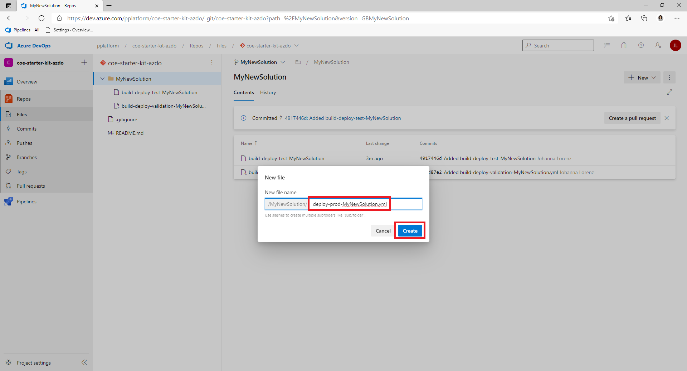
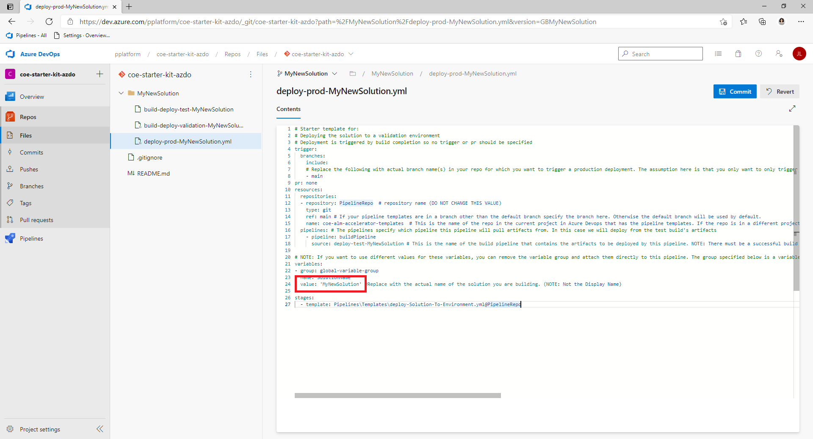

## ALM Accelerator Sample Solution Setup

When you create a solution in Dataverse you'll need to create pipelines specifically for that solution. Follow these steps for creating pipelines for the ALM Accelerator Sample Solution in Azure DevOps. There are sample pipelines included in the Pipeline directory in the CoE ALM Templates repo.

- https://github.com/microsoft/coe-alm-accelerator-templates/blob/main/Pipelines/build-deploy-validation-SampleSolution.yml
- https://github.com/microsoft/coe-alm-accelerator-templates/blob/main/Pipelines/build-deploy-test-SampleSolution.yml
- https://github.com/microsoft/coe-alm-accelerator-templates/blob/main/Pipelines/build-deploy-prod-SampleSolution.yml
- https://github.com/microsoft/coe-alm-accelerator-templates/blob/main/Pipelines/deploy-test-SampleSolution.yml
- https://github.com/microsoft/coe-alm-accelerator-templates/blob/main/Pipelines/deploy-prod-SampleSolution.yml

The sample pipelines provides flexibility for organizations to store their pipeline templates in a separate project or repo from the specific solution pipeline YAML. Follow the steps below to configure your **solution pipeline**. Repeat the steps for each of the solutions you will be source controlling with the ALM Accelerator.

> [!IMPORTANT] The pipeline YAML for your solution pipeline will always be stored in the same repo to which you will be source controlling your solution. However, the pipeline templates (i.e. the folder Pipeline\Templates) can exist in either the same repo as your solution pipeline YAML or in a separate repo and/or project. 

### Create the Solution Build and Deployment Pipeline(s)

Solution Pipelines are used to build and deploy your source controlled solutions to environments in your tenant. You can create as many solution pipelines as needed based on your organization's environment strategy. The sample pipelines provided assume only 3 environments (Validation, Test, Production). However, more or less can be created as needed with specific triggers in the pipelines or without triggers that can be run manually as well. The sample deployment pipelines trigger off of changes to a branch (i.e. Test and Production) or as a part of a branch policy in Azure DevOps (i.e. Validation). See [Setting Branch Policies for Pull Request Validation](#setting-branch-policies-for-pull-request-validation) below for more information on Branch Policies.

The following steps show how to create a pipeline from the sample pipeline YAML (**build-deploy-validation-SampleSolution.yml**). Follow these steps to create all of your deployment pipelines.

> [NOTE!] The following steps will create pipelines that build and deploy for each environment (Validation, Test and Production). However, you may want to only build and deploy for Validation and Test and then deploy the artifacts from the Test build to Production. Included in [the section following this section](#create-the-solution-deployment-pipelines-optional) are instructions for doing the latter. If this is your preferred method of setting up the pipelines follow the steps below for only the Validation and Test environment and then skip to the next section to see how to configure your release pipeline.

1. In Azure DevOps go to the **Repo** that contains the [Pipelines folder you committed](#copy-the-yaml-pipelines-from-github-to-your-azure-devops-instance) and select the Pipelines folder

1. Open the sample deployment pipeline (i.e. **build-deploy-validation-SampleSolution.yml, build-deploy-test-SampleSolution.yml or build-deploy-prod-SampleSolution.yml**) and copy the YAML to use in your new Pipeline. **Note the name of this repo** for use in your pipeline.

   

1. Navigate to the **Repo where you want to source control your solution**.
   
1. Select **New** from the top menu and then **Folder**
   
   
   
1. Give the new **Folder the same name as your solution** (e.g. MyNewSolution) and the new Pipeline YAML file a name (e.g. **build-deploy-validation-SampleSolution.yml**, **build-deploy-test-SampleSolution.yml** or **build-deploy-prod-SampleSolution.yml**). Select **Create**.

   

1. Paste the YAML from **deploy-validation-SampleSolution.yml**, **deploy-test-SampleSolution.yml** or **deploy-prod-SampleSolution.yml** into your new Pipeline YAML file.

   

1. Update the following values in your new Pipeline YAML.

   - Change the **resources -> repositories -> name**  to the repo name that contains your pipeline templates. If your template repository is in another AzDO project you can use the format **projectname/reponame** here. In this case the repo is called **coe-alm-accelerator-templates** and it exists in the same project as our MyNewSolution repo. Additionally, you can specify a branch for where your templates live using the **ref** parameter if required.

      

    - Change any value that references **SampleSolutionName** to the unique name of your Solution (e.g. MyNewSolution).

      

    - Select **Commit** to save your changes.

1. In Azure DevOps go to **Pipelines** and **Create a New Pipeline**

1. Select **Azure Repos Git** for your code Repository.
   

1. Select the **Azure DevOps repo** which contains the deployment Pipeline YAML.

    

1. On the **Configure your pipeline** page select **Existing Azure Pipelines YAML file**, point to the **YAML File in your repo that you created in step 5** and Select **Continue**.
   

1. On the next screen Select **Save** and then Select the 3 dots next to Run Pipeline and Select **Rename/Move**.
   

1. Update the pipeline name to **deploy-validation-MyNewSolution**, **deploy-test-MyNewSolution** or **deploy-prod-MyNewSolution** (where 'MyNewSolution' is the name of your solution) and select **Save**.

   

   > [!NOTE] If your new pipeline was not created in the default branch of the repo you may need to update the **Default branch for manual and scheduled builds**. See the following link for setting the **Default branch for manual and scheduled builds**. [Configure pipeline triggers - Azure Pipelines | Microsoft Docs](https://docs.microsoft.com/en-us/azure/devops/pipelines/process/pipeline-triggers?view=azure-devops&tabs=yaml#branch-considerations-for-pipeline-completion-triggers)

1. Repeat the steps above to create a deployment pipeline for each of your environments referencing the sample deployment pipeline yaml from the **coe-alm-accelerator-templates repo** (i.e. deploy-validation-SampleSolution.yml, deploy-test-SampleSolution.yml and deploy-prod-SampleSolution.yml).

### Create the Solution Deployment Pipeline(s) (Optional)

As mentioned in the note above, the previous section allows you to create pipelines that build and deploy for each environment (Validation, Test and Production). However, if you want to only build and deploy for Validation and Test and then deploy the artifacts from the Test build to Production you can follow these instructions to create your production deployment pipeline after you've created your build and deploy pipeline for Validation and Test above.

1. In Azure DevOps go to the **Repo** that contains the [Pipelines folder you committed](#copy-the-yaml-pipelines-from-github-to-your-azure-devops-instance) and select the Pipelines folder

1. Open the sample deployment pipeline (i.e. **deploy-prod-pipelineartifact-SampleSolution.yml**) and copy the YAML to use in your new Pipeline. **Note the name of this repo** for use in your pipeline.

   

1. Navigate to the **Repo where you want to source control your solution**.

1. Select **New** from the top menu and then **File**

   

5. Give the new Pipeline YAML file a name (e.g. **deploy-prod-MyNewSolution.yml**). Select **Create**

   

6. Paste the YAML from **deploy-prod-pipelineartifact-SampleSolution.yml** into your new Pipeline YAML file.

   

7. Update the following values in your new Pipeline YAML.

   - Update the **trigger -> branches -> include** to the branch(es) for which changes would trigger a deployment to production. 

   - Change the **resources -> repositories -> name** to the repo name that contains your pipeline templates. If your template repository is in another AzDO project you can use the format **projectname/reponame** here. In this case the repo is called **coe-alm-accelerator-templates** and it exists in the same project as our MyNewSolution repo. Additionally, you can specify a branch for where your templates live using the **ref** parameter if required.

     

   - Update **resources -> pipelines -> source** to specify **the build pipeline that contains the artifacts to be deployed** by this pipeline. In this case we are going to deploy the artifacts from our Test pipeline, created above, that built and deployed our Solution to the Test environment.

     

   - Change any value that references **SampleSolutionName** to the unique name of your Solution (e.g. MySolutionName).

     

   

### Importing Data from your Pipeline

In many cases there will be configuration or seed data that you will want to import into your Dataverse environment initially after deploying your solution to the target environment. The pipelines are configured to import data using the **Configuration Migration tool** available via nuget https://www.nuget.org/packages/Microsoft.CrmSdk.XrmTooling.ConfigurationMigration.Wpf. To add configuration data for your pipeline use the following steps. For more information on the **Configuration Migration tool** see here https://docs.microsoft.com/en-us/power-platform/admin/manage-configuration-data

1. Clone the AzDO Repo where your solution is to be source controlled and where you created your solution pipeline YAML to your local machine.

1. Install the **Configuration Migration tool** per the instructions here https://docs.microsoft.com/en-us/dynamics365/customerengagement/on-premises/developer/download-tools-nuget

1. Open the **Configuration Migration tool** select **Create schema** and select **Continue**

   

1. **Login to the tenant** from which you want to **export your configuration data**

   

1. Select your **environment**

   

1. Select the specific **Tables and Columns** you want to export for your configuration data.

   

1. Select **Save and Export** and save the data to a folder called **ConfigurationMigrationData** in your **local Azure DevOps repo** under the **solution folder** for which this configuration data is to be imported.

   > [!NOTE] The pipeline will look for this specific folder to run the import after your solution is imported. Ensure that the name of the folder and the location are the same as the screenshot below.

   

   

1. When prompted to **export the data** select **Yes**

   

1. Choose the **same location** for your exported data and **select Save** then **Export Data**.

   

   

1. When the export is complete **unzip the files from the data.zip** file to the ConfigurationMigrationData directory and **delete the data.zip** file.

   

1. Finally, **Commit the changes** with your data to Azure DevOps.

### Setting Branch Policies for Pull Request Validation

In order to leverage executing the build pipeline for your solution when a **Pull Request is created** you'll need to create a **Branch Policy** to execute the Pipeline you created in the previous step. Use the following steps to set your Branch Policy. For more information on Branch Policies see here https://docs.microsoft.com/en-us/azure/devops/repos/git/branch-policies?view=azure-devops

1. In Azure DevOps go to **Repos** and select the **Branches** folder

1. Locate the **target branch** on which you want to run the **Pull Request policy** and select the ellipsis to the right of the target branch and Select **Branch Policies**.

   

1. On the **Branch Policies** screen go to **Build Validation**

1. Click the **+ Button** to add a **new Branch Policy**

   

1. Select the Pipeline you just created from the **Build pipeline** dropdown

1. Specify a **Path filter** (if applicable). The path filter will ensure that only changes to the path specified will trigger the pipeline for your Pull Request.

1. Set the **Trigger** to **Automatic**

1. Set the **Policy requirement** to **Required**

1. Set the **Build expiration** to **Immediately**

1. Set a **Display name** for your Branch Policy (e.g. PR Build Validation)

1. Click **Save**

   

### Setting Deployment Pipeline Variables

The ALM Accelerator uses JSON formatted Pipeline variables for updating **connection references, environment variables, setting permissions for AAD Groups and Dataverse teams** as well as **sharing Canvas Apps and updating ownership of solution components** such as Power Automate flows. **EnvironmentName** and **ServiceConnection** variables are **required** for each pipeline. All other pipeline variables are **optional** and depend on what type of components your solution pipelines deploy. For instance, if your solutions only contain Dataverse Tables, Columns and Model Driven Apps **some of these steps may not be necessary** and can be skipped. The following variables allow you to fully automate the deployment of your solutions and specify how to configure items that are specific to the environment to which the solution is being deployed.

> [!IMPORTANT] These pipeline variables will be set for each **deployment pipeline** you've configured above based on the environment to which your pipeline deploys.

#### Create Environment and Service Connection (Required)

These variables are required by every deployment pipeline. The Environment variable is **EnvironmentName** and the Service Connection variable is **ServiceConnection**.

The **EnvironmentName** variable is used to specify the Azure DevOps environment being deployed to in order to enable tracking deployment history and set permissions and approvals for deployment to specific environments. Depending on the environment to which you're deploying set this value to **Validate, Test or Production** For more information on Environments in AzureDevOps see https://docs.microsoft.com/en-us/azure/devops/pipelines/process/environments.


 The **ServiceConnection** variable is used to specify how the deployment pipeline connects to the Power Platform. The values used for the Service Connection variable are the names of the Service Connections created above [Create a Service Connection for DevOps to access Power Platform](#create-service-connections-for-devops-to-access-power-platform)


#### Create Connection Reference Pipeline Variable (Optional)

The connection reference variable is **ConnectionReferences**. This pipeline variable is used for setting connection references in your solution to specific connections configured in a target environment after the solution is imported into an environment. Additionally, the **ConnectionReferences** variable is used to enable flows after the solution is imported based on owner of the connection specified in the variable.

1. You will need to create the connections manually in your target environments and copy the IDs for the connection to use in the JSON value below

1. The format of the JSON for these variables take the form of an array of name/value pairs.

   ```json
      [
        "connection reference1 schema name",
        "my environment connection ID1"
      ],
      [
        "connection reference2 schema name",
        "my environment connection ID2"
      ]
   ]
   ```

   - The **schema name** for the connection reference can be obtained from the **connection reference component** in your solution.
     

   - The **connection id** can be obtained via the url of the connection after you create it. For example the id of the connection below is **9f66d1d455f3474ebf24e4fa2c04cea2** where the url is https://.../connections/shared_commondataservice/9f66d1d455f3474ebf24e4fa2c04cea2/details#
   

1. Once you've gathered the connection reference schema names and connection ids go to the pipeline for your solution that you created above Select **Edit -> Variables**

1. On the **Pipeline Variables** screen create the **ConnectionReferences** pipeline variables.

1. Set the value to the json formatted array of connection reference schema and connection ids.

   - For the example above the values look like the following
     

1. Where applicable repeat the steps above for each solution / pipeline you create.

#### Create Environment Variable Pipeline Variable (Optional)

The environment variable pipeline variable is **EnvironmentVariables**. This pipeline variable is used for setting Dataverse **Environment variables** in your solution after the solution is imported into an environment.

1. The format of the JSON for these variables take the form of an array of name/value pairs.

   ```json
   [
      [
         "environment variable1 schema name",
         "environment variable1 value"
      ],
      [
         "environment variable2 schema name",
         "environment variable2 value"
      ]
   ]
   ```

   - The **schema name** for the environment variable can be obtained from the **environment variable component** in your solution.
     

1. Once you've gathered the environment variable schema names and connection ids go to the pipeline for your solution that you created above

1. Click Edit -> Variables

1. On the Pipeline Variables screen create the **EnvironmentVariables** pipeline variables.

1. Set the value to the json formatted array of environment variable schema and values.

1. For the example above the values look like the following
   

1. Where applicable repeat the steps above for each solution / pipeline you create.

#### Create AAD Group Canvas Configuration Pipeline Variable (Optional)

The aad group canvas configuration pipeline variable is **AadGroupCanvasConfiguration**. This pipeline variable is used for **sharing canvas apps** in your solution with specific **Azure Active Directory Groups** after the solution is imported into an environment.

1. The format of the JSON for these variables take the form of an array of objects. The **roleName** can be one of **CanView**, **CanViewWithShare** and **CanEdit**

   ```json
   [
    {
        "aadGroupId": "azure active directory group id",
        "canvasNameInSolution": "canvas app schema name1",
        "roleName": "CanView"
    },
    {
        "aadGroupId": "azure active directory group id",
        "canvasNameInSolution": "canvas app schema name2",
        "roleName": "CanViewWithShare"
    },
    {
        "aadGroupId": "azure active directory group id",
        "canvasNameInSolution": "canvas app schema name1",
        "roleName": "CanEdit"
    }
   ]
   ```

   - The **schema name** for the Canvas App can be obtained from the **Canvas App component** in your solution.
     

   - The **azure active directory group id** can be obtained from the **Group blade in Azure Active Directory** from the Azure Portal.
     

1. Once you've gathered the Canvas App schema names and aad group ids go to the pipeline for your solution that you created above

1. Click Edit -> Variables

1. On the Pipeline Variables screen create the **AadGroupCanvasConfiguration** pipeline variables.

1. Set the value to the json formatted array of objects per the sample above.

1. For the example above the values look like the following
   
   Where applicable repeat the steps above for each solution / pipeline you create.

#### Create AAD Group / Team Configuration Pipeline Variable (Optional)

The pipeline variable is **AadGroupTeamConfiguration**. This pipeline variable is used for mapping **Dataverse Teams and Roles** to specific **Azure Active Directory Groups** after the solution is imported into an environment. The security roles will need to added to your solution if they are not manually created in the target environment.

1. The format of the JSON for these variables take the form of an array of objects. One or many roles can be applied to any given team and these roles provide permissions to solution components required by the users in the group.

   ```json
   [
    {
        "aadGroupTeamName": "dataverse team1 name to map",
        "aadSecurityGroupId": "azure active directory group id1",
        "dataverseSecurityRoleNames": [
            "dataverse role1 to apply to the team"
        ]
    },
    {
        "aadGroupTeamName": "dataverse team2 name to map",
        "aadSecurityGroupId": "azure active directory group id2",
        "dataverseSecurityRoleNames": [
            "dataverse role2 to apply to the team"
        ]
    }
   ]
   ```

   - The **Dataverse team name** can be any **existing team or a new team** to be created in Dataverse and mapped to an AAD Group after the solution is imported via the pipeline.

   - The **azure active directory group id** can be obtained from the **Group blade in Azure Active Directory** from the Azure Portal.

   

   - The **Dataverse role** can be any **Security Role in Dataverse** that would be applied to the **existing or newly created Team** after the solution is imported via the pipeline. The role should have permissions to the resources required by the solution (e.g. Tables and Processes)

1. Once you've gathered the team names, aad group ids and roles go to the pipeline for your solution that you created above. Click Edit -> Variables
1. On the Pipeline Variables screen create the **AadGroupTeamConfiguration** pipeline variables.
1. Set the value to the json formatted array of environment variable schema and values.
1. For the example above the values look like the following
   
1. Where applicable repeat the steps above for each solution / pipeline you create.

#### Create Solution Component Ownership Pipeline Variable (Optional)

The  pipeline variable is **SolutionComponentOwnershipConfiguration**. This variable is used for assigning ownership of solution components to Dataverse Users after the solution is imported into an environment. This is particularly useful for components such as Flows that will be owned by default by the Service Principal user when the solution is imported by the pipeline and organizations want to reassign them after import. Additionally, the  **SolutionComponentOwnershipConfiguration** will be used to enable flows that don't have any connection references. The flow will be enabled by the user specified when no connection references are found to use to enable the flow.

>[!NOTE] The current pipeline only implements the ability to set ownership of Flows. The ability to assign other components to users could be added in the future.

1. The format of the JSON for these variables take the form of an array of objects.

   ```json
   [
    {
        "solutionComponentType": solution component1 type code,
        "solutionComponentUniqueName": "unique id of the solution component1",
        "ownerEmail": "new owner1 email address"
    },
    {
        "solutionComponentType": solution component2 type code,
        "solutionComponentUniqueName": "unique id of the solution component2",
        "ownerEmail": "new owner2 email address"
    }
   ]
   ```

   - The **solution component type code** is based on the component types specified in the following doc https://docs.microsoft.com/en-us/dynamics365/customer-engagement/web-api/solutioncomponent?view=dynamics-ce-odata-9 (e.g. a Power Automate Flow is component type 29). The component type should be specified as an integer value (i.e. with no quotes)
   - The **unique name of the solution component**, in the case of a Power Automate Flow, has to be taken from the unpacked solution. This is a limitation of flows currently not requiring unique names when they are created. As such the only true unique identifier for a Flow is the internal ID the system uses to identify it in a solution.
     
      
   - The **owner email** can be gathered from the user's record in Dataverse or Office 365.

1. Once you've gathered the component type codes, unique name of the components and owner emails go to the pipeline for your solution that you created above

1. Click Edit -> Variables

1. On the Pipeline Variables screen create the **SolutionComponentOwnershipConfiguration** pipeline variables.

1. Set the value to the json formatted array of environment variable schema and values.

1. For the example above the values look like the following
   

1. Where applicable repeat the steps above for each deployment solution / pipeline you create.

## Importing the Solution and Configuring the App

### Install ALM Accelerator Solutions in Dataverse

> [!NOTE] As of January 2021, before installing the solutions you will need to **enable Power Apps Component Framework for Canvas apps** from the Power Platform Admin Center by going to https://admin.powerplatform.microsoft.com/ selecting your environment and selecting **Settings** - **Product** - **Features**. From here select the toggle for **Power Apps component framework for canvas apps** to turn it on.


1. Download the **latest managed solution** from GitHub (https://github.com/microsoft/coe-starter-kit/releases).

   > [NOTE!] The screenshot below is for reference as to where the managed solution exists under a release. The actual version should be the most recent release.

   

2. Go to https://make.powerapps.com and select the environment you want to use to host the ALM Accelerator App

3. Select **Solutions** from the left navigation.

4. Click **Import** and Browse to the location of the managed solution you downloaded.

5. Click **Next** and **Next** again.

6. On the Connections page select or create a new connection to use to connect to Dataverse for the **CDS DevOps connection**.

7. Click **Import** and wait for the solution to complete the import process.

### Configure the Azure DevOps Custom Connector.

1. In the Power App maker portal select your **Environment** and Select **Data** > **Custom Connectors** > **CustomAzureDevOps**

1. Select **Edit** and go to the **Security** section and select **Edit** and set the following fields.
   

   | Name | Value |
   |--|--|
   | Client id | [The **Application (client) ID** you copied when [creating the App Registration](#appid)] |
   | Client secret | [The **Application (client) Secret** you copied when [creating the App Registration](#appid)] |
   | Tenant ID | leave as the default **common** |
   | Resource URL | [The **Azure DevOps Application (client) ID** you copied when [adding permissions to your App Registration](#azdoappid)] |

1. Select **Update Connector**

1. Verify that the **Redirect URL** is populated on the Security page with the url https://global.consent.azure-apim.net/redirect. If the **Redirect URL is other than https://global.consent.azure-apim.net/redirect** copy the URL and [return to the app registration your created](#create-an-app-registration-in-your-aad-environment) and update the [Redirect URI](#appredirect) you set earlier to the updated url.

1. Verify the connector from the **Test** menu once you've completed the steps above.
    - Navigate to the **Test** menu.

    - Select **New Connnection** and follow the prompts to create a new connection.

    - In the Power App maker portal select your **Environment** and Select **Data** > **Custom Connectors** > **CustomAzureDevOps**.

    - Select **Edit** and go to the **Test** section and find the **GetOrganizations** operation.

    - Select **Test operation** and verify you **Response Status returned is 200**.

    

## Using the ALM Accelerator App

1. Once the app is installed and configured launch it from your Environment under Apps.

    > [!NOTE] When you first launch the app you may need to consent to the app using your connections.
1. Select the **Cog** in the top right to select your **Azure DevOps Environment**, **Project** and **Repo** to which you'll push your changes and submit your pull requests and select **Save**
   

   > [!NOTE] If you don't see your DevOps Organization / Project in the dropdown double check that the Custom connector is working correctly after updating it's Security settings.
1. From the Environment Drop Down **Select the Dataverse Environment** in which you will be doing your development work.
   

   > [!NOTE] In order for your Environment to show up in this drop down a service connection in the Azure DevOps project you just selected is required (see [Create a Service Connection for DevOps to access Power Platform](#create-service-connections-for-devops-to-access-power-platform). Additionally, verify that you've followed the steps to reconnect the flow above if you do not see any environments in the list.
1. By default the **unmanaged solutions** in your Environment should be displayed in the main window with buttons to **Push Changes** and **Create Pull Requests**.
1. To import an unmanaged solution from an existing Azure DevOps project to begin making changes select the **+ Import Solutions** button and select a solution and version.

   > [!NOTE] the solutions available are based on previous builds of your pipelines. The idea is that others have previously built the solutions and you are pulling the latest copy of the solution into your new development environment. If the solution has never been built previously you would begin with the next step.

   
1. Once your solution is imported into Dataverse, or you've created a new unmanaged solution and made your customizations, you can push your changes to Git using the **Push Changes to Git** button for your solution.
   >[!NOTE]: Be sure to publish your changes before initiating the push. If a newly created solution doesn't show in your list immediately. Click the Refresh button to reload all solutions.
   - Select an **existing branch** or **create a new branch** based on an existing branch and enter a **comment**. Use the hashtag notation e.g. `#123` to link the changes to a specific work item in Azure DevOps and Select **Commit**.
   
   >[!NOTE]: There is an option to specify if the latest changes contain Delete Components. This allows the user to specify whether to perform an **update** or an **upgrade** of the solution when it is deployed. The former will increase the performance of the pipelines and reduce the overall time to deploy.
   - When the push begins a waiting indicator will appear. If the push is successful a checkbox will appear otherwise a red x will appear. In order to see the progress of your push select the progress indicator which will take you to the running pipeline in Azure DevOps.
   - Repeat the pushes as you iterate on your solution.
1. When you are ready to create a pull request for the changes to your branch select the Create Pull Request button.
   >[!NOTE]: Be sure to publish your changes before initiating the push.
   - Specify the Source and Target branch and enter a Title and Comment for your Pull Request and Select Create.**
   

1. Once a Pull Request is created for your changes the remaining steps to Merge and Release to Test occur in Azure DevOps. Depending on the Branch Policies and Triggers configured for your Target Branch, an Azure DevOps user can approve or reject your Pull Request based on their findings in the submitted changes and that status will appear in the App. Approving the PR will initiate the deployment of your solution to the Test environment. If the Pull Request is approved you will see the progress move to Test and a status based on the pipeline's success or failure in that stage.

   

1. For Production a Pull Request will need to be created in Azure DevOps that merges the changes into your Production release branch. The same approval process will be required depending on your branch policies and once the PR is completed your solution will be pushed to Production. Once the pipeline for deploying to Production is finished you will see the status of the deployment in the App.

## Troubleshooting

1. Occasionally, you may see the following when launching the app. "The app stopped working. Try refreshing your browser." This generally happens after launching the app and then getting a prompt to login. To get around this issue use a **private browser session**. This isn't an issue with the app itself but an issue with credential caching in the browser.

   

1. When you setup your pipelines such that the pipeline templates are stored in a different repository than the solution pipeline you may get the following message when trying to run your pipeline for the first time. To eliminate the error select the **Permit** button to grant the repo running the pipeline access to the template repository.

   

   Alternatively, to disable this notification for all pipelines you can turn off Limit Job authorization scope to referenced Azure DevOps repositories in Project -> Settings -> General. This setting is turned on by default when you create a new project.

    

1. Build completion triggers not firing. There a few reasons the pipeline completion triggers may not fire depending on how you have setup your branches and build pipelines. **For troubleshooting tips see here https://docs.microsoft.com/en-us/azure/devops/pipelines/process/pipeline-triggers?view=azure-devops&tabs=yaml#branch-considerations-for-pipeline-completion-triggers**