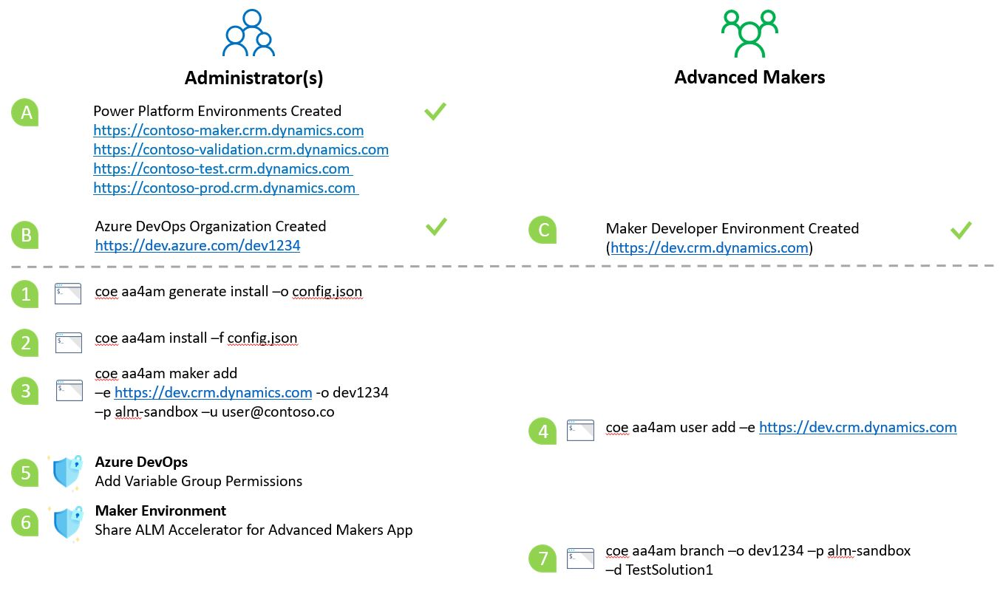

# Overview

To complete the initial steps to install of an Advanced Makers deployment you wil need to complete the administrative tasks. Once this is done Advances Makers can create and register development environments.



## Initial Install

Assuming a single user that has Power Platform Global Administrator, DevOps Administrator rights and Azure Active directory Administrator rights the install process has the following main parts:

1. Complete [Before You Start](./before-you-start) to ensure that:

   A) Power Platform Environments have been created

   B) Azure DevOps Organization and Project has been created

   C) COE CLI installed

2. Create install configuration file and review the generated JSON file and confirm the settings before you start the install

```bash
coe aa4am generate install -o test.json
```

Which will generate a file similar to

```json
{
  "log": [
    "info"
  ],
  "components": [
    "all"
  ],
  "aad": "ALMAcceleratorServicePrincipal",
  "group": "ALMAcceleratorForAdvancedMakers",
  "devOpsOrganization": "https://dev.azure.com",
  "project": "alm-sandbox",
  "repository": "pipelines",
  "settings": {
    "installEnvironments": [
      "validation",
      "test",
      "prod"
    ],
    "validation": "https://sample-validation.crm.dyamics.com",
    "test": "https://sample-test.crm.dyamics.com",
    "prod": "https://sample-prod.crm.dyamics.com",
    "createSecret": "true",
    "region": [
      "NAM"
    ]
  },
  "importMethod": "api",
  "endpoint": "prod"
}
```

3. Review the json and being the install using the following command

```bash
coe aa4am install -f test.json
```

### Post Install Security Setup

1. Create AAD Security to Share Canvas Application with Advanced Makers

2. Create Azure DevOps Group to add Advanced Makers to

   a. Grant Variable Groups rights 

   b. Grant Build Administrator Rights

3. Ensure Maker assigned as Azure DevOps user with **Basic** permissions and access to DevOps project e.g. **alm-sandbox**

4. COE CLI install commands executed to setup and install the ALM Accelerator for Advanced Makers

5. Service Connections from Azure DevOps to Power Platforms validation, test and production have been created

## Read Next

- Complete the [Install Overview](./index.md#onstall-overview)
