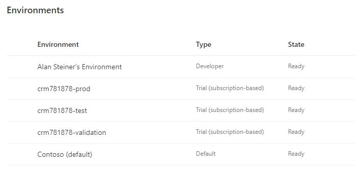

## Before You Start

Before you start an install of AA4AM ensure that you have the following in place

### CoE Command Line

Install the CoE CLI [locally](../install.md#local-install) or via a [docker image](../install.md#docker-install)

### Power Platform

Environment | Description
----------- | -------------
Developer | Development environments that each Advanced Maker will use to create and manage source controlled solutions
ALM Environment | Environment with Dataverse enabled. Will be used to deploy managed solution.
ALM Environment - Dataverse Connection | See [Maker Environment Dataverse](#maker-environment-dataverse) below to create the Dataverse Connection
Validation | Environment used to validate builds before merging into a solution branch              |
Test | Preproduction Environment used to test solutions before moving to production          |
Production | Production Environment for managed solutions                                          |

Notes:

1. As a Microsoft Partner you can request access to demo tenants to test ALM Accelerators for Advanced Makers
   1) Visit https://docs.microsoft.com/en-us/partner-center/mpn-demos for more information
   2) Go to https://demos.microsoft.com to request a new environment
   3) Select My Environments
   4) Select Create Tenant
   5) Select tenant location
   6) Select "Dynamics 365 Customer Engagement"
2. Sample environment from https://admin.powerplatform.microsoft.com/environments for a [Demo Deployment](./scenarios/tenant-deployments.md#demonstration-deployment)

   

### Maker Environment Dataverse

In the maker environment you will need a Dataverse connection to be created by the install user.

This can be done using the following steps
1. Go to https://make.powerapps.com/

2. Select your maker environment that you will deploy the ALM Accelerator for Advanced Makers into

3. Navigate to Data -> Connections

4. New Connection

5. Microsoft Dataverse (legacy)

6. Select Create

### Azure

Ensure the user you run with has the following permissions

Component | Description
--------- | ----------
Global Administrator or Privileged Role Administrator|Grant tenant-wide admin consent to an application [Read More](https://docs.microsoft.com/en-us/azure/active-directory/manage-apps/grant-admin-consent)

### Azure DevOps

The following must be installed before the CoE CLI AA4AM install cab begin

Component | Description
--------- | ----------
Organization | Review [Add Organization Users](https://docs.microsoft.com/en-us/azure/devops/organizations/accounts/add-organization-users?view=azure-devops) to create Azure DevOps organization and add users 
Project | An Azure DevOps project to integrate with. This guide uses the name **alm-sandbox** as the project name

The following will be setup or used as part of the install and follow on [coe aa4am branch](../help/aa4am/branch.md)

Component | Description
--------- | ----------
Extensions | Review the [extensions configuration](../../config/AzureDevOpsExtensionsDetails.json) that will be installed
Repository | Ensure the git repository has been initialized with an initial commit

Notes:
1. If installing using demo tenant you can request a trial Azure DevOps environment
   - https://azure.microsoft.com/en-us/services/devops/

   - Create Organization

   - Create initial project e.g. alm-sandbox

2. Review the Azure [DevOps Extensions](../../config/AzureDevOpsExtensionsDetails.json) that will be installed by the CLI application to ensure your organization gives consent for them to be installed. 
   - [Power Platform Build Tools](https://marketplace.visualstudio.com/items?itemName=microsoft-IsvExpTools.PowerPlatform-BuildTools)

   - [Power DevOps Tools](https://marketplace.visualstudio.com/items?itemName=WaelHamze.xrm-ci-framework-build-tasks)

   - [RegexReplace Azure Pipelines Task](https://marketplace.visualstudio.com/items?itemName=knom.regexreplace-task)
  
   - [SARIF SAST Scans Tab](https://marketplace.visualstudio.com/items?itemName=sariftools.scans)

### Read Next

Once you have verified the above

1. Determine the install [deployment scenario](./scenarios/readme.md) you are targeting
1. Complete the [Admin Install](./admin-install.md)