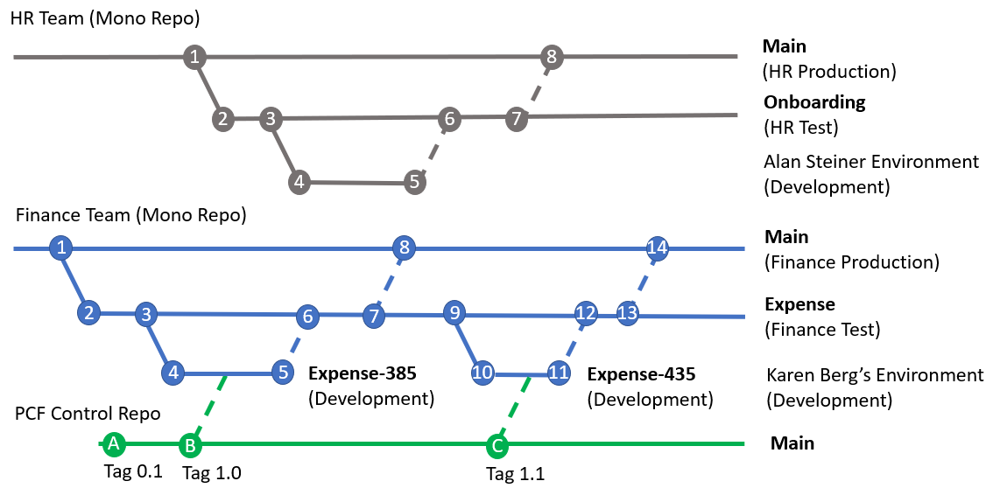

## Branching and Merging

Understanding of [Branching and Merging](https://docs.microsoft.com/en-us/azure/devops/repos/git/git-branching-guidance?view=azure-devops), [Pull Request](https://docs.microsoft.com/en-us/azure/devops/repos/git/git-branching-guidance?view=azure-devops#review-and-merge-code-with-pull-requests) and [Build Pipelines](https://docs.microsoft.com/en-us/azure/devops/pipelines/get-started/key-pipelines-concepts?view=azure-devops) are important concepts that are combined together with fusion development teams of Advanced Makers, Professional Developers and Operations teams will need to understand. The ALM Accelerator for Advanced Makers (AA4AM) builds on these concepts to allow Power Platform solutions to be managed.

### Example

The example below illustrates two parts of the organization the HR and Finance teams using different DevOps projects to manage related solutions for each department.



#### HR Team

The HR team manages one Azure DevOps git repository that stores each solution as a folder within the repository. This approach allows Advanced Makers in the HR team to see and collaborate on HR related solutions.

##### Steps

1. Create a new Azure DevOps Project and from the main branch for a new solution branch named Onboarding.

```bash
coe aa4am branch \
    -o https://dev.azure.com/contoso \
    -p HR \
    -r HR-Solutions \
    -d Onboarding \
    -s validation=https://contoso-hr-validation.crm.dynamics.com,test=https://contoso-hr-test.crm.dynamics.com,https://contoso-hr.crm.dynamics.com
```

More information on the [coe aa4am branch](../help/aa4am/branch.md) command

2. After this command is run a default branch with Azure DevOps pipelines has been created in the repository

3. The Advanced Maker **Alan Steiener** creates an unmanaged Solution named **Onboarding** in his development environment

4. Using the AA4AM Administration application Alan Created a new feature branch and **Push changes to Git**

5. Once the initial set of features is complete **Create Pull Request** using the AA4AM Administration application. The validation build pipeline is executed. The Pull Request is approved and then the feature branch is committed to the solution branch

6. The merged commit can trigger a Continuous Deployment to the test environment

7. When the set of features are ready for a production deployment a Pull Request can be made to merge changes into the main branch

8. The build and deployment pipelines can be configured to package the solution to the production environment

#### Finance

The Finance team maintains a separate Azure DevOps project for Finance related solutions. 

This Azure DevOps project could be in:
- The same Azure DevOps project with a different repository from the HR team (e.g. Different HR-Solutions and Fin-Solutions repositories)

- A separate Azure DevOps project and repository. This would allow different Role based security rights for the project

- A separate Azure DevOps Organization, Project and repository. This would allow different Azure Active Directory tenants to be used.

##### Steps

Karen as the Advanced Maker in the finance team follows a similar process to what Alan did inside the HR team.

1. **Karen** creates a new Azure DevOps solution branch for the Expense application.

```bash
coe aa4am branch \
    -o https://dev.azure.com/contoso \
    -p Finance \
    -r Finance-Solutions \
    -d Expense \
    -s validation=https://contoso-fin-validation.crm.dynamics.com,test=https://contoso-fin-test.crm.dynamics.com,https://contoso-fin.crm.dynamics.com
```

More information on the [coe aa4am branch](../help/aa4am/branch.md) command

2. After this command is run a default branch with Azure DevOps pipelines has been created in the repository

3. **Karen Berg** creates an unmanaged Solution named **Expense** in her development environment

4. Using the AA4AM Administration application Karen creates a new feature branch with the ID of the work item that has been assigned **385** and **Push changes to Git**

5. Once the initial set of features is complete **Create Pull Request** using the AA4AM Administration application. The validation build pipeline is executed. The Pull Request is approved and then the feature branch is committed to the solution branch

6. The merged commit can trigger a Continuous Deployment to the test environment

7. When the set of features are ready for a production deployment a Pull Request can be made to merge changes into the main branch

8. The build and deployment pipelines can be configured to package the solution to the production environment

Steps 9 through 14 repeat the process of 3-8 to contribute a new feature to the solution.

### PowerApps Component Framework (PCF)

In this example the Finance application makes use of a common component to visually interact with their data.

This PCF component is managed in a separate code repository. As new releases are created they are tagged with release versions.

A release version is imported into a feature branch for a Power Platform solution. This approach allows different versions of the PCF control to be developed and integrated with different solutions over time. In the Finance example version 1.0 to 1.1, which is committed to the **Expense-435** branch to update the PCF control being used.