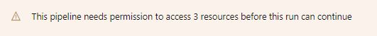
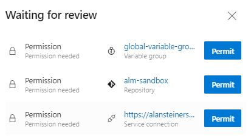

## Maker Setup

Once a user has been setup with a development environment [Read More](./development-environments.md) they will need to use the following sections to provide access to the service principal and create a solution branch.

### Setup Service Principal

The Azure DevOps Pipeline uses a Azure Active Directory service principal to connect to the development environment and import and export the solution. To enable access to the environment the following command will add the service principal as a System Administrator to the developer Power Platform environment.

1. Log out of any existing sessions if not the maker or a Power Platform tenant Administrator

```bash
az logout

```

2. To ensure the Application User has access to the development environment you need to run the following command

```bash
coe aa4am user add \
   -e https://org12345-dev.crm.dynamics.com
```

More information on the [coe aa4am user add](../help/aa4am/user/add.md) command

### Maker Create Solution

Once the environment has been setup and your development environment created and registered as a service connection in Azure DevOps you can use the following steps to create a source control managed solution.

1. Switch to Developer Environment

2. Create new solution e.g. NewSolution1

3. Add items to the solution. For example

   a. Select Solution

   b. Add Canvas Application

   c. Add Button

   d. Save Application and Close

4. Create Solution branch using the following CLI command

```bash
coe aa4am branch \
  -o https://dev.azure.com/dev12345 \
  -p alm-sandbox \
  -d MySolution1

```

More information on the [coe aa4am branch](../help/aa4am/branch.md) command

NOTES:
  - **-o** is the name of your DevOps Organization

  - **-p** is the name of the Azure DevOps Project

  - **-d** is the name of the solution branch to create

  - If the repository you want to create a branch for is empty you will need to commit an initial commit before a branch can be created.

5. Open ALM Accelerator for Advanced Maker Application

6. Select Push change to Git

   a. Create New Branch e.g. MySolution1-WIP

   b. From existing Solution Branch created above e.g. MySolution1

   c. Add a comment e.g. Initial version

7. Click on Latest Push Status 

   a. Permit permissions for pipeline to run (Variable Group, Service Connection, Pipeline)

### Post Setup Checks

After setting up an advanced maker you may need to verify the following

1. If this is your first branch created you will need to check variables applied for the created pipeline

2. The first time that each pipeline is run from the administration application you will need to open the pipeline in Azure DevOps and approve the resources used by the pipeline.

3. Select the blue icon for the Azure DevOps Build in the application

   

4. Check if is message similar to the following that requires approval of the pipeline to run

   

5. If required select "View" and permit the build pipeline to access the required resources (Variable group. Repository and Service Connection)

   

NOTES:
1. If you are using a free Azure Subscription you may receive error "No hosted parallelism has been purchased or granted.". To resolve this issue visit https://aka.ms/azpipelines-parallelism-request to request Azure Pipeline build compute 

### Read Next

- Complete the [Install Overview](./readme.md#install-overview)