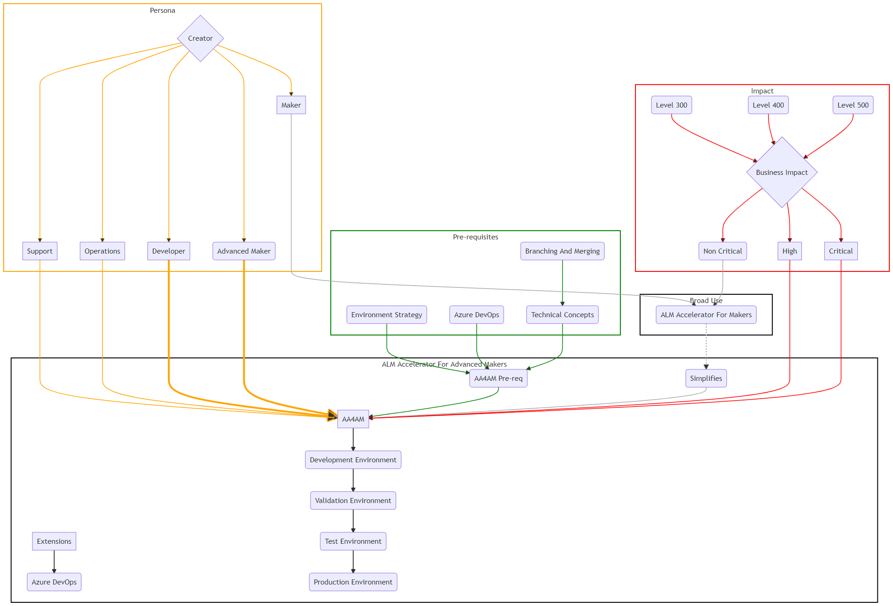
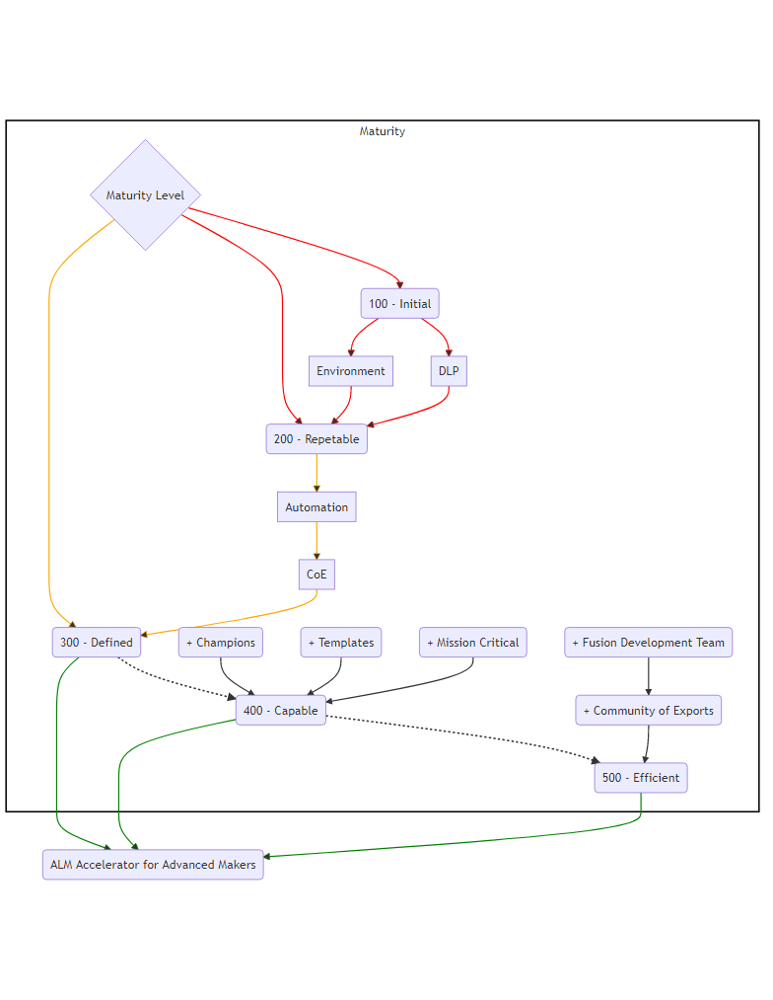

## Maturity Model

The [Power CAT adoption maturity model](https://powerapps.microsoft.com/en-us/blog/power-cat-adoption-maturity-model-repeatable-patterns-for-successful-power-platform-adoption/) provides a set of levels and capabilities that can be used to evaluate usage of the Application Lifecycle Management (ALM) and how the ALM Accelerator for Advanced Makers (AA4AM) can assist.

### Quick Start

AA4AM is a good match if you can check to see if the following apply:

- What is the impact of the solution?
   - Are the applications classified as Critical or High [Business Impact](#business-impact)?
   - Who is using the application?
      - Is this a Productivity application used by everyone in your organization?
      - Is it used by Senior Leadership to make Business Impact Decisions?
      - Is it integrated with External users e.g. Partners / Customer who will rely on solution as part of external process?
   - Are there specific Compliance and Auditing needs?
      - How important is tracking and auditing who is using the application?
      - Is there compliance and auditing requirements of the solution?       
- Do you have the prerequisites in place?
  - Do you have a defined [Environment strategy](../before-you-start.md#power-platform) for Development, Validation, Test and Production?
  - Do you use Azure DevOps or can you integrate with Azure DevOps for Source Control and Build Pipelines?
  - Do you have license prerequisites in place?
    - Do you have Basic or above Azure DevOps licenses for Makers?
    - Per App or Per User Power Apps licenses to access the AA4AM Maker Solution?
- Are you looking to move to [Level 300 - Defined](#level-300-defined) or beyond
- Administration
    - Do you have Environment Strategy in place?
    - What is the request strategy for environments?
      - Do you have a process to create Development / Test and Production Environments?
      - Is the process automated to request environments?
- Are Source control concepts understood?
  - Is [Branching and Merging](https://docs.microsoft.com/en-us/azure/devops/repos/git/git-branching-guidance?view=azure-devops) understood?
  - Are [Pull Request](https://docs.microsoft.com/en-us/azure/devops/repos/git/git-branching-guidance?view=azure-devops#review-and-merge-code-with-pull-requests) used to review and merge changes?
  - Are [Build Pipelines](https://docs.microsoft.com/en-us/azure/devops/pipelines/get-started/key-pipelines-concepts?view=azure-devops) used to integrate and deploy between Validation and Test, Production environments?
- Are [Fusion development](https://docs.microsoft.com/en-us/learn/paths/transform-business-applications-with-fusion-development/) teams engaged to include Low code and Pro code teams?
  - Are your professional development teams familiar with [Branching and Merging](../branching-and-merging.md) strategies and able to assist makers?
  - Do your Pro Code and Operations teams manage DevOps pipelines?
  - Are you Pro code team creating components in JavaScript?
  - Are you integrating with OpenAPI enabled Web APIs?
  - Are you using or planning to creating [plugins](https://docs.microsoft.com/en-us/powerapps/developer/data-platform/plug-ins) to extend business process in Dataverse?
- Support
  - Who is supporting the application / solution?
  - Do you have formal support team to manage issues for the solution?

Where some gaps exist then a set of proactive training and or workshops can help grow the maturity of people, process and technology to assist them in moving toward Advanced Maker integration inside your organization.

### Understand the Concepts

#### Levels

The maturity model has the following levels

##### Level 100 Initial

(_organic, chaotic, ad-hoc, individual heroics_): This phase describes the starting point for use of a new or undocumented process. In the Initial phase the organization has pockets of success or experimentation with Power Platform, but without any visibility into organization-wide adoption and use. There is no overall strategy or governance approach, apps are largely in the Default environment and no DLP policies have been put in place. Apps are mostly used by a single team and supported by the makers. Apps primarily use Excel and SharePoint as their data sources. The organization sees the potential of a strategic investment in the Power Platform, but there is no clear path forward for organization-wide execution.

##### Level 200 Repeatable

This phase describes a process that is at least documented sufficiently such that repeating the same steps may be attempted.

In the context of the Power Platform, organizations in the repeatable stage are taking what they’ve learned in the Initial stage to put structure around the deployment of Power Platform, often through controls implemented by a central IT team or other team focused on Power Platform.

The CoE Starter Kit is deployed to provide tenant-wide visibility into the use of Power Platform and begin to identify, if not control, applications that are beginning to become broadly used in the organization. 

Environments are used as needed, but in an ad-hoc manner – for example, various Production environments and different DLP policies might be created without a consistent strategy. These organizations sometimes believe that the use of the Power Platform is running “out of control” until they shape their use of the administrative and governance controls available for Power Platform, transitioning to the Defined Stage.

##### Level 300 Defined

This phase describes a process that is defined/confirmed as a standard business process.

The Defined organization is standardizing the repeatable practices that evolved in the Repeatable phase – for example, Environment and DLP requests are automated, solutions are used to move apps and flows between environments, and makers are starting to share common components. The organization is achieving measurable success with Power Platform to digitally transform and has a defined Power Platform Center of Excellence team.

Much of this transformation may still reflect the organic growth that got the organization to this point, but the Center of Excellence team is working to automate those processes and define standard approaches that will move the organization to the Capable stage.

##### Level 400 Capable

This phrase describes a process that is quantitatively managed in accordance with agreed-upon metrics. 

The Capable organization has standard processes for managing and monitoring Power Platform. These processes, described during the **Defined stage**, are now largely automated and are well understood by makers.

Power Platform capabilities are being used to transform the business broadly and used for enterprise-critical apps and integrations. Platform Champions have established channels for sharing best practices, training new makers and conducting regular hackathons. Standard, branded app templates and components are available to all makers. Business Value assessments are carried out to measure and understand the impact of the Power Platform.

##### Level 500 – Efficient

This phrase describes a process that is quantitatively managed in accordance with agreed-upon metrics.

In the context of the Power Platform, in the Efficient stage the organization has proven the capabilities of Power Platform to rapidly transform mission critical capabilities. Standardized, automated processes and an established community of experts allow new digitization opportunities to be implemented rapidly, allowing the organization to recognize value quickly and begin to integrate more advanced capabilities, such as artificial intelligence (AI).

Fusion Teams enable legacy capabilities and modern cloud architecture to be used easily within Power Platform unlocking broad use of existing data and automation. In Organizations at the Leading Stage, the Power Platform is key part of the digital transformation strategy and Enterprise Architecture in the organization. Organizations at this stage have exec sponsorship for the Power Platform. Organizations at the Leading stage influence best practices in the community and drive new uses of Power Platform.

#### Capabilities

##### Strategy and Vision

Evaluates the ability to reach the organizational goals taking into account the following factors
  - Is it aimed at the existing Business Model or targeting new Digital Business Models?
  - What is the mix of different approaches from Incremental, Experimental, Evolutionary or Aspirational change?
  - What is the effect on current people, process technology?
  - What is the alignment with Tactical vs Strategic goals?
  
What are the challenges that are being considered:
  - Investments - Are the investments accelerating business strategy?
  - What are the People, Process & Technology Investments required to cover change?
  - What is the impact of Disruption? – Introduction of new tech, new generation of economic desires & behaviors, increased pace of business innovation, competitive adaptation 
  - What is the pace of change?
  - Is the pace or change stretching communication and adaptation capabilities?

What are the expected benefits of the strategy and vision. For example:
  - Reduction of cost
  - Optimize Operations
  - Maximize Revenue streams
  - Defend market share
  - Improve customer satisfaction
  - Automate processes
  - Agility to react quickly to change

**Leading questions**

Alignment
  - Is innovation driven by Business Areas (bottom up)?
  - Is there a Common vision between IT and Business?
  - Is there a Dedicated Power Platform product owner?
  - Is there an established [Center of Excellence team](https://docs.microsoft.com/power-platform/guidance/adoption/coe)?
  - Is Power Platform a key part of the digital transformation strategy?

Impact
  - Is the Power Platform targeting low complexity scenarios?
  - Is there limited reuse of common components and services?
  - Do applications allow Bottom up and top down innovation?
  - Do applications focus on increased delivery efficiency, supporting rapidly changing business needs?
  - Are there Organization wide initiatives to deliver larger scale integrated apps?

Strategy
  - Is the Power Platform strategy defined?
  - Is there a demand management process in place?
  - Is there a defined understanding of Power Platform's role in your organization’s IT portfolio?
  - Are business plans shared across departments?
  - Is Vision and strategy understood by all?
  - Do Enterprise Architecture decisions include Power Platform capabilities?

#### Business Value

Evaluate the business value looking at:

**Business Strategy Viability**

Leading questions to consider

- What Business outcomes will this realize?
- What is the expected time frame?
- What do you do well today?
- What do you want to do today better?
- What thing do you want to do differently?

**Technological Viability**

Leading questions to consider

- What are manual steps vs automated steps?
- How measurable are the qualitative and quantitative outcomes?
- What is the dashboard/report capability to allow stakeholders to visualize and drill into and tack action on data?
- How available are analytics?
- On what frequency are analytics updated?
- How frequently are changes required
- What is the technical debt that needs to be accounted for?
- What are the security implications?

**Financial Viability**

Leading questions to consider

- What is the economic value added?
- Does this address current market model or is a new model being developed?
- What time horizon for implementation?
- What investment model is required?

##### Business Impact

**Critical**

Production, operations, or deployment deadlines will be severely affected, or there will be a severe impact on production or profitability. Multiple users or services are affected.

Initial Response time < 60 minutes with 24x7 access

Issues demand an immediate response and require 24x7 operation, every day.

**High**

The system has moderate business impact and can be dealt with during business hours. The expected usage could be by multiple users or single users, customers.

Initial Response time 2, 4 Hours or Next Day, Business hours access with 24x7 available support

**Non Critical**

The system has minimal business impact. The issue is important but does not have a significant current service or productivity impact. Acceptable workarounds will be considered.

Initial Response time 4-8 hours or greater with Business hours access and support (For example 9:00AM - 5:00PM)

#### Admin and Governance

Leading questions to consider

- Who can create environments?
- What [Data Loss Prevention (DLP)](https://docs.microsoft.com/power-platform/admin/wp-data-loss-prevention) policies are in place?
- [Power Platform Service Admin](https://docs.microsoft.com/power-platform/admin/overview-role-powerapps-admin) roles exists to Administer Power Platform tenants and Environments?
- Are tenants / environments isolated from each other?
- Is there monitoring in place?
  - Has the [CoE Starter Kit – Core](https://docs.microsoft.com/power-platform/guidance/coe/core-components) been installed?
  - Does [License, capacity and consumption monitoring](https://docs.microsoft.com/power-platform/guidance/adoption/capacity-and-licenses) inform decision making?
  - Has the [CoE Starter Kit – Governance Module](https://docs.microsoft.com/power-platform/guidance/coe/governance-components) been adopted to gain compliance insights and archive resources?
  - Does telemetry help identify business-critical apps and makers?
- Are custom environments used for specific use cases and ALM scenarios?

#### Support

- Are apps created by makers supported by a help desk or dedicated team?
- Has application / solution risk profile been defined detailing what level of support will be received?
- Is there an ongoing continuous improvement plan for the application?
- Are there clearly defined roles and responsibilities for the solution?
- Do the roles and responsibilities include ownership to build and operate the solution?

#### Nurture and Citizen Makers

- Do you have a [Training and Upskilling](https://docs.microsoft.com/power-platform/guidance/adoption/training-strategy) program for your makers to help them learn key concepts to grow your pool of Advanced Makers?
- Do you have an Internal [Champions](https://docs.microsoft.com/en-us/power-platform/guidance/adoption/champions) Community established?
- Do you have the [CoE Starter Kit – Nurture](https://docs.microsoft.com/power-platform/guidance/coe/nurture-components) module adopted?
- Do you have show and Tell sessions to demonstrate Advanced Maker Concepts?
- Do you have an adoption campaign to demonstrate how fusion development processes work?
- Do you have a career path options for makers?
- Have you built a community of mentors to share Advanced Maker concepts and best practices?
- Do you have a Common development strategy and goals for Citizen and Professional developers?

#### Automation

- Do you have Environment and DLP connector policy requests that are automated?
- Do you have Communication about processes and compliance between Admin and Makers? Is this process automated?

#### Fusion Teams

- Do you have [Standard libraries, custom connectors and components](https://docs.microsoft.com/power-platform/guidance/adoption/reusable) to be consumed by makers?
- Do you have the need for fusion teams manage source control and app lifecycle (e.g. Build, Verification, Test, Production)
- Do you have Cross-functional teams that plan and execute work jointly, including makers, testers and operational teams?
- Do you have Common development strategy and goals for Citizen and Pro developers needed for new projects?