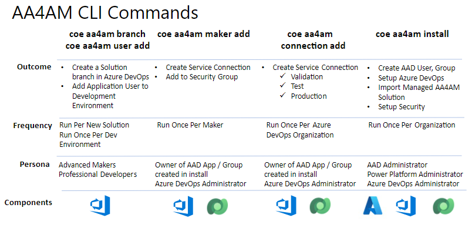

## Personas

Understanding the roles that different personas play in ALM Accelerator for Advanced Makers is important in helping you plan for and implement a AA4AM deployment in your organization.

### Persona Command Mapping



#### Solution Setup

Assuming that AA4AM has been setup and installed, the first command that the Advanced Maker will run is the **coe aa4am user add** command. This command will register an Application User created during install as a System administrator in their development environment to integrate with the solution. For example using the default parameters

```bash
coe aa4am user add \
  -e https://contoso-alans-dev.crm.dynamics.com
```

Read more on the [coe aa4am user add](../help/aa4am/user/add.md)

The **coe aa4am branch** command will be run each time a new solution is created. This command allows a new solution branch to be created in Azure DevOps with the associated ALM DevOps pipeline to validate pull requests and push changes to test and production environments.

```bash
coe aa4am branch \
  -o https://dev.azure.com/contoso \
  -p alm-sandbox \
  -d MySolution
```

More information on the [coe aa4am branch](../help/aa4am/branch.md) command

#### Administrator Setup

As each Advanced Maker or Professional Developer creates a development environment it will need to be registered with Azure DevOps and the Azure Active Directory Application. The user running this command requires Project Administrator rights in Azure DevOps and Owner rights of the Azure Active Directory Application.

```bash
coe aa4am maker add \
  -o https://dev.azure.com/contoso \
  -p alm-sandbox \
  -e https://contoso-userdev.crm.dynamics.com \
  -a aa4am-ado-service-principal \
  -g aa4am-makers \
  -u alan-s@contoso.com
```

More information on the [coe aa4am maker add](../help/aa4am/maker/add.md) command

Each Azure DevOps project will also require connections to deployment environments used by Azure DevOps pipelines

```bash
coe aa4am connection add \
  -o https://dev.azure.com/contoso \
  -p alm-sandbox \
  -e https://contoso-build.crm.dynamics.com \
  -a aa4am-ado-service-principal

coe aa4am connection add \
  -o https://dev.azure.com/contoso \
  -p alm-sandbox \
  -e https://contoso-test.crm.dynamics.com \
  -a aa4am-ado-service-principal

coe aa4am connection add \
  -o https://dev.azure.com/contoso \
  -p alm-sandbox \
  -e https://contoso-prod.crm.dynamics.com \
  -a aa4am-ado-service-principal
```

More information on the [coe aa4am connection add](../help/aa4am/connection/add.md) command

#### Install

To deploy an instance of AA4AM in your organization the **coe aa4am generate install** and **coe aa4am install** commands are used once to deploy the Managed solution. The install will automate key elements 
- Azure Active Directory
    - New Azure Active directory Application that will be used by Azure DevOps for Service Connections and Access to Power Platform Environment
    - New Azure Active Directory Group to provide access to Azure DevOps resources and Share the Maker Canvas application
- Azure DevOps resources
    - Import Azure DevOps Pipelines
    - Variable Groups
    - Create Service Connections to Power Platform Environments
- Power Platform Environments
    - Setup Application Users
    - Import Managed Solution and Setup Security

```bash
coe aa4am generate install -o install.json
coe aa4am install -f install.json
```

More information on the [coe aa4am generate install](../help/aa4am/generate/install.md) command

More information on the [coe aa4am install](../help/aa4am/install.md) command

### Persona Description

- **Business Users** - Licensed internal users of the created solutions. Will not directly use the AA4AM tools they will be able to see the shared applications. May report version number of application to the support team.

- **Maker** - Wants to use components or services produced by an advanced maker or professional developer. Uses off the shelf components and documentation. Not directly exposed to the Application Lifecycle as this process is abstracted away. Create and Share the Application with Business Users.

- **Advanced Maker** - Collaborates with Professional Development and IT teams to integrate and build applications. Assumed to be familiar with concepts like ALM, DevOps, Branching and Merging. Works in Development environment and push changes into validation and testing and production environments. Uses managed AA4AM Canvas management application and Azure DevOps website.

- **Professional Developer** - Advanced maker knowledge plus the ability to use lower level development programing languages and SDKs to create components and services. For example JavaScript and PCF controls, Dataverse Plugins in C#, Azure Services and APIs e.g. Azure Functions, API Management. LIkely to work in tools like Visual Studio Code.

- **Data Analyst** - Develop data model, Create and manage data services and post data collection analysis / reporting. For example Power BI reporting, Datalake. For data elements that are covered in the SOlution system e.g. Dataverse Modeling, AI Models. Items not covered today in solution system like Power BI will have separate ALM process.

- **Operations Teams** - Deploy solution to environments across Power Platform and Microsoft Cloud Services (e.g. Azure). Distribute solutions into Power Platform and run ARM templates in Azure. Will not use the CLI commands directly. May use managed canvas application to view and Azure DevOps pipelines to view the status or promote applications from test to production.

- **Support Teams** - Post application deployment look at version of applications deployed, triage issues. May use managed canvas application to view deployed solution versions.

- **Information Security Team** - Will compare against organization standards for Data Loss Prevention (DLP), Authentication and Authorization, Service Principals, Teams and Security. Review the ALM process against Threat models, risks and mitigations.

- **Architecture Team** - Review the entire ALM process and components and verify matches solution methodology and architecture

- **Administrators**
  - **Power Platform Tenant Administrator** - Global right to Power Platform Administration - Manage Environments (Create, Update, Delete). Common commands

  ```bash
  coe aa4am generate install -o data.json
  coe aa4am install -f data.json
  ```

  More information on the [coe aa4am generate install](../help/aa4am/generate/install.md) command

  More information on the [coe aa4am install](../help/aa4am/install.md) command

  - **Power Platform Environment Administrator** - Manage One or more Power Platform Environments - Import solution, add users assign roles

  ```bash
  coe aa4am generate install -o data.json
  coe aa4am install \
    -c environment \
    -e https://contoso-maker.crm.dynamics.com
  ```

  More information on the [coe aa4am generate install](../help/aa4am/generate/install.md) command

  More information on the [coe aa4am install](../help/aa4am/install.md) command

  Add makers to an environment (Assuming they also have Azure DevOps Administrator rights)

    ```bash
    coe aa4am maker add \
      -e https://user-Dev.crm.dynamics.com \
      -o https://dev.azure.com/dev12345 \
      -p alm-sandbox \
      -u user@contoso.com
    ```

  More information on the [coe aa4am maker add](../help/aa4am/maker/add.md) command

  **Azure Tenant Administrator** Manage the AAD Tenant - Create User, Groups,  Applications and Service Principals (O365 or Azure Administrators). Common commands

  ```bash
  coe aa4am install -c aad
  ```

  More information on the [coe aa4am install](../help/aa4am/install.md) command

  **Azure DevOps Organization Administrators**
  
  **Azure DevOps Project Administrators**

  ```bash
  coe aa4am install -c devops \
    -o https://dev.azure.com/dev12345 \
    -p alm-sandbox
  ``` 

  More information on the [coe aa4am install](../help/aa4am/install.md) command
  