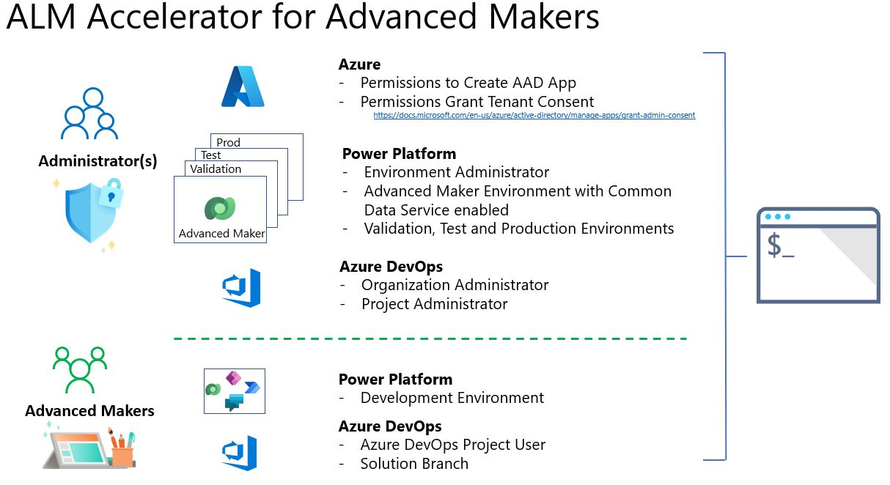

# ALM Accelerator for Advanced Makers

The [ALM Accelerator for Advanced Makers](https://github.com/microsoft/coe-starter-kit/tree/main/ALMAcceleratorForAdvancedMakers) (AA4AM) 
command allows you to manage common Application Lifecycle Management (ALM) tasks for Advanced Makers to install, setup and administration of Power Platform Solutions. 

- [Quick Start](#quick-start) - Guides you through the process of a [demo tenant install](./scenarios/tenant-deployments.md#demonstration-deployment)
- [Understand the Concepts](#understand-the-concepts) - Discuses Scenarios, Personas and Key Concepts behind AA4AM and the install process using the CoE CLI

## Quick Start

This quick start should take around 30 minutes and by the end as an Administrator configure Azure Active Directory, Azure DevOps and the Power Platform environments.

1. Validate organization [maturity model](./maturity/readme.md#quick-start) for AA4AM

1. Create your [Power Platform Environments](./before-you-start.md#power-platform) and [Azure DevOps](./before-you-start.md#azure-devops) Organization and Azure DevOps project.

1. Create an install configuration. Review the [install help](../help/aa4am/install.md) for install parameters

```bash
coe aa4am generate install -o quickstart.json
```

   More information on the [coe aa4am generate install](../help/aa4am/generate/install.md) command

1. If you are creating a [demo tenant install](./scenarios/tenant-deployments.md#demonstration-deployment) use the following command

```bash
coe aa4am install -f quickstart.json
```

   More information on the [coe aa4am install](../help/aa4am/install.md) command

   If you are deploying to your enterprise refer to [Enterprise Deployment](./scenarios/tenant-deployments.md#enterprise-deployment) for further information.

1. [Update permissions for the project build service](https://github.com/microsoft/coe-starter-kit/blob/main/ALMAcceleratorForAdvancedMakers/SETUPGUIDE.md#update-permissions-for-the-project-build-service) to enable build pipelines to interact with Git Repositories

1. Have Advanced Makers create [development environments](./development-environments.md) then Add Advanced Makers to Azure DevOps and share the Canvas Application

```bash
coe aa4am maker add \
   -o https://dev.azure.com/contoso \
   -p alm-sandbox \
   -e https://contoso-userdev.crm.dynamics.com \
   -a aa4am-ado-service-principal \
   -g aa4am-makers -u user@contoso.com
```

   More information on the [coe aa4am maker add](../help/aa4am/maker/add.md) command

   You can also generate a user configuration file. Using this approach will allow you to explore each parameter and review the settings before adding the maker.

```bash
coe aa4am generate maker add -o user.config
coe aa4am maker add \
   -f user.config
```

    More information on the [coe aa4am generate maker add](../help/aa4am/generate/maker/add.md) command

## Understand the Concepts

Not sure what AA4AM is and how it can help? The main GitHub project [README](https://github.com/microsoft/coe-starter-kit/blob/main/ALMAcceleratorForAdvancedMakers/README.md) provides further context and examples of usage.

### Getting Started

- [Scenarios](./scenarios/readme.md) - Discusses different install scenarios for AA4AM from Demo Installs to Enterprise Deployments
- [Personas](./personas.md) - Understand the key personas and how they map to AA4AM CLI commands and the wider AA4AM process
- [Key Concepts](./key-concepts.md) - Understand the key concepts for the components that are being automated under the hood by the CLI commands
- [Branching and Merging](./branching-and-merging.md) - Provides examples of branching and merging approach using AA4AM

### Overview

The diagram below provides an overview of the key components required and permissions required.



### Sample Install

The following recording shows a sample generating a install configuration file and installing AA4AM using the configuration file using a [Demo Deployment](./scenarios/tenant-deployments.md#demonstration-deployment).


### Install Overview

1. Review the [Before You Start](./before-you-start.md) to ensure you have the required Power Platform environments and Azure DevOps organizations created

2. As an administrator complete the [Admin Install](./admin-install.md)

3. Have Advanced Makers create [Development Environments](./development-environments.md)

4. Use [Maker Setup](./maker-setup.md) to create and setup environment and solution branches in the Azure DevOps repository.

Notes:
1. If this is your first build pipeline you will need to set Pipeline Variables for your environment. At a minimum you will need to set **ServiceConnection** variable to your environment you have setup for validation, test and production.

### Read Next

- [ALM Accelerator for Advanced Makers](https://github.com/microsoft/coe-starter-kit/tree/main/ALMAcceleratorForAdvancedMakers) - Overview for AA4AM
- Manual Setup - Understand the key steps that the CLI is automating
  - [Foundational Setup](https://github.com/microsoft/coe-starter-kit/blob/main/ALMAcceleratorForAdvancedMakers/SETUPGUIDE.md#foundational-setup) - Foundational Setup for Manual steps automated by the CLI install command
  - [Development Project Setup](https://github.com/microsoft/coe-starter-kit/blob/main/ALMAcceleratorForAdvancedMakers/SETUPGUIDE.md#development-project-setup) - Documents the Manual steps that are automated by the CLI install command
  - [Solution Setup](https://github.com/microsoft/coe-starter-kit/blob/main/ALMAcceleratorForAdvancedMakers/SETUPGUIDE.md#solution-setup) - Documents the manual steps to setup Azure DevOps that are performed by the CLI install command
  - [Importing Solution](https://github.com/microsoft/coe-starter-kit/blob/main/ALMAcceleratorForAdvancedMakers/SETUPGUIDE.md#importing-the-solution-and-configuring-the-app) - Documents the manual steps to import the managed solution that are performed by the CLI install command