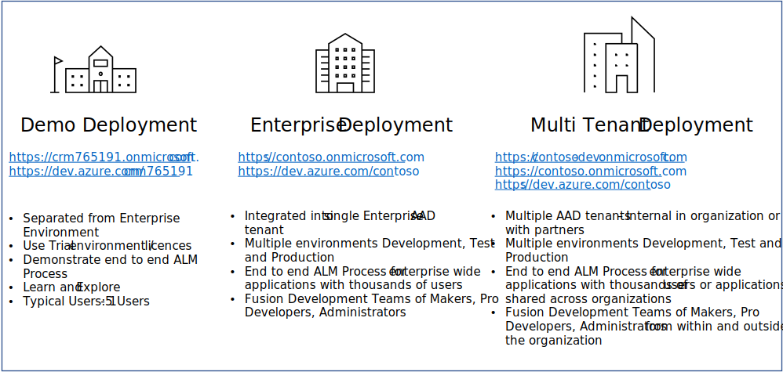
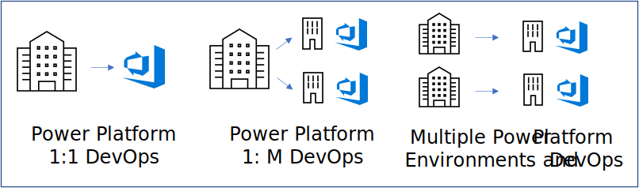

# Scenarios

As you plan you ALM Accelerator for Advanced Makers (AA4AM) one of more of the following scenarios may apply to you.

## Tenant Deployments

AA4AM can be deployed in the following scenarios single demo tenant, single enterprise tenant.

Currently AA4AM **does not** support a multi tenant enterprise deployment model.



### Factors to Consider

- Does ALM for Low Code solutions introduce new concepts to parts of the business that has not been exposed to them before?

- Would a demo environment deployment provide an environment allow the different [personas](./personas.md) to experiment and accelerate adoption of ALM processes?

- Who will manage and operate the ALM process?

- How will the maker community be expanded to adopt new ALM concepts?

- What steps can be put in place to adopt a self service model to provision environments and move between validation, test and production environments.

### Demonstration Deployment

In this scenario you are looking to quickly install AA4AM to demonstrate how it works and demonstrate the end to end process. For this scenario the following is assumed.

1. Using Trial tenant and environments to demonstrate the solution
1. Single Administrator that has rights to the
   - Azure Active Directory tenant administrator
   - Power Platform Global Administrator
   - Power Platform Organization Administrator
1. Demo non administration Maker users that will be used to show process of creating ALM process for Power Platform solutions
1. Non production applications

Once you have the [Admin Install](./admin-install.md) completed Advanced makers can create [Development environments](./development-environments.md) and have Administrators add them to Azure DevOps and the required Azure Active Directory Security Group. 

This will typically use the following commands as the **single administrator**

```bash
coe aa4am generate install -o test.json
coe aa4am install -f test.json
```

Then add a demo user as a maker

```bash
coe aa4am maker add -e https://alans-dev.crm.dynamics.com -o https://dev.azure.com/contoso-dev -p alm-sandbox -u alans@crm716415.onmicrosoft.com
```

Finally makers can then [Setup Managed Solutions](./maker-setup.md)

### Enterprise Deployment

In this scenario the aim is to install AA4AM inside an enterprise tenant and the following is assumed.

1. Likely to have different administration teams. For example
   - Azure Active Directory Administrators
   - Power Platform Administrators. May be Global Administrator or Environment Administrators
   - Azure DevOps Administrators
1. Configuration files for AA4AM install can be shared among different Administration teams
1. Advanced Makers have separate development environments to work on changes
1. AA4AM Azure DevOps pipeline used to validate and promote to Test and Production environments

#### Azure Active Directory Administrators

The tenant administration team will need to create the following

1. Azure Active Directory Application that will be used as Service Principal in Azure DevOps and Power Power Environments
1. Azure Active Directory Group that will be used to grant access to Advanced Makers to Azure DevOps resources and Maker Canvas Application and Dataverse Tables.
1. Grant Tenant Consent for Azure Active Directory Application. This required as the Azure DevOps pipeline uses APIs where an interactive user is not involved. As a result the tenant administrator consent is required.

To install the solution resources the following options can be used

##### Azure Active Directory

1. Use the CLI to install the AAD components. For example using the default install parameters

```bash
coe aa4am install -c aad
```

2. Using a shared configuration file and setting install.json components to aad

```json
{
  "log": [
    "info"
  ],
  "components": [
    "aad"
  ],
  "aad": "ALMAcceleratorServicePrincipal",
  "group": "ALMAcceleratorForAdvancedMakers",
  "devOpsOrganization": "https://dev.azure.com/contoso-dev",
  "project": "alm-sandbox",
  "repository": "pipelines",
  "settings": {
    "installEnvironments": [
      "validation",
      "test",
      "prod"
    ],
    "validation": "https://sample-validation.crm.dyamics.com",
    "test": "https://sample-test.crm.dyamics.com",
    "prod": "https://sample-prod.crm.dyamics.com",
    "createSecret": "true",
    "region": [
      "NAM"
    ]
  },
  "importMethod": "api",
  "endpoint": "prod"
}
```

##### Azure DevOps

```bash
coe aa4am install -c devops -o https://dev.azure.com/contoso-dev -p alm-sandbox
```

##### Power Platform Environment

```bash
coe aa4am install -f install.json
```

```json
{
  "log": [
    "info"
  ],
  "components": [
    "environment"
  ],
  "aad": "ALMAcceleratorServicePrincipal",
  "group": "ALMAcceleratorForAdvancedMakers",
  "devOpsOrganization": "https://dev.azure.com/contoso-dev",
  "project": "alm-sandbox",
  "repository": "pipelines",
  "settings": {
    "installEnvironments": [
      "validation",
      "test",
      "prod"
    ],
    "validation": "https://sample-validation.crm.dyamics.com",
    "test": "https://sample-test.crm.dyamics.com",
    "prod": "https://sample-prod.crm.dyamics.com",
    "createSecret": "true",
    "region": [
      "NAM"
    ]
  },
  "importMethod": "api",
  "endpoint": "prod"
}
```


3. Manual install using the [Create An App Registration in your AAD environment](https://github.com/microsoft/coe-starter-kit/blob/main/ALMAcceleratorForAdvancedMakers/SETUPGUIDE.md#create-an-app-registration-in-your-aad-environment)

### Multi Tenant Deployment

This deployment type is involves different Azure Active Directory deployments that separate development, test and production systems. For example the following Azure Active Directory tenants

- contoso.onmicrosoft.com

- contoso-dev.onmicosoft.com

Currently the AA4AM installation does not support a multi-tenant deployment

#### Multi Tenant Deployment Assumptions

The multi tenant deployment is assumed to have one or more of the following

1. Multiple Azure Active Directory tenants

1. Power Platform Environments for Development, Validation, Test and Production may be in different tenants.

1. The Azure DevOps environment may be in the Development tenant

1. Users of the main tenant my use Azure Business to Business authentication to access the development tenant

1. External users from outside the organization maybe invited to the development tenant and not have access to the main tenant

#### Active Active Directory Implications

To support multi tenant deployments the Azure Active Directory application will need to be configured to support multi tenant authentication.

Further reading

1. [Tenancy in Azure Active Directory](https://docs.microsoft.com/en-us/azure/active-directory/develop/single-and-multi-tenant-apps)

## DevOps Deployment Model



### Factors to Consider

As yoy play you DevOps deployment mode the following factors may help you decide the best approach:

- Do different teams and / or business units require separate locations to store and manage solutions?

- Cost / benefit of the overhead of managing and maintaining managing multiple DevOps process for different Power Platform Environments?

- Do different teams or business units have differing levels of business sensitivity or data loss prevention that will require separate handling? 

- How will common shared assets be shared and managed between multiple teams? For example shared DevOps templates or Shared components.

- Azure Active Directory security model. Will each team manage and maintain Active Directory Applications and Service Principals or will they be shared across different Power Platform environments and Azure DevOps organizations?

### Power Platform 1 to 1 DevOps

In this scenario the following is assumed:

- Single Power Platform Advanced Maker Deployment with Shared Power Platform Environments for the Advanced Maker Canvas Application, Validation, Test and Production Environments

- Single Shared Azure DevOps where all Advanced Makers collaborate on Solutions.

### Power Platform 1 to Many DevOps

In this scenario the following is assumed:

- Single Power Platform Advanced Maker Deployment with Shared Power Platform Environments for the Advanced Maker Canvas Application, Validation, Test and Production Environments

- Multiple Azure DevOps for different teams or Business UNits.

- Each Azure DevOps organization can have a different set of users protected bu different Role Based Access Security Rules


### Multiple Power Platform Enviroments and DevOps

In this scenario the following is assumed:

- Multiple Power Platform Advanced Maker Deployment with Shared Power Platform Environments for the Advanced Maker Canvas Application, Validation, Test and Production Environments

- Multiple Azure DevOps for different teams or Business UNits.

- Each Azure DevOps organization can have a different set of users protected bu different Role Based Access Security Rules
