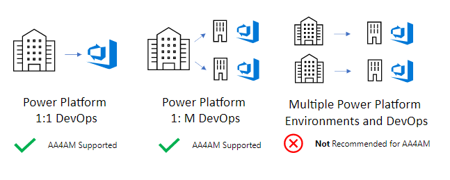

## DevOps Deployment Model

### Factors to Consider

As you plan your DevOps deployment model the following factors may help you decide the best approach:

- Do different teams and / or business units require separate locations to store and manage solutions?

- Cost / benefit of the overhead of managing and maintaining managing multiple DevOps process for different Power Platform Environments?

- Do different teams or business units have differing levels of business sensitivity or data loss prevention that will require separate handling? 

- How will common shared assets be shared and managed between multiple teams? For example shared DevOps templates or Shared components.

- Azure Active Directory security model. Will each team manage and maintain Active Directory Applications and Service Principals or will they be shared across different Power Platform environments and Azure DevOps organizations?

### Power Platform 1 to 1 DevOps

In this scenario the following is assumed:

- Single Power Platform Advanced Maker Deployment with Shared Power Platform Environments for the Advanced Maker Canvas Application, Validation, Test and Production Environments

- Single Shared Azure DevOps where all Advanced Makers collaborate on Solutions.

### Power Platform 1 to Many DevOps

In this scenario the following is assumed:

- Single Power Platform Advanced Maker Deployment with Shared Power Platform Environments for the Advanced Maker Canvas Application, Validation, Test and Production Environments

- Multiple Azure DevOps for different teams or Business Units.

- Each Azure DevOps organization can have a different set of users protected buy different Role Based Access Security Rules

- Multiple pipelines can be defined and used at an Azure DevOps level that allow solutions to be deployed to different validation, test and production environments.

### Multiple Power Platform Environments and DevOps

This scenario is not a recommended deployment model as is requires the deployment and management of multiple AA4AM deployments withing the organization.

In this scenario the following is assumed:

- Multiple Power Platform Advanced Maker Deployment with Shared Power Platform Environments for the Advanced Maker Canvas Application, Validation, Test and Production Environments

- Multiple Azure DevOps for different teams or Business Units

- Each Azure DevOps organization can have a different set of users protected buy different Role Based Access Security Rules