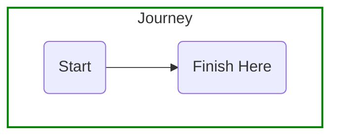
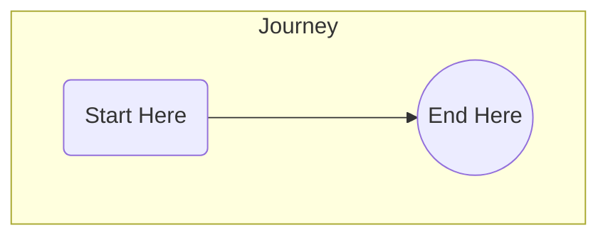

## Documentation

Documentation is key to understanding how the cli works. As new commands are added consider the following

- [Add Markdown Pages](#add-markdown-pages) - Describe the functionality for end users
- [Recording Command Line](#recording-command-line) to demonstrate process

### Add Markdown Pages

Add new pages to [docs](..\docs) that describes the new command and how it is expected to be used.

Consider adding the following to the page
1. Static images that summarize the operation
1. [Recording Command Line](#recording-command-line) to demonstrate process

### Diagrams

For decision trees the diagrams are generated via [mermaid](https://mermaid-js.github.io/mermaid).

Example diagrams:

- [Maturity](../aa4am/maturity/maturity.mmd)
- [AA4AM Decision Tree](../aa4am/maturity/decision-tree.mmd)

#### Diagram Styles

To style the diagram **sample.mmd**

1. Use subgroup styles



2. Apply CSS styles with a file in the same folder. For example in the above create **sample.css** in same folder as the mmd file

```css
#L-start-finish path {
   stroke: red
}
```

NOTES:
1. Review the [node shapes](https://mermaid-js.github.io/mermaid/#/flowchart?id=node-shapes) to control the symbols displayed

2. When css file is requested a svg file will also be generated so that you can look at the class and SVG elements generated to apply css styles

3. Circles can be styled using following approach




To color the end circle green using css [starts with selector](https://www.w3schools.com/cssref/sel_attr_begin.asp). This is required as each item will have a unique id assigned by mermaid.

```css
[id^=flowchart-finish] circle {
   stroke: green;
   fill: lightgreen
}
```

4. Coloring a line. Each line will have the format L-start-finish for the **path** which is the line and the class **.path** which is the line around the arrow head.

```css
#L-start-finsh path,
#L-start-finsh .path
 {
   stroke: green;
}
```

#### Update Diagrams

The static images for each diagram is generated as follows

1. Change to coe-cli folder

```bash
cd coe-cli
```

2. Generate static files

```bash
npm run diagrams
```

### Add Help Pages

Add new help pages to [help](../help) that provides detailed information on the command an options. Help can be accessed using the help command which will display the associated help markdown file in the browser

```bash
coe help aa4am
```

The command above will display the contents of [help/aa4am/readme.md](../help/aa4am/readme.md)

### Recording Command Line

To include a short animated recording of commands and the expected output you can use the following process

A. Install termtosvg in a Unix based terminal

```bash
pip3 install --user termtosvg
```

This process will work cross platform and any of the following options could be used:

   i) Native Unix shell on MacOS or Linux distributions

   ii) Docker images with a Unix shell

   iii) [Windows Subsystem for Linux](https://docs.microsoft.com/en-us/windows/wsl/install-win10) on Windows


B. Record the session to a cast file

```bash
termtosvg record test.cast
```

The generated cast file is a simple text file that can be edited with any text editor.

C. Remove pauses using [term-trim.ps1](..\..\scripts\term-trim.ps1)

```bash
./term-trim.ps1 -Input test.cast -Output test2.cast -Trim 1

```

D. Generate the svg file

```bash
termtosvg render test2.cast test.svg -t window_frame
```
 


