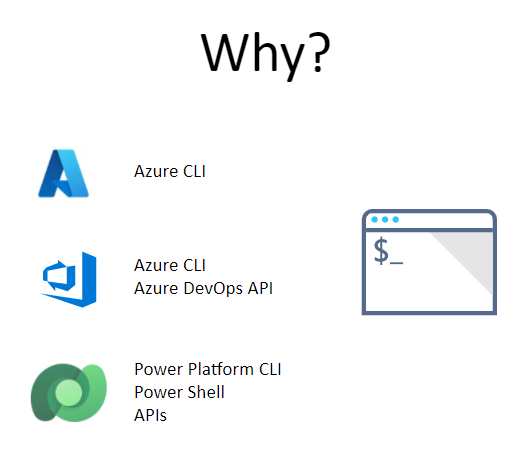
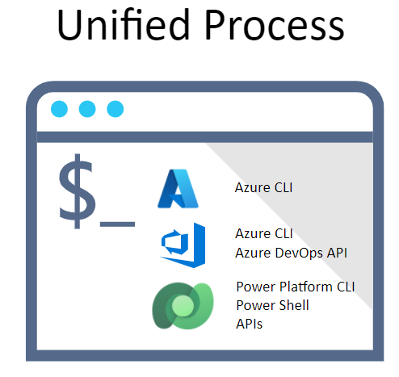

# Overview

For each set of major commands, this guide is organized in the following tracks to explain the Center of Excellence Command Line Interface (CoE CLI):

1. [Quick start](#quick-start) - Follow this track if your goal is to quickly setup a demonstration environment. Using this approach you can rapidly provide a hands on environment that you can use to illustrate the system end to end

2. [Explain the concepts](#explain-the-concepts) - Aimed at Enterprise deployments where individual components of the solution may be installed by different roles. Alternatively you may need a deeper understanding of the components that the CoE CLI is automating.

3. [How does it work](#how-does-it-work) - Dives deeper into how to build, extend and contribute to the CoE CLI.

## Quick Start

The following quick start guides exist

- [Install CoE CLI](./install.md) - Install the CoE CLI to your local environment or as a docker container
- [ALM Accelerator for Advanced Makers Quick Start](./aa4am/readme.md#quick-start) - Install a demonstration environment or an enterprise deployment with Azure Active Directory, Azure DevOps and Power Platform Administration permissions

## Explain the Concepts



The CoE CLI has been designed to provide a set of commands that meet the needs of different [personas](./aa4am/personas.md) across the organization. It can be used to automate the process of installing CoE CLI components covering Azure, Azure DevOps and the Power Platform. 



The CoE CLI wraps existing CLI and APIs to provide a set of commands that can be used to holistically automate the end to end Microsoft Solution deployment required by CoE CLI solutions. 

Comparing and contrasting the CoE CLI to other CLI / APIs:
1. The CoE CLI aims to automate the end to end deployment of components across the Microsoft Cloud

2. The [Azure CLI](https://docs.microsoft.com/en-us/cli/azure/) is aimed at Automating Azure Resources and via extensions Azure DevOps. The CoE CLI uses the Azure CLI for authentication and managing Azure related resources

3. The [Power Platform CLI](https://docs.microsoft.com/en-us/powerapps/developer/data-platform/powerapps-cli) is a simple, one-stop developer CLI that empowers developers and ISVs to perform various operations in Microsoft Power Platform related to environment lifecycle features, and to authenticate and work with Microsoft Dataverse environments, solution packages, portals, code components. As new features are added to the cross platform Power Platform CLI the CoE CLI will leverage the Power Platform CLI features

4. The [Azure DevOps Services REST API](https://docs.microsoft.com/en-us/rest/api/azure/devops/) provides a REST based set of commands to interact with Azure DevOps. The CoE CLI makes use of these APIs to build aggregate commands.

### What Next

As you consider an enterprise deployment the following sections outline the key concepts you will need to understand:

1. [Install CoE CLI](./install.md) - How to install the CoE CLI using local host computer or via a docker container.

2. [ALM Accelerator for Advanced Makers](./aa4am/readme.md) - Use CLI commands to setup and configure an environment for Advanced Makers to enable them to achieve more within your organization. 

### Getting Started

Once the CoE CLI has been [installed](./install.md) you can use -h argument to see help options

```bash
coe -h
```

Authentication for tasks is managed using the Azure CLI. Using standard az cli commands you can login, logout and select accounts. For example

```bash
az login
coe aa4am install -c aad
az logout
```

### Getting Help

You can get short descriptions of any command by adding **--help** to the command line. To get more detailed help you can use the help command. For example to get help on the ALM Accelerator for Advanced Makers use the following command

```
coe help aa4am install
```

Read more in [help](./help/readme.md) pages for detailed description for each command.

### Read More

Further reading

- [CoE CLI Upgrade](./upgrade.md) How to upgrade to a new version of the CoE CLI install.

## How does it work

Interested in learning how the CoE CLI works or want to extend the functionality? The [CLI Development](./cli-development/readme.md) provides the best place to start.
