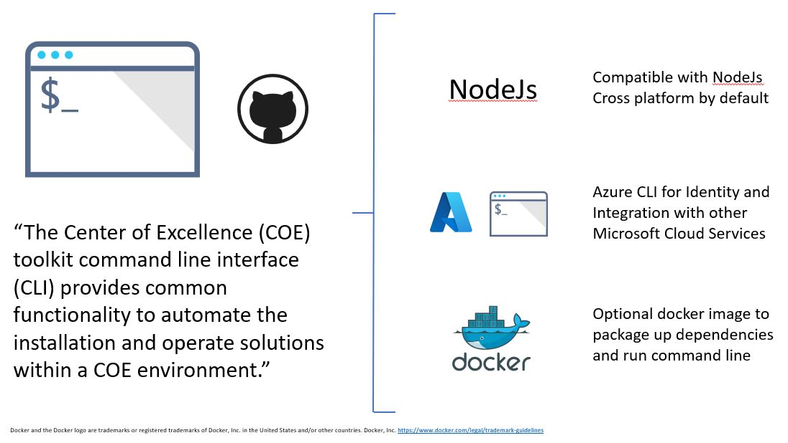

# Overview

Using the Center of Excellence (CoE) toolkit command line interface (CLI), you can manage your CoE deployment on any platform. No matter if you are on Windows, macOS or Linux, using Bash, Cmd or PowerShell. The CoE CLI currently starts with commands for the [ALM Accelerator](./docs/alm/readme.md) and will add more features over time.



## Objectives

- Create as common command line that can be installed cross platform and allows easy distribution and upgrade process as the CoE toolkit evolves
- Allows CoE CLI to be extensible for new verbs and actions
- Where existing features exist in other cli tools provide consider a convenience wrapper vs native implementation in the CoE CLI app
- Allow the process to be run by single user or split process to different
- Allow for future expansion where commands can be run as part of build process

## Documentation

Read the [Documentation](./docs/readme.md) for information on supported commands and setup process

## Requirements

To run the application you will require local install of the following or Docker installed.

1. An installation of Node 12+

   a. https://nodejs.org/en/download/

1. Azure CLI Required for user authentication and Azure Active Directory Integration

   a. https://docs.microsoft.com/cli/azure/install-azure-cli

## Installation

Download zip or clone repository from GitHub repository. Once downloaded you have two options install locally with NodeJS and Azure CLI or create a docker image.

### Local Install

[Watch Local Install](./docs/sample-local-install.md)

Read more on [Local Install Steps Documentation](./docs/readme.md#local-install)

### Docker Install

[Watch Docker Install](./docs/sample-docker-install.md)

Read more on [Docker Install Steps Documentation](./docs/readme.md#docker-install)

## Getting Started

Once installed can use -h argument to see help options

```bash
coe -h

```

Authentication for tasks is managed using the Azure CLI. Using standard az cli commands you can login, logout and select accounts. For example

```bash
az login
coe alm install -c add
az logout
```

Notes:
1. If not logged into Azure cli you will be prompted to login
1. Azure CLI has been selected as it allows integration of CLi command to manage Azure resources that integrate with the Power Platform e.g. Azure Active Directory, Azure API Management, Azure Functions

## CoE CLI Development

Looking to understand how the CoE CLI commands works? The [CoE CLI Development](./docs/cli-development/readme.md) dives technically deeper into the CoE CLI commands and discusses how to debug and add / extend commands.

## Contributions

The [Contribution Guide](./CONTRIBUTING.md) includes technical details on how to contribute additional CoE CLI commands.